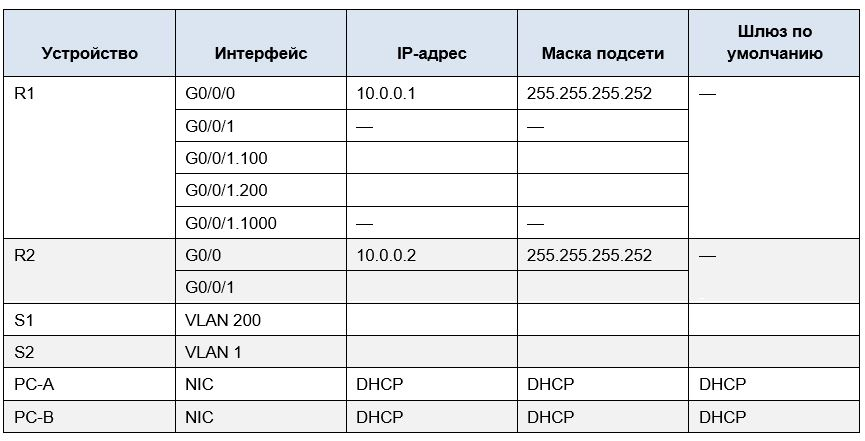

# Лабораторная работа. Реализация DHCPv4 

## Топология

 
## Таблица адресации




## Таблица VLAN

[Перейти к Решению ](#Решение)

## Задачи

### Часть 1. Создание сети и настройка основных параметров устройства

### Часть 2. Настройка и проверка двух серверов DHCPv4 на R1

### Часть 3. Настройка и проверка DHCP-ретрансляции на R2

## Цели
### Часть 1. Создание сети и настройка основных параметров устройства
 
### Часть 2. Настройка и проверка двух серверов DHCPv4 на R1 
### Часть 3. Настройка и проверка DHCP-ретрансляции на R2

## Инструкции
### Часть 1. Создание сети и настройка основных параметров устройства
В первой части лабораторной работы вам предстоит создать топологию сети и настроить базовые параметры для узлов ПК и коммутаторов.
#### Шаг 1:	
Подсеть сети 192.168.1.0/24 в соответствии со следующими требованиями:

a.	Одна подсеть «Подсеть A», поддерживающая 58 хостов (клиентская VLAN на R1).

Подсеть A:

Запишите первый IP-адрес в таблице адресации для R1 G0/0/1.100 . 

b.	Одна подсеть «Подсеть B», поддерживающая 28 хостов (управляющая VLAN на R1). 

Подсеть B:

Запишите первый IP-адрес в таблице адресации для R1 G0/0/1.200. Запишите второй IP-адрес в таблице адресов для S1 VLAN 200 и введите соответствующий шлюз по умолчанию.

c.	Одна подсеть «Подсеть C», поддерживающая 12 узлов (клиентская сеть на R2).

Подсеть C:

Запишите первый IP-адрес в таблице адресации для R2 G0/0/1.


#### Шаг 2:	Создайте сеть согласно топологии.
Подключите устройства, как показано в топологии, и подсоедините необходимые кабели.

#### Шаг 3:	Произведите базовую настройку маршрутизаторов.

**a.**	Назначьте маршрутизатору имя устройства.

**b.**	Отключите поиск DNS, чтобы предотвратить попытки маршрутизатора неверно преобразовывать введенные команды таким образом, как будто они являются именами узлов.

**c.**	Назначьте class в качестве зашифрованного пароля привилегированного режима EXEC.

**d.**	Назначьте cisco в качестве пароля консоли и включите вход в систему по паролю.

**e.**	Назначьте cisco в качестве пароля VTY и включите вход в систему по паролю.

**f.**	Зашифруйте открытые пароли.

**g.**	Создайте баннер с предупреждением о запрете несанкционированного доступа к устройству.

**h.**	Сохраните текущую конфигурацию в файл загрузочной конфигурации.

**i.**	Установите часы на маршрутизаторе на сегодняшнее время и дату.
Примечание. Вопросительный знак (?) позволяет открыть справку с правильной последовательностью параметров, необходимых для выполнения этой команды.


#### Шаг 4:		Настройка маршрутизации между сетями VLAN на маршрутизаторе R1

**a.**	Активируйте интерфейс G0/0/1 на маршрутизаторе.

**b.**	Настройте подинтерфейсы для каждой VLAN в соответствии с требованиями таблицы IP-адресации. 
Все субинтерфейсы используют инкапсуляцию 802.1Q и назначаются первый полезный адрес из вычисленного пула IP-адресов. Убедитесь, что подинтерфейсу для native VLAN не назначен IP-адрес. Включите описание для каждого подинтерфейса.

**c.**	Убедитесь, что вспомогательные интерфейсы работают.

#### Шаг 5:		Настройте G0/1 на R2, затем G0/0/0 и статическую маршрутизацию для обоих маршрутизаторов

**a.**	Настройте G0/0/1 на R2 с первым IP-адресом подсети C, рассчитанным ранее.

**b.**	Настройте интерфейс G0/0/0 для каждого маршрутизатора на основе приведенной выше таблицы IP-адресации.

**c.**	Настройте маршрут по умолчанию на каждом маршрутизаторе, указываемом на IP-адрес G0/0/0 на другом маршрутизаторе.

**d.**	Убедитесь, что статическая маршрутизация работает с помощью пинга до адреса G0/0/1 R2 от R1.

**e.**	Сохраните текущую конфигурацию в файл загрузочной конфигурации.
	
#### Шаг 6: Настройте базовые параметры каждого коммутатора.	

**a.**	Присвойте коммутатору имя устройства.


**b.**	Отключите поиск DNS, чтобы предотвратить попытки маршрутизатора неверно преобразовывать введенные команды таким образом, как будто они являются именами узлов.

**c.**	Назначьте class в качестве зашифрованного пароля привилегированного режима EXEC.

**d.**	Назначьте cisco в качестве пароля консоли и включите вход в систему по паролю.

**e.**	Назначьте cisco в качестве пароля VTY и включите вход в систему по паролю.

**f.**	Зашифруйте открытые пароли.

**g.**	Создайте баннер с предупреждением о запрете несанкционированного доступа к устройству.

**h.**	Сохраните текущую конфигурацию в файл загрузочной конфигурации.

**i.**	Установите часы на маршрутизаторе на сегодняшнее время и дату. 

Примечание. Вопросительный знак (?) позволяет открыть справку с правильной последовательностью параметров, необходимых для выполнения этой команды.

**j.**	Скопируйте текущую конфигурацию в файл загрузочной конфигурации.


#### Шаг 7: Создайте сети VLAN на коммутаторе S1.	

Примечание. S2 настроен только с базовыми настройками. 

**a.**	Создайте необходимые VLAN на коммутаторе 1 и присвойте им имена из приведенной выше таблицы.

**b.**	Настройте и активируйте интерфейс управления на S1 (VLAN 200), используя второй IP-адрес из подсети, рассчитанный ранее. 
Кроме того установите шлюз по умолчанию на S1.

**c.**	Настройте и активируйте интерфейс управления на S2 (VLAN 1), используя второй IP-адрес из подсети, рассчитанный ранее. Кроме того, установите шлюз по умолчанию на S2

**d.**	Назначьте все неиспользуемые порты S1 VLAN Parking_Lot, настройте их для статического режима доступа и административно деактивируйте их. 
На S2 административно деактивируйте все неиспользуемые порты.

Примечание. Команда interface range полезна для выполнения этой задачи с минимальным количеством команд.


#### Шаг 8:	Назначьте сети VLAN соответствующим интерфейсам коммутатора.

**a.**	Назначьте используемые порты соответствующей VLAN (указанной в таблице VLAN выше) и настройте их для режима статического доступа.

**b.**	Убедитесь, что VLAN назначены на правильные интерфейсы.
Вопрос:
Почему интерфейс F0/5 указан в VLAN 1?


#### Шаг 9: Вручную настройте интерфейс S1 F0/5 в качестве транка 802.1Q.

**a.**	Измените режим порта коммутатора, чтобы принудительно создать магистральный канал.

**b.**	В рамках конфигурации транка  установите для native  VLAN значение 1000.

**c.**	В качестве другой части конфигурации магистрали укажите, что VLAN 100, 200 и 1000 могут проходить по транку.

**d.**	Сохраните текущую конфигурацию в файл загрузочной конфигурации.

**e.**	Проверьте состояние транка.

*Вопрос:*

Какой IP-адрес был бы у ПК, если бы он был подключен к сети с помощью DHCP?

*Ответ:*


### Часть 2: Настройка и проверка двух серверов DHCPv4 на R1

В части 2 необходимо настроить и проверить сервер DHCPv4 на R1. Сервер DHCPv4 будет обслуживать две подсети, подсеть A и подсеть C.

#### Шаг 1.	Настройте R1 с пулами DHCPv4 для двух поддерживаемых подсетей. Ниже приведен только пул DHCP для подсети A

**a.**	Исключите первые пять используемых адресов из каждого пула адресов.

**b.**	Создайте пул DHCP (используйте уникальное имя для каждого пула).

**c.**	Укажите сеть, поддерживающую этот DHCP-сервер.

**d.**	В качестве имени домена укажите CCNA-lab.com.

**e.**	Настройте соответствующий шлюз по умолчанию для каждого пула DHCP.

**f.**	Настройте время аренды на 2 дня 12 часов и 30 минут.

**g.**	Затем настройте второй пул DHCPv4, используя имя пула R2_Client_LAN и вычислите сеть, маршрутизатор по умолчанию, и используйте то же имя домена и время аренды, что и предыдущий пул DHCP.

#### Шаг 2.	Сохраните конфигурацию.
Сохраните текущую конфигурацию в файл загрузочной конфигурации.

#### Шаг 3.	Проверка конфигурации сервера DHCPv4

**a.**	Чтобы просмотреть сведения о пуле, выполните команду show ip dhcp pool .

**b.**	Выполните команду show ip dhcp bindings для проверки установленных назначений адресов DHCP.

**c.**	Выполните команду show ip dhcp server statistics для проверки сообщений DHCP.

#### Шаг 4.	Попытка получить IP-адрес от DHCP на PC-A

**a.**	Из командной строки компьютера PC-A выполните команду ipconfig /all.

**b.**	После завершения процесса обновления выполните команду ipconfig для просмотра новой информации об IP-адресе.

**c.**	Проверьте подключение с помощью пинга IP-адреса интерфейса R0 G0/0/1.

### Часть 3.	Настройка и проверка DHCP-ретрансляции на R2

В части 3 настраивается R2 для ретрансляции DHCP-запросов из локальной сети на интерфейсе G0/0/1 на DHCP-сервер (R1). 

#### Шаг 1.	Настройка R2 в качестве агента DHCP-ретрансляции для локальной сети на G0/0/1

**a.**	Настройте команду ip helper-address на G0/0/1, указав IP-адрес G0/0/0 R1.

**b.**	Сохраните конфигурацию.

#### Шаг 2.	Попытка получить IP-адрес от DHCP на PC-B

**a.**	Из командной строки компьютера PC-B выполните команду ipconfig /all.

**b.**	После завершения процесса обновления выполните команду ipconfig для просмотра новой информации об IP-адресе.

**c.**	Проверьте подключение с помощью пинга IP-адреса 
интерфейса R1 G0/0/1.

**d.**	Выполните show ip dhcp binding для R1 для проверки назначений адресов в DHCP.

**e.**	Выполните команду show ip dhcp server statistics для проверки сообщений DHCP.

# РЕШЕНИЕ

## Цели
### Часть 1. Создание сети и настройка основных параметров устройства


#### Шаг 1 Cоздание схемы адресации


#### Шаг 2. Создаем сеть согласно топологии в СPT:

Общий вид тополигии:


#### Шаг 3.	Произведите базовую настройку маршрутизаторов.

Выполним базовую настройку маршрутизаторов.

 Настройка R0 переименуем его в R1 согласно указанному имени в топологии:

 ```
Router>enable 
Router#conf terminal 
Router(config)#hostname R1
R1(config)#no ip domain-lookup 
R1(config)#enable secret class
R1(config)#line console 0
R1(config-line)#password cisco
R1(config-line)#login
R1(config-line)#line vty 0 15
R1(config-line)#password cisco
R1(config-line)#exit
R1(config)#service password-encryption 
R1(config)#banner motd #
Enter TEXT message.  End with the character '#'.
Unauthorized access is strictly prohibited. #
R1(config)#exit 
R1#
%SYS-5-CONFIG_I: Configured from console by console

R1#
R1#clock  set 00:38:00 07 sep 2024
R1#write 
Building configuration...
[OK]
 ```

Аналогичным образом настраиваем R1, меняем ему имя на R2 согласно схемы:


```
Router>enable 
Router#conf terminal 
Enter configuration commands, one per line.  End with CNTL/Z.
Router(config)#hostname R2
R2(config)#ip domain-lookup 
R2(config)#enable secret class
R2(config)#line console 0
R2(config-line)#password cisco
R2(config-line)#login 
R2(config-line)#end
R2(config-line)#line vty 0 15
R2(config-line)#exit 
R2(config)#service password-encryption 
R2(config)#exit
R2(config)#banner motd #
Enter TEXT message.  End with the character '#'.
Unauthorized access is strictly prohibited. #


R2(config)#exit 
R2#
R2#clock set 00:55:00 07 sep 2024
R2#write 
Building configuration...
[OK]
R2#
```

#### Шаг 4. Настройка маршрутизации между сетями VLAN на маршрутизаторе R1

Активируем интерфейс G0/0/1 на маршрутизаторе:

```


Unauthorized access is strictly prohibited. 

User Access Verification
Password: 

R1>en
Password: 
R1#conf t
Enter configuration commands, one per line.  End with CNTL/Z.
R1(config)#int
R1(config)#interface gi
R1(config)#interface gigabitEthernet 0/0/1
R1(config-if)#no sh
R1(config-if)#no shutdown 

R1(config-if)#
%LINK-5-CHANGED: Interface GigabitEthernet0/0/1, changed state to up

%LINEPROTO-5-UPDOWN: Line protocol on Interface GigabitEthernet0/0/1, changed state to up

R1#
%SYS-5-CONFIG_I: Configured from console by console
```
Настроим подинтерфейсы (100,200,Native) для каждого VLAN в исходя из таблицы-адресации.
Каждый субинтерфейс имеет  инкапсуляцию 802.1Q и назначаются первый полезный адрес из вычисленного пула IP-адресов, добавим дексриптор для каждого подинтерфейса.

```
R1#
R1#
R1#conf t
Enter configuration commands, one per line.  End with CNTL/Z.
R1(config)#interface gigabitEthernet 0/0/1.100
R1(config-subif)#
%LINK-5-CHANGED: Interface GigabitEthernet0/0/1.100, changed state to up

%LINEPROTO-5-UPDOWN: Line protocol on Interface GigabitEthernet0/0/1.100, changed state to up
desc
R1(config-subif)#description Clients
R1(config-subif)#encapsulation dot1Q 100
% Incomplete command.
R1(config-subif)#ip address 192.168.1.1 255.255.255.192

% Configuring IP routing on a LAN subinterface is only allowed if that
subinterface is already configured as part of an IEEE 802.10, IEEE 802.1Q,
or ISL vLAN.

R1(config-subif)#
R1(config-subif)# exit

	
R1#
R1#conf terminal 
Enter configuration commands, one per line.  End with CNTL/Z.
R1(config)#interface gigabitEthernet 0/0/1.200
R1(config-subif)#
%LINK-5-CHANGED: Interface GigabitEthernet0/0/1.200, changed state to up

%LINEPROTO-5-UPDOWN: Line protocol on Interface GigabitEthernet0/0/1.200, changed state to up en
R1(config-subif)#encapsulation dot1Q 200
R1(config-subif)#description Control
R1(config-subif)#ip address 192.168.1.65 255.255.255.224
R1(config-subif)#exit 
R1(config)#interface gigabitEthernet 0/0/1.1000
R1(config-subif)#
%LINK-5-CHANGED: Interface GigabitEthernet0/0/1.1000, changed state to up

%LINEPROTO-5-UPDOWN: Line protocol on Interface GigabitEthernet0/0/1.1000, changed state to up
enc
R1(config-subif)#encapsulation dot1Q 1000 native
R1(config-subif)#description Native VLAN
R1(config-subif)#exit 
R1(config)#exit 
R1#
%SYS-5-CONFIG_I: Configured from console by console

R1#
```
Командой `show ip interface brief` проверим, что всё работает верно.

```
R1#
R1#show ip interface brief 
Interface              IP-Address      OK? Method Status                Protocol 
GigabitEthernet0/0/0   unassigned      YES unset  administratively down down 
GigabitEthernet0/0/1   unassigned      YES unset  up                    up 
GigabitEthernet0/0/1.100192.168.1.1     YES manual up                    up 
GigabitEthernet0/0/1.200192.168.1.65    YES manual up                    up 
GigabitEthernet0/0/1.1000unassigned      YES unset  up                    up 
GigabitEthernet0/0/2   unassigned      YES unset  administratively down down 
Vlan1                  unassigned      YES unset  administratively down down
R1#
```


#### Шаг 5. Настраиваем G0/1 на R2, затем G0/0/0 и статическую маршрутизацию для обоих маршрутизаторов

Настраиваем G0/0/1 на R2 с первым IP-адресом подсети C, рассчитанный ранее

```


R2>
R2>en
Password: 
R2#conf terminal 
Enter configuration commands, one per line.  End with CNTL/Z.
R2(config)#
R2(config)#interface gigabitEthernet 0/0/1
R2(config-if)#ip address 192.168.1.97 255.255.255.240
R2(config-if)#no shutdown 

R2(config-if)#
%LINK-5-CHANGED: Interface GigabitEthernet0/0/1, changed state to up

%LINEPROTO-5-UPDOWN: Line protocol on Interface GigabitEthernet0/0/1, changed state to up
```


Hастроим интерфейс G0/0/0  для каждого маршрутизатора на основе приведенной выше таблицы IP-адресации:


На R1:
```
Enter configuration commands, one per line.  End with CNTL/Z.
R1(config)#interface gigabitEthernet 0/0/0
R1(config-if)#ip address 10.0.0.1 255.255.255.252
R1(config-if)#no shutdown 

R1(config-if)#
%LINK-5-CHANGED: Interface GigabitEthernet0/0/0, changed state to up

R1(config-if)#
R1(config-if)#exit 
R1(config)#exit 
R1#
%SYS-5-CONFIG_I: Configured from console by console
wr
R1#write 
Building configuration...
[OK]
R1#
```

На R2:

```
R2#
R2#conf t
Enter configuration commands, one per line.  End with CNTL/Z.
R2(config)#interface gigabitEthernet 0/0/0 
R2(config-if)#ip address 10.0.0.2 255.255.255.252
R2(config-if)#no sh

R2(config-if)#
%LINK-5-CHANGED: Interface GigabitEthernet0/0/0, changed state to up

%LINEPROTO-5-UPDOWN: Line protocol on Interface GigabitEthernet0/0/0, changed state to up

R2(config-if)#
R2(config-if)#ex
R2(config-if)#exit 
R2(config)#ex
R2(config)#exit 
R2#
%SYS-5-CONFIG_I: Configured from console by console

R2#
```

Настроим маршрут по умолчанию на каждом маршрутизаторе, указываемый на IP-адрес G0/0/0 на другом маршрутизаторе

```
R1>en
Password: 
R1#conf t
Enter configuration commands, one per line.  End with CNTL/Z.
R1(config)#ip route 0.0.0.0 0.0.0.0 10.0.0.2
R1(config)#
```

```
R2>
R2>en
Password: 
R2#conf t
Enter configuration commands, one per line.  End with CNTL/Z.
R2(config)#ip route 0.0.0.0 0.0.0.0 10.0.0.1
R2(config)#
```

Командой `ping` можно проверить, что  статическая маршрутизация работает верно  до адреса G0/0/1 R2 от R1 и наоборот.

```
R1#ping 192.168.1.97

Type escape sequence to abort.
Sending 5, 100-byte ICMP Echos to 192.168.1.97, timeout is 2 seconds:
!!!!!
Success rate is 100 percent (5/5), round-trip min/avg/max = 0/0/0 ms
R1#
```

```
R2#
R2#ping 192.168.1.65

Type escape sequence to abort.
Sending 5, 100-byte ICMP Echos to 192.168.1.65, timeout is 2 seconds:
!!!!!
Success rate is 100 percent (5/5), round-trip min/avg/max = 0/0/0 ms

R2#
```
Как видим пинги в обе стороны проходят.

На обоих маршрутизатораз командой `copy running-config startup-config` сохраним текущую конфигурацию в файл автозагрузки.


#### Шаг 6. Настраиваем базовые параметры каждого коммутатора

Выполним первичную настройку обоих Switch'ей.

```
Switch>
Switch>en
Switch#conf t
Enter configuration commands, one per line.  End with CNTL/Z.
Switch(config)#hostname S1
S1(config)#ip domain-lookup 
S1(config)#line console 0
S1(config-line)#password cisco
S1(config-line)#login
S1(config-line)#line vty 0 15
S1(config-line)#exit 
S1(config)#service  password-encryption 
S1(config)#banner motd #
Enter TEXT message.  End with the character '#'.
Do No Enter#

S1(config)#wr
S1(config)#exit 
S1#
%SYS-5-CONFIG_I: Configured from console by console
wr
S1#write 
Building configuration...
[OK]
S1#
```

```
Switch>
Switch>en
Switch#conf t
Enter configuration commands, one per line.  End with CNTL/Z.
Switch(config)#hostname S2
S2(config)#no ip domain-lookup 
S2(config)#enable  secret class
S2(config)#line console 0
S2(config-line)#password cisco
S2(config-line)#login
S2(config-line)#line vty 0 15
S2(config-line)#password cisco
S2(config-line)#login
S2(config-line)#exit 
S2(config)#service password-encryption 
S2(config)#banner motd #
Enter TEXT message.  End with the character '#'.
Do No Enter#

S2(config)#exit 
S2#
%SYS-5-CONFIG_I: Configured from console by console

S2#
S2#copy running-config startup-config
Destination filename [startup-config]? startup-config
Building configuration...
[OK]
S2#
```
#### Шаг 7. Создаем сети VLAN на коммутаторе S1

**a.** Создаем необходимые VLAN на коммутаторе S1 и присвойте им имена из приведенной выше таблицы:

```
S1#
S1#conf t
Enter configuration commands, one per line.  End with CNTL/Z.
S1(config)#vlan 100
S1(config-vlan)#name Clients
S1(config-vlan)#vlan 200
S1(config-vlan)#name Control
S1(config-vlan)#vlan 999
S1(config-vlan)#name Parking_lot
S1(config-vlan)#vlan 1000
S1(config-vlan)#name Native
S1(config-vlan)#
```

**b.** Настраиваем и активируем интерфейс управления на S1 (VLAN 200), используя второй IP-адрес из подсети, рассчитанный ранее. Устанавливаем шлюз по умолчанию на S1

```
S1(config)#
S1(config)#interface vlan 200
S1(config-if)#
%LINK-5-CHANGED: Interface Vlan200, changed state to up

S1(config-if)#ip address 192.168.1.66 255.255.255.224
S1(config-if)#no shutdown 
S1(config-if)#exit 
S1(config)#ip default-gateway 192.168.1.65
S1(config)#
```

**c.** Настраиваем и активируем интерфейс управления на S2 (VLAN 1), используя второй IP-адрес из подсети, рассчитанный ранее. Устанавливаем шлюз по умолчанию на S2

```
S2#
S2#conf t
Enter configuration commands, one per line.  End with CNTL/Z.
S2(config)#interface vlan 1
S2(config-if)#ip address 192.168.1.98 255.255.255.240
S2(config-if)#no shutdown 

S2(config-if)#
%LINK-5-CHANGED: Interface Vlan1, changed state to up

%LINEPROTO-5-UPDOWN: Line protocol on Interface Vlan1, changed state to up

S2(config-if)#exit 
S2(config)#ip default-gateway 192.168.1.97
S2(config)#
```

**d.** Назначаем все неиспользуемые порты S1 VLAN Parking_Lot, настраиваем их для статического режима доступа и административно деактивируйте их. На S2 административно деактивируйте все неиспользуемые порты
Для удобства с несколькими портами воспользуемся командой `interface range`

```
S1(config)#
S1(config)#interface range f0/1 - 4, f0/7 - 24, g0/1 -2
S1(config-if-range)#switchport mode access 
S1(config-if-range)#switchport access vlan 999
S1(config-if-range)#shutdown 

%LINK-5-CHANGED: Interface FastEthernet0/1, changed state to administratively down

%LINK-5-CHANGED: Interface FastEthernet0/2, changed state to administratively down

%LINK-5-CHANGED: Interface FastEthernet0/3, changed state to administratively down

%LINK-5-CHANGED: Interface FastEthernet0/4, changed state to administratively down

%LINK-5-CHANGED: Interface FastEthernet0/7, changed state to administratively down

%LINK-5-CHANGED: Interface FastEthernet0/8, changed state to administratively down

%LINK-5-CHANGED: Interface FastEthernet0/9, changed state to administratively down

%LINK-5-CHANGED: Interface FastEthernet0/10, changed state to administratively down

%LINK-5-CHANGED: Interface FastEthernet0/11, changed state to administratively down

%LINK-5-CHANGED: Interface FastEthernet0/12, changed state to administratively down

%LINK-5-CHANGED: Interface FastEthernet0/13, changed state to administratively down

%LINK-5-CHANGED: Interface FastEthernet0/14, changed state to administratively down

%LINK-5-CHANGED: Interface FastEthernet0/15, changed state to administratively down

%LINK-5-CHANGED: Interface FastEthernet0/16, changed state to administratively down

%LINK-5-CHANGED: Interface FastEthernet0/17, changed state to administratively down

%LINK-5-CHANGED: Interface FastEthernet0/18, changed state to administratively down

%LINK-5-CHANGED: Interface FastEthernet0/19, changed state to administratively down

%LINK-5-CHANGED: Interface FastEthernet0/20, changed state to administratively down

%LINK-5-CHANGED: Interface FastEthernet0/21, changed state to administratively down

%LINK-5-CHANGED: Interface FastEthernet0/22, changed state to administratively down

%LINK-5-CHANGED: Interface FastEthernet0/23, changed state to administratively down

%LINK-5-CHANGED: Interface FastEthernet0/24, changed state to administratively down

%LINK-5-CHANGED: Interface GigabitEthernet0/1, changed state to administratively down

%LINK-5-CHANGED: Interface GigabitEthernet0/2, changed state to administratively down
S1(config-if-range)#
S1(config-if-range)#exit
```

Проверим, что получилось:
```
S1#
S1#show vlan 

VLAN Name                             Status    Ports
---- -------------------------------- --------- -------------------------------
1    default                          active    Fa0/5, Fa0/6
100  Clients                          active    
200  Control                          active    
999  Parking_lot                      active    Fa0/1, Fa0/2, Fa0/3, Fa0/4
                                                Fa0/7, Fa0/8, Fa0/9, Fa0/10
                                                Fa0/11, Fa0/12, Fa0/13, Fa0/14
                                                Fa0/15, Fa0/16, Fa0/17, Fa0/18
                                                Fa0/19, Fa0/20, Fa0/21, Fa0/22
                                                Fa0/23, Fa0/24, Gig0/1, Gig0/2
1000 Native                           active    
1002 fddi-default                     active    
1003 token-ring-default               active    
1004 fddinet-default                  active    
1005 trnet-default                    active    


S1#show ip  interface brief 
Interface              IP-Address      OK? Method Status                Protocol 
FastEthernet0/1        unassigned      YES manual administratively down down 
FastEthernet0/2        unassigned      YES manual administratively down down 
FastEthernet0/3        unassigned      YES manual administratively down down 
FastEthernet0/4        unassigned      YES manual administratively down down 
FastEthernet0/5        unassigned      YES manual up                    up 
FastEthernet0/6        unassigned      YES manual up                    up 
FastEthernet0/7        unassigned      YES manual administratively down down 
FastEthernet0/8        unassigned      YES manual administratively down down 
FastEthernet0/9        unassigned      YES manual administratively down down 
FastEthernet0/10       unassigned      YES manual administratively down down 
FastEthernet0/11       unassigned      YES manual administratively down down 
FastEthernet0/12       unassigned      YES manual administratively down down 
FastEthernet0/13       unassigned      YES manual administratively down down 
FastEthernet0/14       unassigned      YES manual administratively down down 
FastEthernet0/15       unassigned      YES manual administratively down down 
FastEthernet0/16       unassigned      YES manual administratively down down 
FastEthernet0/17       unassigned      YES manual administratively down down 
FastEthernet0/18       unassigned      YES manual administratively down down 
FastEthernet0/19       unassigned      YES manual administratively down down 
FastEthernet0/20       unassigned      YES manual administratively down down 
FastEthernet0/21       unassigned      YES manual administratively down down 
```
Из вывода команд `show ip  interface brief ` и ` show vlan` видим, что все в порядке.

```
S2>en
Password: 
S2#
S2#conf t
Enter configuration commands, one per line.  End with CNTL/Z.
S2(config)#interface range f0/1 -4, f0/6 -17, f0/19 -24, g0/1 -2
S2(config-if-range)#switchport mode access 
S2(config-if-range)#shutdown 

%LINK-5-CHANGED: Interface FastEthernet0/1, changed state to administratively down

%LINK-5-CHANGED: Interface FastEthernet0/2, changed state to administratively down

%LINK-5-CHANGED: Interface FastEthernet0/3, changed state to administratively down

%LINK-5-CHANGED: Interface FastEthernet0/4, changed state to administratively down

%LINK-5-CHANGED: Interface FastEthernet0/6, changed state to administratively down

%LINK-5-CHANGED: Interface FastEthernet0/7, changed state to administratively down

%LINK-5-CHANGED: Interface FastEthernet0/8, changed state to administratively down

%LINK-5-CHANGED: Interface FastEthernet0/9, changed state to administratively down

%LINK-5-CHANGED: Interface FastEthernet0/10, changed state to administratively down

%LINK-5-CHANGED: Interface FastEthernet0/11, changed state to administratively down

%LINK-5-CHANGED: Interface FastEthernet0/12, changed state to administratively down

%LINK-5-CHANGED: Interface FastEthernet0/13, changed state to administratively down

%LINK-5-CHANGED: Interface FastEthernet0/14, changed state to administratively down

%LINK-5-CHANGED: Interface FastEthernet0/15, changed state to administratively down

%LINK-5-CHANGED: Interface FastEthernet0/16, changed state to administratively down

%LINK-5-CHANGED: Interface FastEthernet0/17, changed state to administratively down

%LINK-5-CHANGED: Interface FastEthernet0/19, changed state to administratively down

%LINK-5-CHANGED: Interface FastEthernet0/20, changed state to administratively down

%LINK-5-CHANGED: Interface FastEthernet0/21, changed state to administratively down

%LINK-5-CHANGED: Interface FastEthernet0/22, changed state to administratively down

%LINK-5-CHANGED: Interface FastEthernet0/23, changed state to administratively down

%LINK-5-CHANGED: Interface FastEthernet0/24, changed state to administratively down

%LINK-5-CHANGED: Interface GigabitEthernet0/1, changed state to administratively down

%LINK-5-CHANGED: Interface GigabitEthernet0/2, changed state to administratively down
S2(config-if-range)#exit 
S2(config)#exit 
S2#
%SYS-5-CONFIG_I: Configured from console by console
```

Проверим:
```
S2#show ip  interface  brief 
Interface              IP-Address      OK? Method Status                Protocol 
FastEthernet0/1        unassigned      YES manual administratively down down 
FastEthernet0/2        unassigned      YES manual administratively down down 
FastEthernet0/3        unassigned      YES manual administratively down down 
FastEthernet0/4        unassigned      YES manual administratively down down 
FastEthernet0/5        unassigned      YES manual up                    up 
FastEthernet0/6        unassigned      YES manual administratively down down 
FastEthernet0/7        unassigned      YES manual administratively down down 
FastEthernet0/8        unassigned      YES manual administratively down down 
FastEthernet0/9        unassigned      YES manual administratively down down 
FastEthernet0/10       unassigned      YES manual administratively down down 
FastEthernet0/11       unassigned      YES manual administratively down down 
FastEthernet0/12       unassigned      YES manual administratively down down 
FastEthernet0/13       unassigned      YES manual administratively down down 
FastEthernet0/14       unassigned      YES manual administratively down down 
FastEthernet0/15       unassigned      YES manual administratively down down 
FastEthernet0/16       unassigned      YES manual administratively down down 
FastEthernet0/17       unassigned      YES manual administratively down down 
FastEthernet0/18       unassigned      YES manual up                    up 
FastEthernet0/19       unassigned      YES manual administratively down down 
FastEthernet0/20       unassigned      YES manual administratively down down 
FastEthernet0/21       unassigned      YES manual administratively down down 
```
Всё нормально, порты в статусе down.
 Как видим, что все неиспользуемые порты во VLAN 999 Parking_lot.

 #### Шаг 8. Назначаем сети VLAN соответствующим интерфейсам коммутатора.

 **a.** Назначаем используемые порты соответствующей VLAN (указанной в таблице VLAN выше) и настраиваем их для режима статического доступа

```
S1#
S1#conf terminal 
Enter configuration commands, one per line.  End with CNTL/Z.
S1(config)#
S1(config)#interface fastEthernet 0/6
S1(config-if)#switchport mode access 
S1(config-if)#switchport access vlan 100
S1(config-if)#
```

**b.**  Убеждаемся, что VLAN назначены на правильные интерфейсы.

```

S1#
S1#show vlan brief 

VLAN Name                             Status    Ports
---- -------------------------------- --------- -------------------------------
1    default                          active    Fa0/5
100  Clients                          active    Fa0/6
200  Control                          active    
999  Parking_lot                      active    Fa0/1, Fa0/2, Fa0/3, Fa0/4
                                                Fa0/7, Fa0/8, Fa0/9, Fa0/10
                                                Fa0/11, Fa0/12, Fa0/13, Fa0/14
                                                Fa0/15, Fa0/16, Fa0/17, Fa0/18
                                                Fa0/19, Fa0/20, Fa0/21, Fa0/22
                                                Fa0/23, Fa0/24, Gig0/1, Gig0/2
1000 Native                           active    
1002 fddi-default                     active    
1003 token-ring-default               active    
1004 fddinet-default                  active    
1005 trnet-default                    active    
S1#

```

Интерфейс F0/5 находиться в VLAN 1 потому, что это VLAN по умолчанию а сам интерфейс не был настроен, настроим его.

#### Шаг 9. Вручную настраиваем интерфейс S1 F0/5 в качестве транка 802.1Q

**a.** Изменяем режим порта коммутатора, чтобы принудительно создать магистральный канал

```
S1#
S1#int
S1#conf t
Enter configuration commands, one per line.  End with CNTL/Z.
S1(config)#int 
S1(config)#int f
S1(config)#inte
S1(config)#interface f
S1(config)#interface fastEthernet 0/5
S1(config-if)#swi
S1(config-if)#switchport m
S1(config-if)#switchport mode tr
S1(config-if)#switchport mode trunk 

S1(config-if)#
%LINEPROTO-5-UPDOWN: Line protocol on Interface FastEthernet0/5, changed state to down

%LINEPROTO-5-UPDOWN: Line protocol on Interface FastEthernet0/5, changed state to up

%LINEPROTO-5-UPDOWN: Line protocol on Interface Vlan200, changed state to up

S1(config-if)#
S1(config-if)#sh
S1(config-if)#no sh
S1(config-if)#no shutdown 
S1(config-if)#swi
S1(config-if)#switchport tru
S1(config-if)#switchport trunk n
S1(config-if)#switchport trunk native vl
S1(config-if)#switchport trunk native vlan 1000
S1(config-if)#sw
S1(config-if)#switchport tru
S1(config-if)#switchport trunk all
S1(config-if)#switchport trunk allowed v
S1(config-if)#switchport trunk allowed vlan 100,200,1000
S1(config-if)#exi
S1(config-if)#exit 
S1(config)#cop
S1(config)#exi
S1(config)#exit 
```

Проверим настройки транка:
```
S1#
S1#show interfaces trunk 
Port        Mode         Encapsulation  Status        Native vlan
Fa0/5       on           802.1q         trunking      1000

Port        Vlans allowed on trunk
Fa0/5       100,200,1000

Port        Vlans allowed and active in management domain
Fa0/5       100,200,1000

Port        Vlans in spanning tree forwarding state and not pruned
Fa0/5       100,200,1000

S1#

```

Если бы ПК не был подключен к сети с помощью DHCP, он бы автоматически получил  IP в диапозоне 169.254.x.x (дефолтный диапазон адрессов)

### Часть 2. Настройка и проверка двух серверов DHCPv4 на R1

#### Шаг 1. Настраиваем R1 с пулами DHCPv4 для двух поддерживаемых подсетей
**a.** Исключаем первые пять используемых адресов из каждого пула адресов
```
R1#conf t
Enter configuration commands, one per line.  End with CNTL/Z.
R1(config)#ip dhcp excluded-address 192.168.1.1 192.168.1.5
R1(config)#
```

**b.** Создаем пул DHCP

```
R1(config)#
R1(config)#ip dh
R1(config)#ip dhcp poo
R1(config)#ip dhcp pool R1_Clients
R1(dhcp-config)#
```

**c.** Указываем сеть, поддерживающую этот DHCP-сервер

```
R1(dhcp-config)#network 192.168.1.0 255.255.255.192
```

**d.** В качестве имени домена указываем CCNA-lab.com

```
R1(dhcp-config)#domain-name ccna-lab.com
```


**e.** Настраиваем соответствующий шлюз по умолчанию для каждого пула DHCP
```
R1(dhcp-config)#default-router 192.168.1.1
```
**f.** Настраиваем время аренды на 2 дня 12 часов и 30 минут

```
R1(dhcp-config)#lease 2 12 30
                ^
% Invalid input detected at '^' marker.
	
R1(dhcp-config)#lea
```
Команда не отрабатывает, уточнить.

**g.** Затем настраиваем второй пул DHCPv4, используя имя пула R2_Client_LAN и вычисляем сеть, маршрутизатор по умолчанию, и используем то же имя домена и время аренды, что и предыдущий пул DHCP.

```
R1#conf t
Enter configuration commands, one per line.  End with CNTL/Z.
R1(config)#ip dhcp excluded-address 192.168.1.97 192.168.1.101
R1(config)#ip dhcp pool R2_Clients
R1(dhcp-config)#network 192.168.1.96 255.255.255.240
R1(dhcp-config)#default-router 192.168.1.97
R1(dhcp-config)#domain-name ccna-lab.com
```

команда lease не отрабатывает.

#### Шаг 2. Сохраняем конфигурацию

Сохраняем текущую конфигурацию в файл загрузочной конфигурации

#### Шаг 3. Попытка получить IP-адрес от DHCP на PC-A

a. Из командной строки компьютера PC-A выполняем команду ipconfig /all

b. После завершения процесса обновления выполняем команду ipconfig для просмотра новой информации об IP-адресе

```
C:\>
C:\>ipconfig /all

FastEthernet0 Connection:(default port)

   Connection-specific DNS Suffix..: ccna-lab.com
   Physical Address................: 0090.21D4.5B5D
   Link-local IPv6 Address.........: FE80::290:21FF:FED4:5B5D
   IPv6 Address....................: ::
   IPv4 Address....................: 192.168.1.6
   Subnet Mask.....................: 255.255.255.192
   Default Gateway.................: ::
                                     192.168.1.1
   DHCP Servers....................: 192.168.1.1
   DHCPv6 IAID.....................: 
   DHCPv6 Client DUID..............: 00-01-00-01-11-2D-5A-7E-00-90-21-D4-5B-5D
   DNS Servers.....................: ::
                                     0.0.0.0

Bluetooth Connection:

   Connection-specific DNS Suffix..: ccna-lab.com
   Physical Address................: 000A.4137.AB11
   Link-local IPv6 Address.........: ::

   ```


c. Проверяем подключение с помощью пинга IP-адреса интерфейса R0 G0/0/1

```
C:\>
C:\>ping 192.168.1.1

Pinging 192.168.1.1 with 32 bytes of data:

Reply from 192.168.1.1: bytes=32 time<1ms TTL=255
Reply from 192.168.1.1: bytes=32 time=13ms TTL=255
Reply from 192.168.1.1: bytes=32 time<1ms TTL=255
Reply from 192.168.1.1: bytes=32 time<1ms TTL=255

Ping statistics for 192.168.1.1:
    Packets: Sent = 4, Received = 4, Lost = 0 (0% loss),
Approximate round trip times in milli-seconds:
    Minimum = 0ms, Maximum = 13ms, Average = 3ms

C:\>
```

### Часть 3. Настройка и проверка DHCP-ретрансляции на R2
#### Шаг 1. Настройка R2 в качестве агента DHCP-ретрансляции для локальной сети на G0/0/1

a. Настраиваем команду ip helper-address на G0/0/1, указав IP-адрес G0/0/0 R1

b. Сохраняем конфигурацию

```
R2>en
Password: 
R2#conf t
Enter configuration commands, one per line.  End with CNTL/Z.
R2(config)#interface gigabitEthernet 0/0/1
R2(config-if)#ip helper-address 10.0.0.1
R2(config-if)#exit 
R2(config)#exit 
R2#
%SYS-5-CONFIG_I: Configured from console by console
wr
R2#write 
Building configuration...
[OK]
R2#
```


#### Шаг 2. Попытка получить IP-адрес от DHCP на PC-B

a. Из командной строки компьютера PC-B выполняем команду ipconfig /all

b. После завершения процесса обновления выполняем команду ipconfig для просмотра новой информации об IP-адресе

```
C:\>
C:\>
C:\>ipconfig

FastEthernet0 Connection:(default port)

   Connection-specific DNS Suffix..: ccna-lab.com
   Link-local IPv6 Address.........: FE80::2D0:D3FF:FE9E:B8BD
   IPv6 Address....................: ::
   IPv4 Address....................: 192.168.1.102
   Subnet Mask.....................: 255.255.255.240
   Default Gateway.................: ::
                                     192.168.1.97

Bluetooth Connection:

   Connection-specific DNS Suffix..: ccna-lab.com
   Link-local IPv6 Address.........: ::
   IPv6 Address....................: ::
   IPv4 Address....................: 0.0.0.0
   Subnet Mask.....................: 0.0.0.0
   Default Gateway.................: ::
                                     0.0.0.0

C:\>
```
c. Проверяем подключение с помощью пинга IP-адреса интерфейса R1 G0/0/1

```
C:\>
C:\>
C:\>
C:\>ping 192.168.1.1

Pinging 192.168.1.1 with 32 bytes of data:

Reply from 192.168.1.1: bytes=32 time<1ms TTL=254
Reply from 192.168.1.1: bytes=32 time<1ms TTL=254
Reply from 192.168.1.1: bytes=32 time<1ms TTL=254
Reply from 192.168.1.1: bytes=32 time<1ms TTL=254

Ping statistics for 192.168.1.1:
    Packets: Sent = 4, Received = 4, Lost = 0 (0% loss),
Approximate round trip times in milli-seconds:
    Minimum = 0ms, Maximum = 0ms, Average = 0ms

C:\>
```

d. Выполняем show ip dhcp binding для R1 для проверки назначений адресов в DHCP

```
R1>en
Password: 
R1#show ip dhcp binding 
IP address       Client-ID/              Lease expiration        Type
                 Hardware address
192.168.1.6      0090.21D4.5B5D           --                     Automatic
192.168.1.102    00D0.D39E.B8BD           --                     Automatic
R1#
```

В окончательном виде топология выглядит так;


