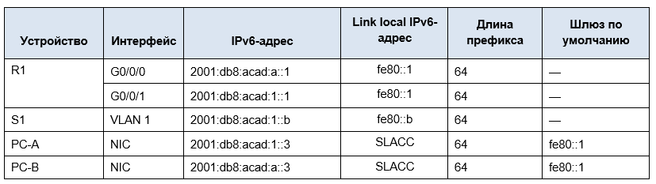

# Лабораторная работа. Настройка IPv6-адресов на сетевых устройствах 

## Топология

вставить картинку

 ## Таблица адресации

 Вставить верную таблицу ниже
 

## Задачи

### Часть 1. Настройка топологии и конфигурация основных параметров маршрутизатора и коммутатора
####   Шаг 1. Настройте маршрутизатор.
####   Шаг 2. Настройте коммутатор.

### Часть 2. Ручная настройка IPv6-адресов

####   Шаг 1. Назначьте IPv6-адреса интерфейсам Ethernet на R1.
####   Шаг 2. Активируйте IPv6-маршрутизацию на R1.
####   Шаг 3. Назначьте IPv6-адреса интерфейсу управления (SVI) на S1.
####   Шаг 4. Назначьте компьютерам статические IPv6-адреса.

### Часть 3. Проверка сквозного соединения

## Сводная таблица по интерфейсам маршрутизаторов
Вставить таблицу

**Примечание.** Чтобы определить конфигурацию маршрутизатора, можно посмотреть на интерфейсы и установить тип маршрутизатора и количество его интерфейсов. Перечислить все комбинации конфигураций для каждого класса маршрутизаторов невозможно. Эта таблица содержит идентификаторы для возможных комбинаций интерфейсов Ethernet и последовательных интерфейсов на устройстве. Другие типы интерфейсов в таблице не представлены, хотя они могут присутствовать в данном конкретном маршрутизаторе. В качестве примера можно привести интерфейс ISDN BRI. Строка в скобках — это официальное сокращение, которое можно использовать в командах Cisco IOS для обозначения интерфейса.

# Решение

### Часть 1. Настройка топологии и конфигурация основных параметров маршрутизатора и коммутатора
После подключения сети, инициализации и перезагрузки маршрутизатора и коммутатора выполните следующие действия:
####    Шаг 1. Настройте маршрутизатор.
Назначьте имя хоста и настройте основные параметры устройства.
a)	Прописываем no ip domain-lookup
domain-lookup1
б)Задаём имя устройству
hostnameR1
в) Шифруем и задаем пароль
encryption1
г) Делаем баннер
banner1

####    Шаг 2. Настройте коммутатор.
Назначьте имя хоста и настройте основные параметры устройства.
a)	Прописываем no ip domain-lookup
domain-lookup2
б)Задаём имя устройству
hostnameS1
в) Шифруем и задаем пароль
encryption2
г) Делаем баннер
banner2

### Часть 2. Ручная настройка IPv6-адресов

####	Шаг 1. Назначьте IPv6-адреса интерфейсам Ethernet на R1.
a)	Назначьте глобальные индивидуальные IPv6-адреса, указанные в таблице адресации обоим интерфейсам Ethernet на R1.
 Назначил IP на интерфейс **gig 0/0**
 вставить картинку НазначениеIPgig00
 
 Установили **link-local address**
 вставить картинку
 Назначил IP на интерфейс gig 0/1 + установил link-local address
 
b)	Введите команду ``show ipv6 interface brief``, чтобы проверить, назначен ли каждому интерфейсу корректный индивидуальный IPv6-адрес.

Примечание. Отображаемый локальный адрес канала основан на адресации EUI-64, которая автоматически использует MAC-адрес интерфейса для создания 128-битного локального IPv6-адреса канала.
Проверяем назначенные IP командой ``show ipv6 interface brief``
c)	Чтобы обеспечить соответствие локальных адресов канала индивидуальному адресу, вручную введите локальные адреса канала на каждом интерфейсе Ethernet на R1.
Примечание. Каждый интерфейс маршрутизатора относится к отдельной сети. Пакеты с локальным адресом канала никогда не выходят за пределы локальной сети, а значит, для обоих интерфейсов можно указывать один и тот же локальный адрес канала.
d)	Используйте выбранную команду, чтобы убедиться, что локальный адрес связи изменен на ``fe80::1``  

Вопрос:
Какие группы многоадресной рассылки назначены интерфейсу G0/0?
Ответ:
``Joined group address(es):
FF02::1
FF02::2
FF02::1:FF00:1``

вставить картинку

####	Шаг 2. Активируйте IPv6-маршрутизацию на R1.
a)	В командной строке на PC-B введите команду ipconfig, чтобы получить данные IPv6-адреса, назначенного интерфейсу ПК.
Вопрос:
Назначен ли индивидуальный IPv6-адрес сетевой интерфейсной карте (NIC) на PC-B?
Нет, только link-local address
вставить картинку
b)	Активируйте IPv6-маршрутизацию на R1 с помощью команды ``ipv6 unicast-routing``.
вставить картинку

####    Шаг 3. Назначьте IPv6-адреса интерфейсу управления (SVI) на S1.
####    Шаг 4. Назначьте компьютерам статические IPv6-адреса.

Скрин 1
Скрин2
Скрин3
Скрин4

### Часть 3. Проверка сквозного соединения.

