# Лабораторная работа. Настройка IPv6-адресов на сетевых устройствах 

## Топология

 ## Таблица адресации

## Задачи

### Часть 1. Настройка топологии и конфигурация основных параметров маршрутизатора и коммутатора
####   Шаг 1. Настройте маршрутизатор.
####   Шаг 2. Настройте коммутатор.

### Часть 2. Ручная настройка IPv6-адресов
####   Шаг 1. Назначьте IPv6-адреса интерфейсам Ethernet на R1.
####   Шаг 2. Активируйте IPv6-маршрутизацию на R1.
####   Шаг 3. Назначьте IPv6-адреса интерфейсу управления (SVI) на S1.
####   Шаг 4. Назначьте компьютерам статические IPv6-адреса.
### Часть 3. Проверка сквозного соединения
## Сводная таблица по интерфейсам маршрутизаторов
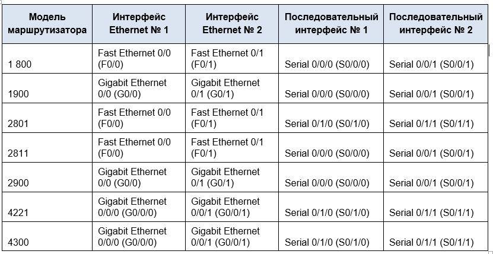

**Примечание.** Чтобы определить конфигурацию маршрутизатора, можно посмотреть на интерфейсы и установить тип маршрутизатора и количество его интерфейсов. Перечислить все комбинации конфигураций для каждого класса маршрутизаторов невозможно. Эта таблица содержит идентификаторы для возможных комбинаций интерфейсов Ethernet и последовательных интерфейсов на устройстве. Другие типы интерфейсов в таблице не представлены, хотя они могут присутствовать в данном конкретном маршрутизаторе. В качестве примера можно привести интерфейс ISDN BRI. Строка в скобках — это официальное сокращение, которое можно использовать в командах Cisco IOS для обозначения интерфейса.

# Решение
### Часть 1. Настройка топологии и конфигурация основных параметров маршрутизатора и коммутатора
После подключения сети, инициализации и перезагрузки маршрутизатора и коммутатора выполните следующие действия:
####    Шаг 1. Настройте маршрутизатор.
Назначьте имя хоста и настройте основные параметры устройства.

a)	Прописываем no ip domain-lookup

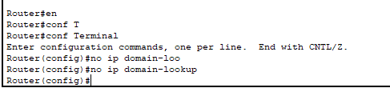

б) Задаём имя устройству

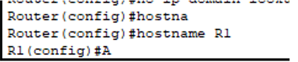

в) Шифруем и задаем пароль

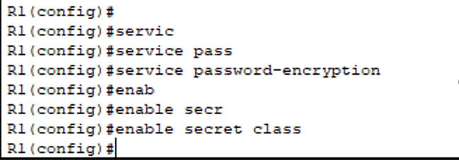

г) Делаем баннер

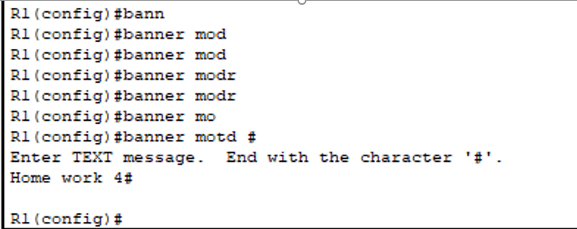

####    Шаг 2. Настройте коммутатор.
Назначьте имя хоста и настройте основные параметры устройства.

a)	Прописываем no ip domain-lookup

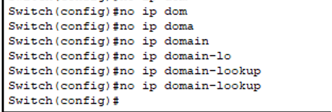 

б) Задаём имя устройству

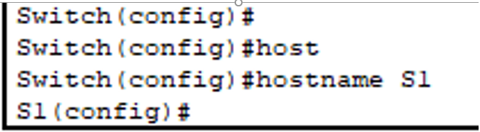

в) Шифруем и задаем пароль

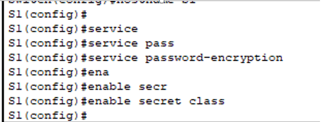

г) Делаем баннер

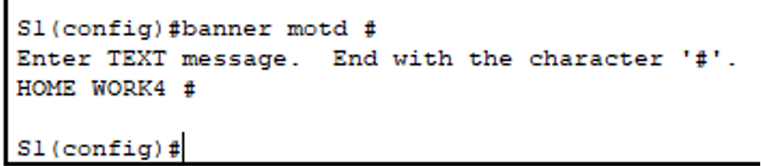

### Часть 2. Ручная настройка IPv6-адресов
####	Шаг 1. Назначьте IPv6-адреса интерфейсам Ethernet на R1.

a)	Назначьте глобальные индивидуальные IPv6-адреса, указанные в таблице адресации обоим интерфейсам Ethernet на R1.

 Назначил IP на интерфейс **gig 0/0**

 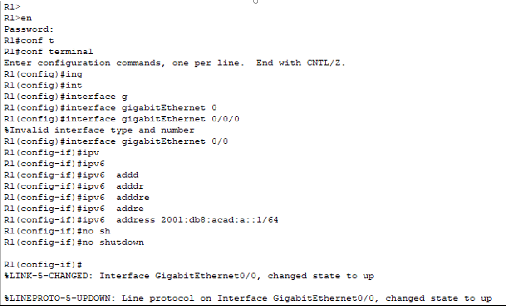
 
 Установил **link-local address**

 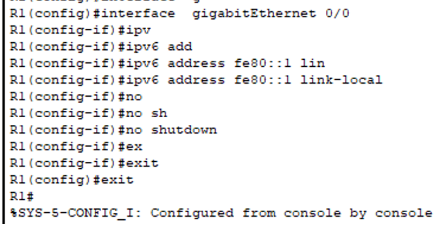

 Назначил IP на интерфейс gig 0/1 + установил link-local address

 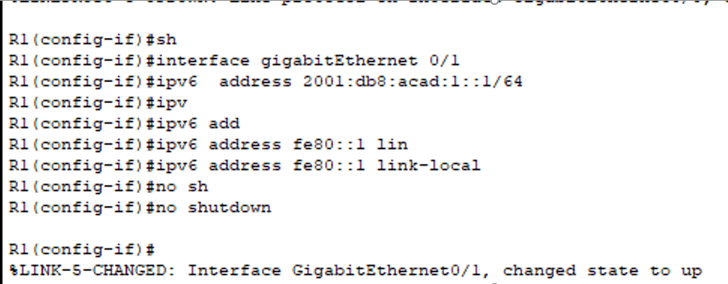

b)	Введите команду ``show ipv6 interface brief``, чтобы проверить, назначен ли каждому интерфейсу корректный индивидуальный IPv6-адрес.

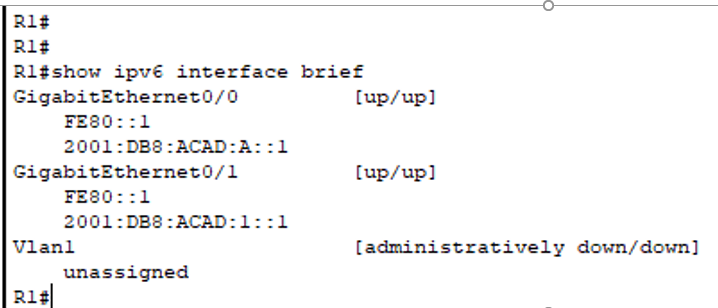

Примечание. Отображаемый локальный адрес канала основан на адресации EUI-64, которая автоматически использует MAC-адрес интерфейса для создания 128-битного локального IPv6-адреса канала.
Проверяем назначенные IP командой ``show ipv6 interface brief``

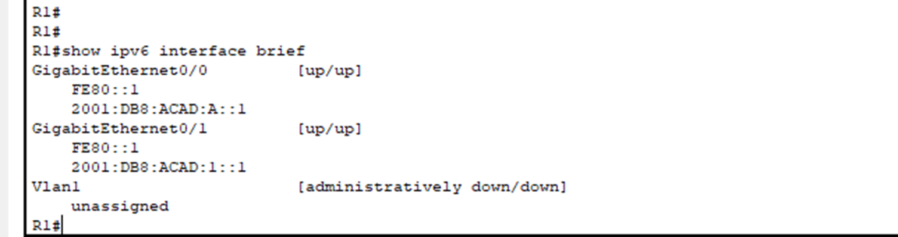

c)	Чтобы обеспечить соответствие локальных адресов канала индивидуальному адресу, вручную введите локальные адреса канала на каждом интерфейсе Ethernet на R1.
Примечание. Каждый интерфейс маршрутизатора относится к отдельной сети. Пакеты с локальным адресом канала никогда не выходят за пределы локальной сети, а значит, для обоих интерфейсов можно указывать один и тот же локальный адрес канала.

d)	Используйте выбранную команду, чтобы убедиться, что локальный адрес связи изменен на ``fe80::1``  

**Вопрос:**
*Какие группы многоадресной рассылки назначены интерфейсу G0/0?*

**Ответ:**
``Joined group address(es):
FF02::1
FF02::2
FF02::1:FF00:1``

####	Шаг 2. Активируйте IPv6-маршрутизацию на R1.

a)	В командной строке на PC-B введите команду ipconfig, чтобы получить данные IPv6-адреса, назначенного интерфейсу ПК.

**Вопрос:**
*Назначен ли индивидуальный IPv6-адрес сетевой интерфейсной карте (NIC) на PC-B?*

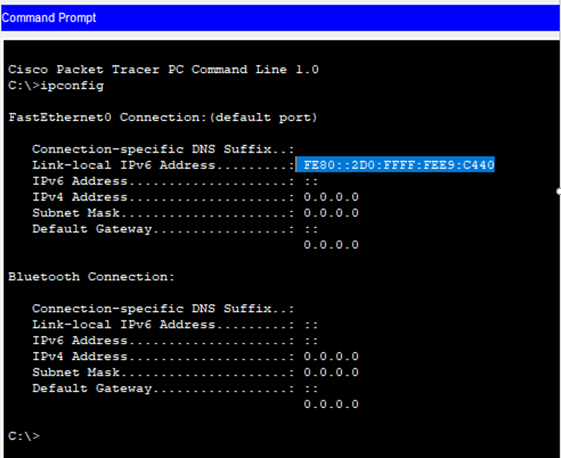
**Ответ:** *Нет, только link-local address*

b)	Активируйте IPv6-маршрутизацию на R1 с помощью команды ``ipv6 unicast-routing``.
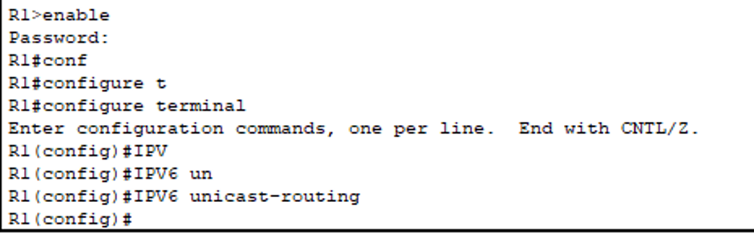

Примечание. Это позволит компьютерам получать IP-адреса и данные шлюза по умолчанию с помощью функции SLAAC (Stateless Address Autoconfiguration (Автоконфигурация без сохранения состояния адреса)).

с) Теперь, когда R1 входит в группу многоадресной рассылки всех маршрутизаторов, еще раз введите команду ``ipconfig`` на PC-B. Проверьте данные IPv6-адреса.

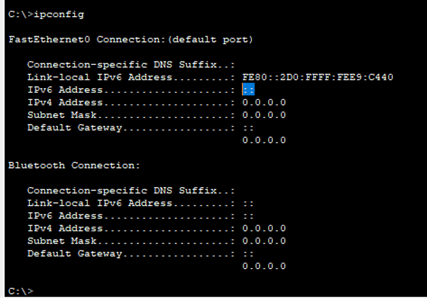

После включения ``ipv6 unicast-routing``.

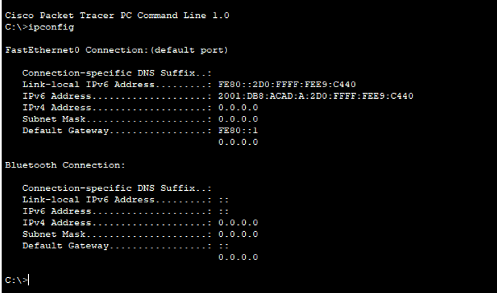

**Вопрос:** *Почему PC-B получил глобальный префикс маршрутизации и идентификатор подсети, которые вы настроили на R1?*

**Ответ:** *Установленного адреса нет.*

####    Шаг 3. Назначьте IPv6-адреса интерфейсу управления (SVI) на S1.
a)	Назначьте адрес IPv6 для S1. Также назначьте этому интерфейсу локальный адрес канала fe80::b

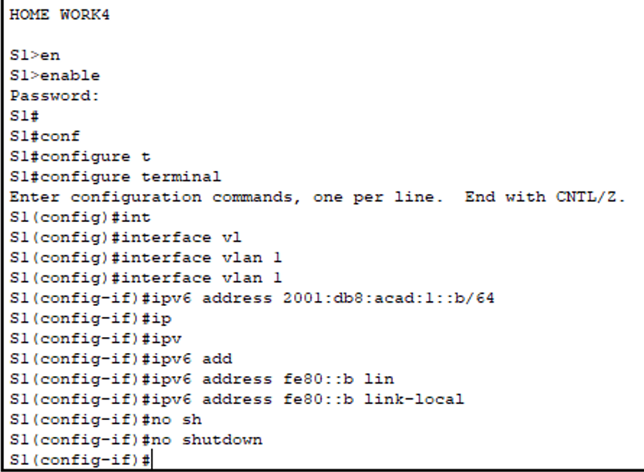

b)	Проверьте правильность назначения IPv6-адресов интерфейсу управления с помощью команды ``show ipv6 interface vlan1``.

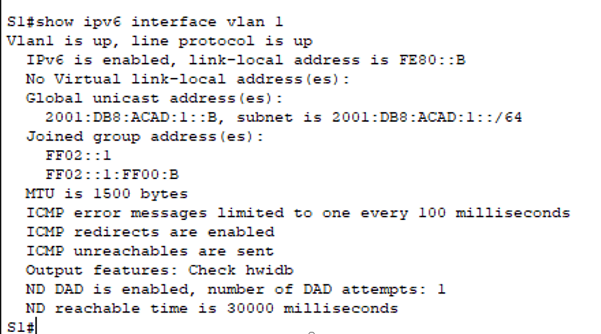

####    Шаг 4. Назначьте компьютерам статические IPv6-адреса.
a)	Откройте окно Свойства Ethernet для каждого ПК и назначьте адресацию IPv6.
b)	Убедитесь, что оба компьютера имеют правильную информацию адреса IPv6. Каждый компьютер должен иметь два глобальных адреса IPv6: один статический и один SLACC.
Примечание. При выполнении работы в среде Cisco Packet Tracer установите статический и SLACC адреса на компьютеры последовательно, отразив результаты в отчете

### Часть 3. Проверка сквозного соединения.

С PC-A отправьте эхо-запрос на FE80::1. Это локальный адрес канала, назначенный G0/1 на R1.

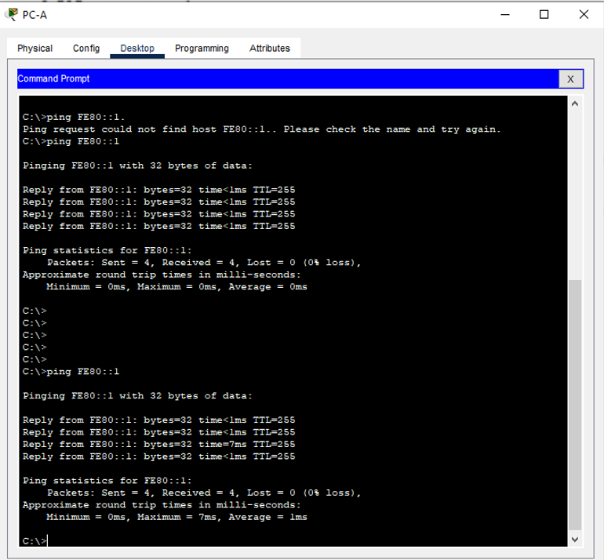

Отправьте эхо-запрос на интерфейс управления S1 с PC-A.

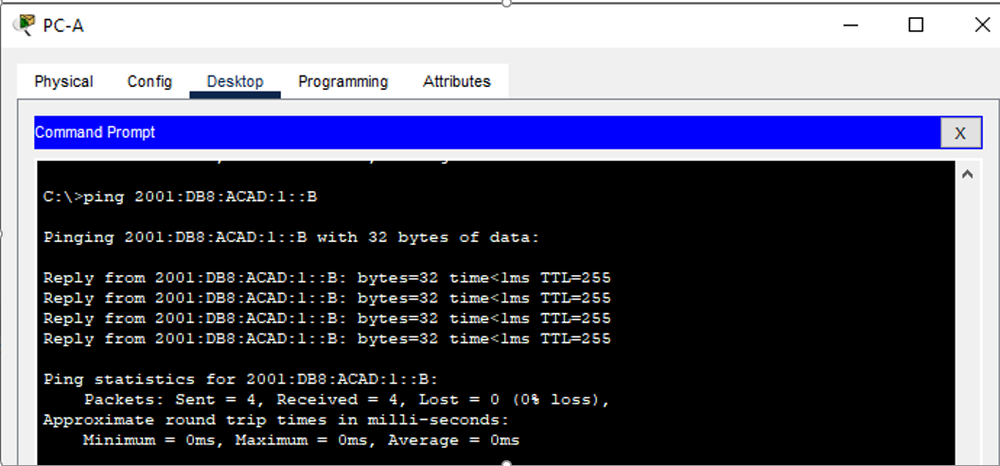

Введите команду ``tracert`` на PC-A, чтобы проверить наличие сквозного подключения к PC-B.
С PC-B отправьте эхо-запрос на PC-A.
С PC-B отправьте эхо-запрос на локальный адрес канала G0/0 на R1.
Примечание.  В случае отсутствия сквозного подключения проверьте, правильно ли указаны IPv6-адреса на всех устройствах.

