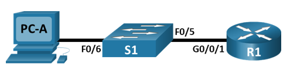
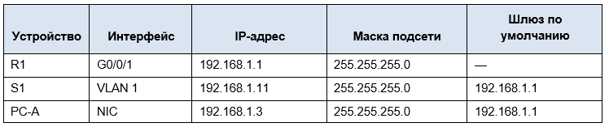
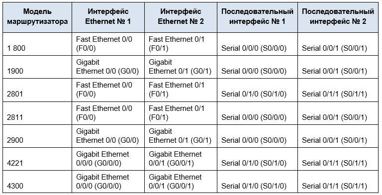
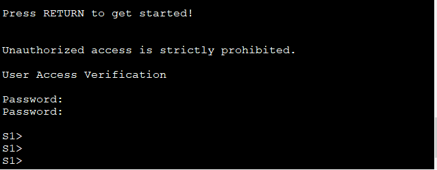

# Лабораторная работа. Доступ к сетевым устройствам по протоколу SSH

## Топология



 ## Таблица адресации


## Сводная таблица по интерфейсам маршрутизаторов



## Задачи

### Часть 1. Настройка основных параметров устройства
### Часть 2. Настройка маршрутизатора для доступа по протоколу SSH
### Часть 3. Настройка коммутатора для доступа по протоколу SSH
### Часть 4. SSH через интерфейс командной строки (CLI) коммутатора


### Часть 1. Настройка основных параметров устройства
В части 1 потребуется настроить топологию сети и основные параметры, такие как IP-адреса интерфейсов, доступ к устройствам и пароли на маршрутизаторе.
####   Шаг 1. Создайте сеть согласно топологии.
####   Шаг 2. Выполните инициализацию и перезагрузку маршрутизатора и коммутатора.
####   Шаг 3. Настройте маршрутизатор.

1.	Подключитесь к маршрутизатору с помощью консоли и активируйте привилегированный режим EXEC.

2.	Войдите в режим конфигурации.

3.	Отключите поиск DNS, чтобы предотвратить попытки маршрутизатора неверно преобразовывать введенные команды таким образом, как будто они являются именами узлов.

4.	Назначьте class в качестве зашифрованного пароля привилегированного режима EXEC.

5.	Назначьте cisco в качестве пароля консоли и включите вход в систему по паролю.

6.	Назначьте cisco в качестве пароля VTY и включите вход в систему по паролю.

7.	Зашифруйте открытые пароли.

8.	Создайте баннер, который предупреждает о запрете несанкционированного доступа.

9.	Настройте и активируйте на маршрутизаторе интерфейс G0/0/1, используя информацию, приведенную в таблице адресации.

10.	Сохраните текущую конфигурацию в файл загрузочной конфигурации.

####  Шаг 4. Настройте компьютер PC-A.
1.	Настройте для PC-A IP-адрес и маску подсети.
2.	Настройте для PC-A шлюз по умолчанию.

#### Шаг 5. Проверьте подключение к сети.
Пошлите с PC-A команду Ping на маршрутизатор R1. Если эхо-запрос с помощью команды ping не проходит, найдите и устраните неполадки подключения.

### Часть 2. Настройка маршрутизатора для доступа по протоколу SSH
 Подключение к сетевым устройствам по протоколу Telnet сопряжено с риском для безопасности, поскольку вся информация передается в виде открытого текста. Протокол SSH шифрует данные сеанса и обеспечивает аутентификацию устройств, поэтому для удаленных подключений рекомендуется использовать именно этот протокол. В части 2 вам нужно настроить маршрутизатор для приема соединений SSH по линиям VTY.
####   Шаг 1.  Настройте аутентификацию устройств.
При генерации ключа шифрования в качестве его части используются имя устройства и домен. Поэтому эти имена необходимо указать перед вводом команды crypto key.
1.	Задайте имя устройства.
2.  Задайте домен для устройства.
####   Шаг 2. Создайте ключ шифрования с указанием его длины.
####   Шаг 3. Шаг 3. Создайте имя пользователя в локальной базе учетных записей.
Настройте имя пользователя, используя admin в качестве имени пользователя и Adm1nP@55 в качестве пароля.

####   Шаг 4. Активируйте протокол SSH на линиях VTY.
1.	Активируйте протоколы Telnet и SSH на входящих линиях VTY с помощью команды transport input.
2.	Измените способ входа в систему таким образом, чтобы использовалась проверка пользователей по локальной базе учетных записей.

#### Шаг 5. Сохраните текущую конфигурацию в файл загрузочной конфигурации.

#### Шаг 6. Установите соединение с маршрутизатором по протоколу SSH.
1.	Запустите Tera Term с PC-A.
2.	Установите SSH-подключение к R1. Use the username admin and password Adm1nP@55. У вас должно получиться установить SSH-подключение к R1.


###  Часть 3. Настройка коммутатора для доступа по протоколу SSH
В части 3 вам предстоит настроить коммутатор для приема подключений по протоколу SSH, а затем установить SSH-подключение с помощью программы Tera Term.

#### Шаг 1. Настройте основные параметры коммутатора.
Откройте окно конфигурации
1.	Подключитесь к коммутатору с помощью консольного подключения и активируйте привилегированный режим EXEC.
2.	Войдите в режим конфигурации.
3.	Отключите поиск DNS, чтобы предотвратить попытки маршрутизатора неверно преобразовывать введенные команды таким образом, как будто они являются именами узлов.
4.	Назначьте class в качестве зашифрованного пароля привилегированного режима EXEC.
5.	Назначьте cisco в качестве пароля консоли и включите вход в систему по паролю.
6.	Назначьте cisco в качестве пароля VTY и включите вход в систему по паролю.
7.	Зашифруйте открытые пароли.
8.	Создайте баннер, который предупреждает о запрете несанкционированного доступа.
9.	Настройте и активируйте на коммутаторе интерфейс VLAN 1, используя информацию, приведенную в таблице адресации.
10.	Сохраните текущую конфигурацию в файл загрузочной конфигурации.

#### Шаг 2. Настройте коммутатор для соединения по протоколу SSH.
Для настройки протокола SSH на коммутаторе используйте те же команды, которые применялись для аналогичной настройки маршрутизатора в части 2.
1.	Настройте имя устройства, как указано в таблице адресации.
2.	Задайте домен для устройства.
3.	Создайте ключ шифрования с указанием его длины.
4.	Создайте имя пользователя в локальной базе учетных записей.
5.	Активируйте протоколы Telnet и SSH на линиях VTY.
6.	Измените способ входа в систему таким образом, чтобы использовалась проверка пользователей по локальной базе учетных записей.

#### Шаг 3. Установите соединение с коммутатором по протоколу SSH.
Запустите программу Tera Term на PC-A, затем установите подключение по протоколу SSH к интерфейсу SVI коммутатора S1.
Вопрос:
Удалось ли вам установить SSH-соединение с коммутатором?

### Часть 4. Настройка протокола SSH с использованием интерфейса командной строки (CLI) коммутатора
 Клиент SSH встроен в операционную систему Cisco IOS и может запускаться из интерфейса командной строки. В части 4 вам предстоит установить соединение с маршрутизатором по протоколу SSH, используя интерфейс командной строки коммутатора.

#### Шаг 1. Посмотрите доступные параметры для клиента SSH в Cisco IOS.
 Используйте вопросительный знак (?), чтобы отобразить варианты параметров для команды `ssh`.
```
S1# ssh? 
  -c Select encryption algorithm
  -l Log in using this user name
  -m Select HMAC algorithm
  -o Specify options
  -p Connect to this port
  -v Specify SSH Protocol Version
  -vrf Specify vrf name
  ````
  **WORD IP-адрес или имя хоста удаленной системы**

#### Шаг 2. Установите с коммутатора S1 соединение с маршрутизатором R1 по протоколу SSH.
1.	Чтобы подключиться к маршрутизатору R1 по протоколу SSH, введите команду –l admin. Это позволит вам войти в систему под именем admin. При появлении приглашения введите в качестве пароля **Adm1nP@55**
```
S1# ssh -l admin 192.168.1.1
Password: 
Authorized Users Only!
R1>
```

2.	Чтобы вернуться к коммутатору S1, не закрывая сеанс SSH с маршрутизатором R1, нажмите комбинацию клавиш **Ctrl+Shift+6**. Отпустите клавиши **Ctrl+Shift+6** и нажмите **x**. 

Отображается приглашение привилегированного режима EXEC коммутатора.
```
R1>
S1#
````

3.	Чтобы вернуться к сеансу SSH на R1, нажмите клавишу **Enter** в пустой строке интерфейса командной строки. Чтобы увидеть окно командной строки маршрутизатора, нажмите клавишу **Enter** еще раз.
```
S1#
[Resuming connection 1 to 192.168.1.1 ... ]
R1>
```

4.	Чтобы завершить сеанс SSH на маршрутизаторе R1, введите в командной строке маршрутизатора команду `exit`.
```
R1# exit
[Connection to 192.168.1.1 closed by foreign host]
S1#
```

**Вопрос: Какие версии протокола SSH поддерживаются при использовании интерфейса командной строки?**

**Ответ:** *Используются версии 1.99, можно переключиться на 2.0*


# Решение

### Часть 1. Настройка основных параметров устройства
####    Шаг 1. Создайте сеть согласно топологии. 
####    Шаг 2. Выполните инициализацию и перезагрузку маршрутизатора и коммутатора.
####    Шаг 3. Настройте маршрутизатор.

1.	Подключитесь к маршрутизатору с помощью консоли и активируйте привилегированный режим EXEC.

2.	Войдите в режим конфигурации.


3.	Отключите поиск DNS, чтобы предотвратить попытки маршрутизатора неверно преобразовывать введенные команды таким образом, как будто они являются именами узлов.


 
4.	Назначьте class в качестве зашифрованного пароля привилегированного режима EXEC.

5.	Назначьте cisco в качестве пароля консоли и включите вход в систему по паролю.

6.	Назначьте cisco в качестве пароля VTY и включите вход в систему по паролю.

7.	Зашифруйте открытые пароли.

8.	Создайте баннер, который предупреждает о запрете несанкционированного доступа.

9.	Настройте и активируйте на маршрутизаторе интерфейс G0/0/1, используя информацию, приведенную в таблице адресации.

10.	Сохраните текущую конфигурацию в файл загрузочной конфигурации.

#### Шаг 4. Настройте компьютер PC-A.
1.	Настройте для PC-A IP-адрес и маску подсети.
2.	Настройте для PC-A шлюз по умолчанию.

#### Шаг 5. Проверьте подключение к сети.
Пошлите с PC-A команду `ping` на маршрутизатор R1. 
Если эхо-запрос с помощью команды `ping` не проходит, найдите и устраните неполадки подключения.


### Часть 2. Настройка маршрутизатора для доступа по протоколу SSH
#### Шаг 1. Настройте аутентификацию устройств.
При генерации ключа шифрования в качестве его части используются имя устройства и домен. Поэтому эти имена необходимо указать перед вводом команды crypto key.
Откройте окно конфигурации
1.	Задайте имя устройства.
2.	Задайте домен для устройства.

#### Шаг 2. Создайте ключ шифрования с указанием его длины.
#### Шаг 3. Создайте имя пользователя в локальной базе учетных записей.
Настройте имя пользователя, используя admin в качестве имени пользователя и Adm1nP @55 в качестве пароля.
#### Шаг 4. Активируйте протокол SSH на линиях VTY.
1.	Активируйте протоколы Telnet и SSH на входящих линиях VTY с помощью команды transport input.
2.	Измените способ входа в систему таким образом, чтобы использовалась проверка пользователей по локальной базе учетных записей.
#### Шаг 5. Сохраните текущую конфигурацию в файл загрузочной конфигурации.
#### Шаг 6. Установите соединение с маршрутизатором по протоколу SSH.
1.	Запустите Tera Term с PC-A.
2.	Установите SSH-подключение к R1. Use the username admin and password Adm1nP@55. У вас должно получиться установить SSH-подключение к R1.


###  Часть 3. Настройка коммутатора для доступа по протоколу SSH
В части 3 вам предстоит настроить коммутатор для приема подключений по протоколу SSH, а затем установить SSH-подключение с помощью программы Tera Term.

#### Шаг 1. Настройте основные параметры коммутатора.
Откройте окно конфигурации
1.	Подключитесь к коммутатору с помощью консольного подключения и активируйте привилегированный режим EXEC.
2.	Войдите в режим конфигурации.

```
Switch#
Switch#
Switch#en
Switch#conf t
Switch(config)#
```

3.	Отключите поиск DNS, чтобы предотвратить попытки маршрутизатора неверно преобразовывать введенные команды таким образом, как будто они являются именами узлов.

 Прописываем `no ip domain-lookup`
```
Switch>
Switch>en
Switch#conf t
Switch(config)#no ip domain-look
Switch(config)#no ip domain-lookup 
Switch(config)#
```
Сразу зададим имя устройству: 
```
Switch#>
Switch# hostname S1
```
Дополнительно воспользуемся параметром ```logging synchronous```. чтобы консольные сообщения не прерывали выполнение команд.

Пропишем на устройстве:
```
Switch#en
Switch#enable 
Switch#conf t
Switch(config)#line con 
Switch(config)#line con 0
Switch(config-line)#loggin
Switch(config-line)#logging syn
Switch(config-line)#logging synchronous 
Switch(config-line)#
```

4.	Назначьте class в качестве зашифрованного пароля привилегированного режима EXEC.

Выполним команду `enable secret class`

`S1(config)#enable secret class`

5.	Назначьте cisco в качестве пароля консоли и включите вход в систему по паролю.


6.	Назначьте cisco в качестве пароля VTY и включите вход в систему по паролю.

Воспользуемся коммандой : `password`

```
S1(config)#
S1(config)#line
S1(config)#line con
S1(config)#line console 0
S1(config-line)#password cisco
S1(config-line)#login
S1(config-line)#end
S1#
```

7.	Зашифруйте открытые пароли.

Выполним команду `service password-encryption`

`S1(config)#service password-encryption`

8.	Создайте баннер, который предупреждает о запрете несанкционированного доступа.

`S1(config)#banner motd #`

Скриншот при входе:



9.	Настройте и активируйте на коммутаторе интерфейс VLAN 1, используя информацию, приведенную в таблице адресации.
10.	Сохраните текущую конфигурацию в файл загрузочной конфигурации.

#### Шаг 2. Настройте коммутатор для соединения по протоколу SSH.
Для настройки протокола SSH на коммутаторе используйте те же команды, которые применялись для аналогичной настройки маршрутизатора в части 2.
1.	Настройте имя устройства, как указано в таблице адресации.
2.	Задайте домен для устройства.
3.	Создайте ключ шифрования с указанием его длины.
4.	Создайте имя пользователя в локальной базе учетных записей.
5.	Активируйте протоколы Telnet и SSH на линиях VTY.
6.	Измените способ входа в систему таким образом, чтобы использовалась проверка пользователей по локальной базе учетных записей.

#### Шаг 3. Установите соединение с коммутатором по протоколу SSH.
Запустите программу Tera Term на PC-A, затем установите подключение по протоколу SSH к интерфейсу SVI коммутатора S1.
Вопрос:
Удалось ли вам установить SSH-соединение с коммутатором?

### Часть 4. Настройка протокола SSH с использованием интерфейса командной строки (CLI) коммутатора
 Клиент SSH встроен в операционную систему Cisco IOS и может запускаться из интерфейса командной строки. В части 4 вам предстоит установить соединение с маршрутизатором по протоколу SSH, используя интерфейс командной строки коммутатора.

#### Шаг 1. Посмотрите доступные параметры для клиента SSH в Cisco IOS.
 Используйте вопросительный знак (?), чтобы отобразить варианты параметров для команды `ssh`.


