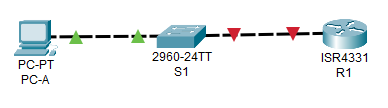
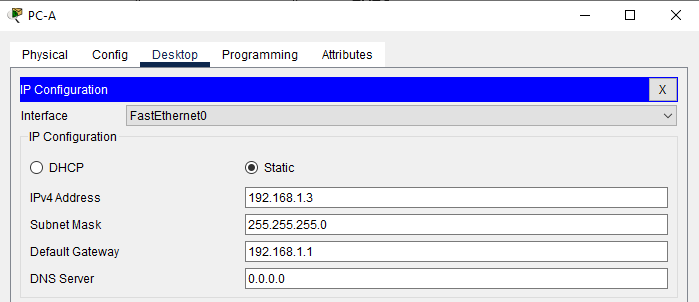

# Лабораторная работа. Доступ к сетевым устройствам по протоколу SSH

## Топология


 ## Таблица адресации


## Сводная таблица по интерфейсам маршрутизаторов


## Задачи

### Часть 1. Настройка основных параметров устройства
### Часть 2. Настройка маршрутизатора для доступа по протоколу SSH
### Часть 3. Настройка коммутатора для доступа по протоколу SSH
### Часть 4. SSH через интерфейс командной строки (CLI) коммутатора

## Инструкции

### Часть 1. Настройка основных параметров устройства
В части 1 потребуется настроить топологию сети и основные параметры, такие как IP-адреса интерфейсов, доступ к устройствам и пароли на маршрутизаторе.
####   Шаг 1. Создайте сеть согласно топологии.
####   Шаг 2. Выполните инициализацию и перезагрузку маршрутизатора и коммутатора.
####   Шаг 3. Настройте маршрутизатор.

1.	Подключитесь к маршрутизатору с помощью консоли и активируйте привилегированный режим EXEC.

2.	Войдите в режим конфигурации.

3.	Отключите поиск DNS, чтобы предотвратить попытки маршрутизатора неверно преобразовывать введенные команды таким образом, как будто они являются именами узлов.

4.	Назначьте class в качестве зашифрованного пароля привилегированного режима EXEC.

5.	Назначьте cisco в качестве пароля консоли и включите вход в систему по паролю.

6.	Назначьте cisco в качестве пароля VTY и включите вход в систему по паролю.

7.	Зашифруйте открытые пароли.

8.	Создайте баннер, который предупреждает о запрете несанкционированного доступа.

9.	Настройте и активируйте на маршрутизаторе интерфейс G0/0/1, используя информацию, приведенную в таблице адресации.

10.	Сохраните текущую конфигурацию в файл загрузочной конфигурации.

####  Шаг 4. Настройте компьютер PC-A.
1.	Настройте для PC-A IP-адрес и маску подсети.
2.	Настройте для PC-A шлюз по умолчанию.

#### Шаг 5. Проверьте подключение к сети.
Пошлите с PC-A команду Ping на маршрутизатор R1. Если эхо-запрос с помощью команды ping не проходит, найдите и устраните неполадки подключения.

### Часть 2. Настройка маршрутизатора для доступа по протоколу SSH
 Подключение к сетевым устройствам по протоколу Telnet сопряжено с риском для безопасности, поскольку вся информация передается в виде открытого текста. Протокол SSH шифрует данные сеанса и обеспечивает аутентификацию устройств, поэтому для удаленных подключений рекомендуется использовать именно этот протокол. В части 2 вам нужно настроить маршрутизатор для приема соединений SSH по линиям VTY.
####   Шаг 1.  Настройте аутентификацию устройств.
При генерации ключа шифрования в качестве его части используются имя устройства и домен. Поэтому эти имена необходимо указать перед вводом команды crypto key.
1.	Задайте имя устройства.
2.  Задайте домен для устройства.
####   Шаг 2. Создайте ключ шифрования с указанием его длины.
####   Шаг 3. Шаг 3. Создайте имя пользователя в локальной базе учетных записей.
Настройте имя пользователя, используя admin в качестве имени пользователя и Adm1nP@55 в качестве пароля.

####   Шаг 4. Активируйте протокол SSH на линиях VTY.
1.	Активируйте протоколы Telnet и SSH на входящих линиях VTY с помощью команды `transport input`.
2.	Измените способ входа в систему таким образом, чтобы использовалась проверка пользователей по локальной базе учетных записей.

#### Шаг 5. Сохраните текущую конфигурацию в файл загрузочной конфигурации.

#### Шаг 6. Установите соединение с маршрутизатором по протоколу SSH.
1.	Запустите Tera Term с PC-A.
2.	Установите SSH-подключение к R1. Use the username admin and password Adm1nP@55. У вас должно получиться установить SSH-подключение к R1.

###  Часть 3. Настройка коммутатора для доступа по протоколу SSH
В части 3 вам предстоит настроить коммутатор для приема подключений по протоколу SSH, а затем установить SSH-подключение с помощью программы Tera Term.

#### Шаг 1. Настройте основные параметры коммутатора.
Откройте окно конфигурации
1.	Подключитесь к коммутатору с помощью консольного подключения и активируйте привилегированный режим EXEC.
2.	Войдите в режим конфигурации.
3.	Отключите поиск DNS, чтобы предотвратить попытки маршрутизатора неверно преобразовывать введенные команды таким образом, как будто они являются именами узлов.
4.	Назначьте class в качестве зашифрованного пароля привилегированного режима EXEC.
5.	Назначьте cisco в качестве пароля консоли и включите вход в систему по паролю.
6.	Назначьте cisco в качестве пароля VTY и включите вход в систему по паролю.
7.	Зашифруйте открытые пароли.
8.	Создайте баннер, который предупреждает о запрете несанкционированного доступа.
9.	Настройте и активируйте на коммутаторе интерфейс VLAN 1, используя информацию, приведенную в таблице адресации.
10.	Сохраните текущую конфигурацию в файл загрузочной конфигурации.

#### Шаг 2. Настройте коммутатор для соединения по протоколу SSH.
Для настройки протокола SSH на коммутаторе используйте те же команды, которые применялись для аналогичной настройки маршрутизатора в части 2.
1.	Настройте имя устройства, как указано в таблице адресации.
2.	Задайте домен для устройства.
3.	Создайте ключ шифрования с указанием его длины.
4.	Создайте имя пользователя в локальной базе учетных записей.
5.	Активируйте протоколы Telnet и SSH на линиях VTY.
6.	Измените способ входа в систему таким образом, чтобы использовалась проверка пользователей по локальной базе учетных записей.

#### Шаг 3. Установите соединение с коммутатором по протоколу SSH.
Запустите программу Tera Term на PC-A, затем установите подключение по протоколу SSH к интерфейсу SVI коммутатора S1.
Вопрос:
Удалось ли вам установить SSH-соединение с коммутатором?

### Часть 4. Настройка протокола SSH с использованием интерфейса командной строки (CLI) коммутатора
 Клиент SSH встроен в операционную систему Cisco IOS и может запускаться из интерфейса командной строки. В части 4 вам предстоит установить соединение с маршрутизатором по протоколу SSH, используя интерфейс командной строки коммутатора.

#### Шаг 1. Посмотрите доступные параметры для клиента SSH в Cisco IOS.

Используйте вопросительный знак (?), чтобы отобразить варианты параметров для команды `ssh`.
```
S1# ssh? 
  -c Select encryption algorithm
  -l Log in using this user name
  -m Select HMAC algorithm
  -o Specify options
  -p Connect to this port
  -v Specify SSH Protocol Version
  -vrf Specify vrf name
  ```


#### Шаг 2. Установите с коммутатора S1 соединение с маршрутизатором R1 по протоколу SSH.
1.	Чтобы подключиться к маршрутизатору R1 по протоколу SSH, введите команду –l admin. Это позволит вам войти в систему под именем admin. При появлении приглашения введите в качестве пароля **Adm1nP@55**
```
S1# ssh -l admin 192.168.1.1
Password: 
Authorized Users Only!
R1>
```
2.	Чтобы вернуться к коммутатору S1, не закрывая сеанс SSH с маршрутизатором R1, нажмите комбинацию клавиш **Ctrl+Shift+6**. Отпустите клавиши **Ctrl+Shift+6** и нажмите **x**. 

Отображается приглашение привилегированного режима EXEC коммутатора.
```
R1>
S1#
```

3.	Чтобы вернуться к сеансу SSH на R1, нажмите клавишу **Enter** в пустой строке интерфейса командной строки. Чтобы увидеть окно командной строки маршрутизатора, нажмите клавишу **Enter** еще раз.
```
S1#
[Resuming connection 1 to 192.168.1.1 ... ]
R1>
```

4.	Чтобы завершить сеанс SSH на маршрутизаторе R1, введите в командной строке маршрутизатора команду `exit`.
```
R1# exit
[Connection to 192.168.1.1 closed by foreign host]
S1#
```

**Вопрос: Какие версии протокола SSH поддерживаются при использовании интерфейса командной строки?**

**Ответ:** *Используются версии 1.99, можно переключиться на 2.0*


# Решение

### Часть 1. Настройка основных параметров устройства
####    Шаг 1. Создайте сеть согласно топологии. 

####    Шаг 2. Выполните инициализацию и перезагрузку маршрутизатора и коммутатора.
####    Шаг 3. Настройте маршрутизатор.

1.	Подключитесь к маршрутизатору с помощью консоли и активируйте привилегированный режим EXEC.

Выполним подключение и смену имени:

`R1#enable` 

Зададим имя маршрутизатору: 

`Router(config)#hostname R1`

2.	Войдите в режим конфигурации.


3.	Отключите поиск DNS, чтобы предотвратить попытки маршрутизатора неверно преобразовывать введенные команды таким образом, как будто они являются именами узлов.

```
R1#enable
R1#configure terminal 
R1(config)#no ip domain-lookup
R1(config)#
```
 
Дополнительно воспользуемся параметром logging synchronous. чтобы консольные сообщения не прерывали выполнение команд.

Пропишем на устройстве:

```
R1(config)#
R1(config)#line con 0
R1(config-line)#logging synchronous 
R1(config-line)#
```

4.	Назначьте class в качестве зашифрованного пароля привилегированного режима EXEC.

Выполним команду `enable secret class`

`R1(config)#enable secret class`

5.	Назначьте cisco в качестве пароля консоли и включите вход в систему по паролю.

6.	Назначьте cisco в качестве пароля VTY и включите вход в систему по паролю.

Воспользуемся коммандой : `password`

```
R1(config)#
R1(config)#line console 0
R1(config-line)#password cisco
R1(config-line)#login
R1(config-line)#end
R1#
```

7.	Зашифруйте открытые пароли.

Выполним команду `service password-encryption`

`R1(config)#service password-encryption`

8.	Создайте баннер, который предупреждает о запрете несанкционированного доступа.

`R1(config)#banner motd #`

Скриншот при входе:


9.	Настройте и активируйте на маршрутизаторе интерфейс G0/0/1, используя информацию, приведенную в таблице адресации.

```
R1(config)#
R1(config)#interface gigabitEthernet 0/0/1
R1(config-if)#ip address 192.168.1.1 255.255.255.0
R1(config-if)#no shutdown 
R1(config-if)#
```

10.	Сохраните текущую конфигурацию в файл загрузочной конфигурации.

Выполним команду : `copy running-config startup-config `

```
R1#cop
R1#copy ru
R1#copy running-config s
R1#copy running-config st
R1#copy running-config startup-config 
Destination filename [startup-config]? startup-config
Building configuration...
[OK]
R1#
```

#### Шаг 4. Настройте компьютер PC-A.
1.	Настройте для PC-A IP-адрес и маску подсети.
2.	Настройте для PC-A шлюз по умолчанию.



#### Шаг 5. Проверьте подключение к сети.
Пошлите с PC-A команду `ping` на маршрутизатор R1. 

Проверим IP адрес PC-A и выполним команду `ping`

```
C:\>ipconfig

FastEthernet0 Connection:(default port)

   Connection-specific DNS Suffix..: 
   Link-local IPv6 Address.........: FE80::250:FFF:FE0E:BD04
   IPv6 Address....................: ::
   IPv4 Address....................: 192.168.1.3
   Subnet Mask.....................: 255.255.255.0
   Default Gateway.................: ::
                                     192.168.1.1

Bluetooth Connection:

   Connection-specific DNS Suffix..: 
   Link-local IPv6 Address.........: ::
   IPv6 Address....................: ::
   IPv4 Address....................: 0.0.0.0
   Subnet Mask.....................: 0.0.0.0
   Default Gateway.................: ::
                                     0.0.0.0

C:\>ping 192.168.1.1

Pinging 192.168.1.1 with 32 bytes of data:

Reply from 192.168.1.1: bytes=32 time=7ms TTL=255
Reply from 192.168.1.1: bytes=32 time<1ms TTL=255
Reply from 192.168.1.1: bytes=32 time<1ms TTL=255
Reply from 192.168.1.1: bytes=32 time<1ms TTL=255

Ping statistics for 192.168.1.1:
    Packets: Sent = 4, Received = 4, Lost = 0 (0% loss),
Approximate round trip times in milli-seconds:
    Minimum = 0ms, Maximum = 7ms, Average = 1ms

C:\>

```

Если эхо-запрос с помощью команды `ping` не проходит, найдите и устраните неполадки подключения.


### Часть 2. Настройка маршрутизатора для доступа по протоколу SSH
#### Шаг 1. Настройте аутентификацию устройств.
При генерации ключа шифрования в качестве его части используются имя устройства и домен. Поэтому эти имена необходимо указать перед вводом команды crypto key.
Откройте окно конфигурации
1.	Задайте имя устройства.

Имя устройства было задано ранее, при первичной настройке.

2.	Задайте домен для устройства.

Выполним команду: `ip domain-name`

```
R1(config)#
R1(config)#ip domain-name mycompany.local
R1(config)#
```

#### Шаг 2. Создайте ключ шифрования с указанием его длины.

Выполним команду: `crypto key generate rsa general-keys modulus 2048`

```
R1(config)#crypto key generate rsa general-keys mo
R1(config)#crypto key generate rsa general-keys modulus 2048
The name for the keys will be: R1.mycompany.local

% The key modulus size is 2048 bits
% Generating 2048 bit RSA keys, keys will be non-exportable...[OK]
*Mar 1 0:38:37.210: %SSH-5-ENABLED: SSH 1.99 has been enabled
R1(config)#
```
Из вывода видим, что используется версия SSH 1.99 ( является не криптостойкой.)
Выполним команду `ip ssh version 2`

```
R1(config)#ip ssh version 2
R1(config)#
```

Проверить текущую версию можно командой: `do show ip ssh`

```
R1(config)#do show ip ssh
SSH Enabled - version 2.0
Authentication timeout: 120 secs; Authentication retries: 3
R1(config)#
```

Также допускается из режима enable

```
R1#show ip ssh 
SSH Enabled - version 2.0
Authentication timeout: 120 secs; Authentication retries: 3
R1#
```


#### Шаг 3. Создайте имя пользователя в локальной базе учетных записей.
Настройте имя пользователя, используя admin в качестве имени пользователя и Adm1nP@55 в качестве пароля.

Выполним команду: `username admin privilege 15 secret Adm1nP@55`

```
R1(config)#
R1(config)#username admin privilege 15 secret Adm1nP@55
R1(config)#
```


#### Шаг 4. Активируйте протокол SSH на линиях VTY.
1.	Активируйте протоколы Telnet и SSH на входящих линиях VTY с помощью команды transport input.

```
R1(config-line)#transport input all
R1(config-line)#
```
2.	Измените способ входа в систему таким образом, чтобы использовалась проверка пользователей по локальной базе учетных записей.

Выполним команду `login local`

```
R1(config-line)#login local 
R1(config-line)#
```

#### Шаг 5. Сохраните текущую конфигурацию в файл загрузочной конфигурации.

Выполним перезапись конфига.

```
R1#copy running-config startup-config 
Destination filename [startup-config]? startup-config
Building configuration...
[OK]
R1#
```


Выведем полный конфиг комнадой `show running-config`

```
R1#show running-config 
Building configuration...

Current configuration : 981 bytes
!
version 15.4
no service timestamps log datetime msec
no service timestamps debug datetime msec
service password-encryption
!
hostname R1
!

!
enable secret 5 $1$mERr$9cTjUIEqNGurQiFU.ZeCi1
!

ip cef
no ipv6 cef
!
!
username admin privilege 15 secret 5 $1$mERr$qJb.eHvBN7S590aq.dpRL.
!
ip ssh version 2
no ip domain-lookup
ip domain-name mycompany.local
!
spanning-tree mode pvst
!
interface GigabitEthernet0/0/0
 no ip address
 duplex auto
 speed auto
 shutdown
!
interface GigabitEthernet0/0/1
 ip address 192.168.1.1 255.255.255.0
 duplex auto
 speed auto
!
interface GigabitEthernet0/0/2
 no ip address
 duplex auto
 speed auto
 shutdown
!
interface Vlan1
 no ip address
 shutdown
!
ip classless
!
ip flow-export version 9
!
banner motd ^C
Unauthorized access is strictly prohibited.^C
!
line con 0
 password 7 0822455D0A16
 logging synchronous
 login
!
line aux 0
!
line vty 0 4
 login local
line vty 5
 login local
!
!
end
```


#### Шаг 6. Установите соединение с маршрутизатором по протоколу SSH.
1.	Запустите Tera Term с PC-A.
2.	Установите SSH-подключение к R1. Use the username admin and password Adm1nP@55. У вас должно получиться установить SSH-подключение к R1.


`ssh -l admin 192.168.1.1`

Потребуется ввести пароль, вводим и жмём Enter

```
C:\>ssh
Cisco Packet Tracer PC SSH

Usage: SSH -l username target

C:\>ssh -l admin 192.168.1.1 

Password: 

Unauthorized access is strictly prohibited.

R1#
```

Как мы видим из вывода подключение успешно и  мы сразу окаазались привилигированном режиме, т.к при создании пользователя мы указали  максимальный уровень привелегий. `privilege 15`


###  Часть 3. Настройка коммутатора для доступа по протоколу SSH
В части 3 вам предстоит настроить коммутатор для приема подключений по протоколу SSH, а затем установить SSH-подключение с помощью программы Tera Term.

#### Шаг 1. Настройте основные параметры коммутатора.
Откройте окно конфигурации
1.	Подключитесь к коммутатору с помощью консольного подключения и активируйте привилегированный режим EXEC.
2.	Войдите в режим конфигурации.

```
Switch#
Switch#
Switch#en
Switch#conf t
Switch(config)#
```

3.	Отключите поиск DNS, чтобы предотвратить попытки маршрутизатора неверно преобразовывать введенные команды таким образом, как будто они являются именами узлов.

 Прописываем `no ip domain-lookup`
```
Switch>
Switch>en
Switch#conf t
Switch(config)#no ip domain-look
Switch(config)#no ip domain-lookup 
Switch(config)#
```
Сразу зададим имя устройству: 
```
Switch#>
Switch# hostname S1
```
Дополнительно воспользуемся параметром ```logging synchronous```. чтобы консольные сообщения не прерывали выполнение команд.

Пропишем на устройстве:
```
Switch#en
Switch#enable 
Switch#conf t
Switch(config)#line con 
Switch(config)#line con 0
Switch(config-line)#loggin
Switch(config-line)#logging syn
Switch(config-line)#logging synchronous 
Switch(config-line)#
```

4.	Назначьте class в качестве зашифрованного пароля привилегированного режима EXEC.

Выполним команду `enable secret class`

`S1(config)#enable secret class`

5.	Назначьте cisco в качестве пароля консоли и включите вход в систему по паролю.


6.	Назначьте cisco в качестве пароля VTY и включите вход в систему по паролю.

Воспользуемся коммандой : `password`

```
S1(config)#
S1(config)#line
S1(config)#line con
S1(config)#line console 0
S1(config-line)#password cisco
S1(config-line)#login
S1(config-line)#end
S1#
```

7.	Зашифруйте открытые пароли.

Выполним команду `service password-encryption`

`S1(config)#service password-encryption`

8.	Создайте баннер, который предупреждает о запрете несанкционированного доступа.

`S1(config)#banner motd #`

Скриншот при входе:


9.	Настройте и активируйте на коммутаторе интерфейс VLAN 1, используя информацию, приведенную в таблице адресации.

Назначим IP Адресс:

```
S1>en
Password: 
S1#conf t
S1(config)#interface vlan 1
S1(config-if)#ip address 192.168.1.11 255.255.255.0
S1(config-if)#no shutdown 
S1(config-if)#exit
S1(config)#ip default-gateway 192.168.1.1
S1(config)#exit 
S1#
```


10.	Сохраните текущую конфигурацию в файл загрузочной конфигурации.

```
S1>enable 
Password: 
S1#
S1#copy running-config startup-config 
Destination filename [startup-config]? startup-config
Building configuration...
[OK]
S1#
```


#### Шаг 2. Настройте коммутатор для соединения по протоколу SSH.
Для настройки протокола SSH на коммутаторе используйте те же команды, которые применялись для аналогичной настройки маршрутизатора в части 2.
1.	Настройте имя устройства, как указано в таблице адресации.

Имя задано при первичной настройке.

2.	Задайте домен для устройства.

Выполним команду: `ip domain-name`

```
S1(config)#ip domain-name mycompany.local
S1(config)#
```

3.	Создайте ключ шифрования с указанием его длины.

Выполним команду: `crypto key generate rsa general-keys modulus 2048`

```
S1(config)#crypto key generate rsa general-keys modulus 2048
The name for the keys will be: S1.mycompany.local

% The key modulus size is 2048 bits
% Generating 2048 bit RSA keys, keys will be non-exportable...[OK]
*Mar 1 2:11:18.76: %SSH-5-ENABLED: SSH 1.99 has been enabled
S1(config)#
```
Сменим версию SSH:

```
S1(config)#ip ssh version 2
S1(config)#do show ip ssh
SSH Enabled - version 2.0
Authentication timeout: 120 secs; Authentication retries: 3
S1(config)#
```


4.	Создайте имя пользователя в локальной базе учетных записей.

Выполним команду: `username admin privilege 15 secret Adm1nP@55`

```
S1(config)#username admin privilege 15 secret Adm1nP@55
S1(config)#
```

5.	Активируйте протоколы Telnet и SSH на линиях VTY.

Выполним команду: `line vty 0 5` и `transport input all` 

```
S1(config)#line vty 0 5
S1(config-line)#tran
S1(config-line)#transport in
S1(config-line)#transport input all
S1(config-line)#
```

6.	Измените способ входа в систему таким образом, чтобы использовалась проверка пользователей по локальной базе учетных записей.

```
S1(config-line)#login local 
S1(config-line)#
```

Сохраняем настройки, выполнимм: `write`

```
S1#write 
Building configuration...
[OK]
S1#
```

#### Шаг 3. Установите соединение с коммутатором по протоколу SSH.
Запустите программу Tera Term на PC-A, затем установите подключение по протоколу SSH к интерфейсу SVI коммутатора S1.

Выполним ping с PC-А до S1

```
C:\>ping 192.168.1.11

Pinging 192.168.1.11 with 32 bytes of data:

Reply from 192.168.1.11: bytes=32 time<1ms TTL=255
Reply from 192.168.1.11: bytes=32 time<1ms TTL=255
Reply from 192.168.1.11: bytes=32 time<1ms TTL=255
Reply from 192.168.1.11: bytes=32 time<1ms TTL=255

Ping statistics for 192.168.1.11:
    Packets: Sent = 4, Received = 4, Lost = 0 (0% loss),
Approximate round trip times in milli-seconds:
    Minimum = 0ms, Maximum = 0ms, Average = 0ms

C:\>

```

Проверяем подключение по telnet

```
C:\>telnet 192.168.1.11 
Trying 192.168.1.11 ...Open
Unauthorized access is strictly prohibited.


User Access Verification

Username: admin
Password: 
S1#
```


**Вопрос:** *Удалось ли вам установить SSH-соединение с коммутатором?*
**Ответ:** *Соединение успешно.*

### Часть 4. Настройка протокола SSH с использованием интерфейса командной строки (CLI) коммутатора
 Клиент SSH встроен в операционную систему Cisco IOS и может запускаться из интерфейса командной строки. В части 4 вам предстоит установить соединение с маршрутизатором по протоколу SSH, используя интерфейс командной строки коммутатора.

 Подключаемся, вводим пароль.

```
S1#ssh -l admin 192.168.1.1

Password: 


Unauthorized access is strictly prohibited.

R1#
```

Соединение по SSH от S1 к R1 успешно.
