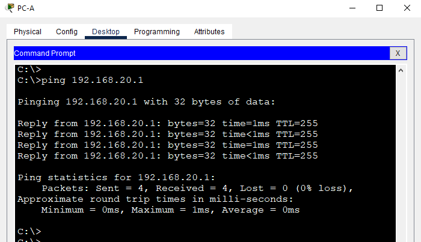

# Лабораторная работа - Внедрение маршрутизации между виртуальными локальными сетями.

## Топология
 
 
 

## Таблица адресации


## Таблица VLAN


## Задачи
### Часть 1. Создание сети и настройка основных параметров устройства
### Часть 2. Создание сетей VLAN и назначение портов коммутатора
### Часть 3. Настройка транка 802.1Q между коммутаторами.
### Часть 4. Настройка маршрутизации между сетями VLAN
### Часть 5. Проверка, что маршрутизация между VLAN работает

## Инструкции
### Часть 1. Создание сети и настройка основных параметров устройства
В первой части лабораторной работы вам предстоит создать топологию сети и настроить базовые параметры для узлов ПК и коммутаторов.


####  Шаг 1. Создайте сеть согласно топологии.
Подключите устройства, как показано в топологии, и подсоедините необходимые кабели.

#### Шаг 2. Настройте базовые параметры для маршрутизатора.
a.	Подключитесь к маршрутизатору с помощью консоли и активируйте привилегированный режим EXEC.
Откройте окно конфигурации

b.	Войдите в режим конфигурации.

c.	Назначьте маршрутизатору имя устройства.

d.	Отключите поиск DNS, чтобы предотвратить попытки маршрутизатора неверно преобразовывать введенные команды таким образом, как будто они являются именами узлов.

e.	Назначьте class в качестве зашифрованного пароля привилегированного режима EXEC.

f.	Назначьте cisco в качестве пароля консоли и включите вход в систему по паролю.

g.	Установите cisco в качестве пароля виртуального терминала и активируйте вход.

h.	Зашифруйте открытые пароли.

i.	Создайте баннер с предупреждением о запрете несанкционированного доступа к устройству.

j.	Сохраните текущую конфигурацию в файл загрузочной конфигурации.

k.	Настройте на маршрутизаторе время.
Закройте окно настройки.

#### Шаг 3. Настройте базовые параметры каждого коммутатора.
a.	Присвойте коммутатору имя устройства.

b.	Отключите поиск DNS, чтобы предотвратить попытки 
маршрутизатора неверно преобразовывать введенные команды таким образом, как будто они являются именами узлов.

c.	Назначьте class в качестве зашифрованного пароля привилегированного режима EXEC.

d.	Назначьте cisco в качестве пароля консоли и включите вход в систему по паролю.

e.	Установите cisco в качестве пароля виртуального терминала и активируйте вход.

f.	Зашифруйте открытые пароли.

g.	Создайте баннер с предупреждением о запрете несанкционированного доступа к устройству.

h.	Настройте на коммутаторах время.

i.	Сохранение текущей конфигурации в качестве начальной.
Закройте окно настройки.

#### Шаг 4. Настройте узлы ПК.
Адреса ПК можно посмотреть в таблице адресации.


### Часть 2. Создание сетей VLAN и назначение портов коммутатора
Во второй части вы создадите VLAN, как указано в таблице выше, на обоих коммутаторах. Затем вы назначите VLAN соответствующему интерфейсу и проверите настройки конфигурации. Выполните следующие задачи на каждом коммутаторе.

#### Шаг 1. Создайте сети VLAN на коммутаторах.
a.	Создайте и назовите необходимые VLAN на каждом коммутаторе из таблицы выше.
Откройте окно конфигурации

b.	Настройте интерфейс управления и шлюз по умолчанию на каждом коммутаторе, используя информацию об IP-адресе в таблице адресации. 

c.	Назначьте все неиспользуемые порты коммутатора VLAN Parking_Lot, настройте их для статического режима доступа и административно деактивируйте их.

Примечание. Команда `interface range` полезна для выполнения этой задачи с минимальным количеством команд.

#### Шаг 2. Назначьте сети VLAN соответствующим интерфейсам коммутатора.
a.	Назначьте используемые порты соответствующей VLAN (указанной в таблице VLAN выше) и настройте их для режима статического доступа.


b.	Убедитесь, что VLAN назначены на правильные интерфейсы.
Закройте окно настройки.

### Часть 3. Конфигурация магистрального канала стандарта 802.1Q между коммутаторами

В части 3 вы вручную настроите интерфейс F0/1 как **TRUNK**.

#### Шаг 1. Вручную настройте магистральный интерфейс F0/1 на коммутаторах S1 и S2.
a.	Настройка статического транкинга на интерфейсе F0/1 для обоих коммутаторов.
Откройте окно конфигурации

b.	Установите native VLAN 1000 на обоих коммутаторах.

c.	Укажите, что VLAN 10, 20, 30 и 1000 могут проходить по транку.

d.	Проверьте транки, native VLAN и разрешенные VLAN через транк.

#### Шаг 2. Вручную настройте магистральный интерфейс F0/5 на коммутаторе S1.
a.	Настройте интерфейс S1 F0/5 с теми же параметрами транка, что и F0/1. Это транк до маршрутизатора.

b.	Сохраните текущую конфигурацию в файл загрузочной конфигурации.

c.	Проверка транкинга.

Вопрос:
Что произойдет, если G0/0/1 на R1 будет отключен?
Закройте окно настройки.

### Часть 4. Настройка маршрутизации между сетями VLAN

#### Шаг 1. Настройте маршрутизатор.
Откройте окно конфигурации
a.	При необходимости активируйте интерфейс G0/0/1 на маршрутизаторе.

b.	Настройте подинтерфейсы для каждой VLAN, как указано в таблице IP-адресации. 
Все подинтерфейсы используют инкапсуляцию 802.1Q. Убедитесь, что подинтерфейсу для native VLAN не назначен IP-адрес. Включите описание для каждого подинтерфейса.

c.	Убедитесь, что вспомогательные интерфейсы работают
Закройте окно настройки.

### Часть 5. Проверьте, работает ли маршрутизация между VLAN

#### Шаг 1. Выполните следующие тесты с PC-A. Все должно быть успешно.
Примечание. Возможно, вам придется отключить брандмауэр ПК для работы ping

a.	Отправьте эхо-запрос с PC-A на шлюз по умолчанию.

b.	Отправьте эхо-запрос с PC-A на PC-B.

c.	Отправьте команду ping с компьютера PC-A на коммутатор S2.

#### Шаг 2. Пройдите следующий тест с PC-B
В окне командной строки на PC-B выполните команду tracert на адрес PC-A.

Вопрос:
Какие промежуточные IP-адреса отображаются в результатах?

## Сводная таблица по интерфейсам маршрутизаторов


**Примечание.** Чтобы определить конфигурацию маршрутизатора, можно посмотреть на интерфейсы и установить тип маршрутизатора и количество его интерфейсов. Перечислить все комбинации конфигураций для каждого класса маршрутизаторов невозможно. Эта таблица содержит идентификаторы для возможных комбинаций интерфейсов Ethernet и последовательных интерфейсов на устройстве. Другие типы интерфейсов в таблице не представлены, хотя они могут присутствовать в данном конкретном маршрутизаторе. В качестве примера можно привести интерфейс ISDN BRI. Строка в скобках — это официальное сокращение, которое можно использовать в командах Cisco IOS для обозначения интерфейса.
Конец документа


# РЕШЕНИЕ

## Задачи
### Часть 1. Создание сети и настройка основных параметров устройства
### Часть 2. Создание сетей VLAN и назначение портов коммутатора
### Часть 3. Настройка транка 802.1Q между коммутаторами.
### Часть 4. Настройка маршрутизации между сетями VLAN
### Часть 5. Проверка, что маршрутизация между VLAN работает

## Инструкции
### Часть 1. Создание сети и настройка основных параметров устройства
В первой части лабораторной работы вам предстоит создать топологию сети и настроить базовые параметры для узлов ПК и коммутаторов.


####  Шаг 1. Создайте сеть согласно топологии.
Подключите устройства, как показано в топологии, и подсоедините необходимые кабели.


#### Шаг 2. Настройте базовые параметры для маршрутизатора.
**a**.	Подключитесь к маршрутизатору с помощью консоли и активируйте привилегированный режим EXEC.

Откройте окно конфигурации

**b**.	Войдите в режим конфигурации.

```
Router>
Router>en
Router#conf t
Enter configuration commands, one per line.  End with CNTL/Z.
Router(config)#
```

**c**.	Назначьте маршрутизатору имя устройства.

```
Router>
Router>en
Router#conf t
Router(config)#
Router(config)#hostname R1
```


**d**.	Отключите поиск DNS, чтобы предотвратить попытки маршрутизатора неверно преобразовывать введенные команды таким образом, как будто они являются именами узлов.

```
R1(config)#no ip domain-lookup
```

Дополнительно воспользуемся параметром logging synchronous. чтобы консольные сообщения не прерывали выполнение команд.

```
R1(config)#line console 0
R1(config-line)#logging  synchronous 
R1(config-line)#
```

***e.***	Назначьте class в качестве зашифрованного пароля привилегированного режима EXEC.

Выполним команду `enable secret class`

```
R1(config)#enable secret class
```

Как видно на скриншоте, пароль на вход в привелигированный режим есть.


**f.**	Назначьте cisco в качестве пароля консоли и включите вход в систему по паролю.

```
R1(config)#line console 0
R1(config-line)#password cisco
R1(config-line)#login
R1(config-line)#end
R1(config-line)#
```

 
**g.**	Установите cisco в качестве пароля виртуального терминала и активируйте вход.

Ограничим доступ к vtu линиямс 0 по 5.

```
R1(config)#line vty 0 5
R1(config-line)#pass
R1(config-line)#password cisco
R1(config-line)#login
R1(config-line)#end
```

**h.**	Зашифруйте открытые пароли.

Выполним команду `service password-encryption`

```
R1(config)#
R1(config)#service password-encryption 
R1(config)#
```


**i.**	Создайте баннер с предупреждением о запрете несанкционированного доступа к устройству.

```
R1(config)#banner mot
R1(config)#banner motd #
Enter TEXT message.  End with the character '#'.
Unauthorized access is strictly prohibited.#

R1(config)#
```

**j.**	Сохраните текущую конфигурацию в файл загрузочной конфигурации.


```
R1#copy running-config startup-config 
Destination filename [startup-config]? startup-config
Building configuration...
[OK]
R1#
```


**k.**	Настройте на маршрутизаторе время.

Проверяем текущее время командой: `show clock detail` 

Обратите внимание, в нашем выводе, *2:58:15.527 UTC Mon Mar 1 1993 помечена звездочкой сначала. Она говорит о том, что это время не вызывает доверия. Причина этого проста – оно синхронизировано с хардварного времени, это можно проверить командой `show clock detail`

Вывод строки : `Time source is hardware calendar` 


```
R1#show clock 
*2:58:15.527 UTC Mon Mar 1 1993
```

```
R1#show clock  detail 
*2:58:37.346 UTC Mon Mar 1 1993
Time source is hardware calendar
R1#
```

В нашем случае доступа к публичным NTP нет, поэтому будем использовать ручную настройку с помощью команды `clock set` - с её помощью мы можем в привилегированном режиме (не в режиме глобальной конфигурации) модифицировать время и дату.

```
R1#clock set 23:10: 05 may 2024
R1#show clock  detail 
23:10:21.256 UTC Sun May 5 2024
Time source is user configuration
R1#
```

Обратите внимание, что источник времени сменился на «user configuration». Дело в том, что если мы перезагрузим наш девайс, время снова подтянется из хардварного источника (его можно проверить командой show calendar). Исправить это можно одной командой: `clock update-calendar`

```
R1#clock update-calendar
```

Закройте окно настройки.


#### Шаг 3. Настройте базовые параметры каждого коммутатора.

*!!! Все настройки выполнены только на одном S1 коммутаторе, необходимо по аналогии настроить коммутатор S2*

**a.**	Присвойте коммутатору имя устройства.

Выполним команду: `hostname`

```
Switch>
Switch>enable 
Switch#conf terminal 
Switch(config)#hostname S1
S1(config)#
```


**b.**	Отключите поиск DNS, чтобы предотвратить попытки 
маршрутизатора неверно преобразовывать введенные 
команды таким образом, как будто они являются именами узлов.

Воспользуемся командой: `no ip domain-lookup`

```
S1(config)#
S1(config)#no ip domain-lookup
S1(config)#
```


Дополнительно воспользуемся командой `logging synchronous`. чтобы консольные сообщения не прерывали выполнение команд.

Пропишем на устройстве:

```
S1(config)#line console 0
S1(config-line)#logging synchronous 
S1(config-line)#
```


**c.**	Назначьте class в качестве зашифрованного пароля привилегированного режима EXEC.

Выполним команду `enable secret class`


```
S1(config)#enable secret class
```

**d.**	Назначьте cisco в качестве пароля консоли и включите вход в систему по паролю.

**e.**	Установите cisco в качестве пароля виртуального терминала и активируйте вход.

Воспользуемся коммандой : `password`

```
S1(config)#line  console 0
S1(config-line)#password cisco
S1(config-line)#login
S1(config-line)#end
S1#
```


**f.**	Зашифруйте открытые пароли.

Выполним команду `service password-encryption`

```
S1(config)#
S1(config)#service password-encryption 
S1(config)#
```


**g.**	Создайте баннер с предупреждением о запрете несанкционированного доступа к устройству. ( Unauthorized access is strictly prohibited.)


Выполним: `banner motd #`

```
S1(config)#
S1(config)#banner motd #
Enter TEXT message.  End with the character '#'.
Unauthorized access is strictly prohibited.#
S1(config)#
```

Как видим из вывода, пароль на вход установлен также баннер предупреждает, что может быть ай-яй-яй или а-та-та-та-та.


**h.**	Настройте на коммутаторах время.

```

S1#show clock 
*7:55:43.442 UTC Tue Mar 2 1993
S1#
S1#show clock detail
*7:55:45.679 UTC Tue Mar 2 1993
Time source is hardware calendar
S1#
```


Обратите внимание, в нашем выводе, *7:55:43.442 UTC Tue Mar 2 1993 помечена звездочкой сначала. Она говорит о том, что это время не вызывает доверия. Причина этого проста – оно синхронизировано с хардварного времени, это можно проверить командой show clock detail

Вывод строки : `Time source is hardware calendar`

В нашем случае доступа к публичным NTP нет, поэтому будем использовать ручную настройку с помощью команды `clock set` - с её помощью мы можем в привилегированном режиме (не в режиме глобальной конфигурации) модифицировать время и дату.


```
S1#clock set 04:05: 08 may 2024
S1#
```
Обратите внимание, что источник времени сменился на «user configuration». Дело в том, что если мы перезагрузим наш девайс, время снова подтянется из хардварного источника (его можно проверить командой show calendar). Исправить это можно одной командой: `clock update-calendar`

```
S1#
S1#show clock detail
4:5:36.614 UTC Wed May 8 2024
Time source is user configuration
S1#show clock 
4:5:43.404 UTC Wed May 8 2024
S1#
S1#clock update-calendar

```


**i.**	Сохранение текущей конфигурации в качестве начальной.
Закройте окно настройки.

Выполним команду : `copy running-config startup-config`

```
S1#copy running-config startup-config
Destination filename [startup-config]? startup-config
Building configuration...
[OK]
S1#
```

#### Шаг 4. Настройте узлы ПК.
Адреса ПК можно посмотреть в таблице адресации.

Задаём имя, назначаем IP-адресс, маску и основной шлюз.


PC-A


PC-B


### Часть 2. Создание сетей VLAN и назначение портов коммутатора
Во второй части вы создадите VLAN, как указано в таблице выше, на обоих коммутаторах. Затем вы назначите VLAN соответствующему интерфейсу и проверите настройки конфигурации. Выполните следующие задачи на каждом коммутаторе.

#### Шаг 1. Создайте сети VLAN на коммутаторах.
**a.**	Создайте и назовите необходимые VLAN на каждом коммутаторе из таблицы выше.
Откройте окно конфигурации

Создадим необходимые VLAN и зададим Descriptions

```
S1(config)#
S1(config)#vlan 10
S1(config-vlan)#name Control
S1(config-vlan)#
S1(config-vlan)#vlan 20
S1(config-vlan)#
S1(config-vlan)#name Sales
S1(config-vlan)#
S1(config-vlan)#vlan 30
S1(config-vlan)#
S1(config-vlan)#name Operations
S1(config-vlan)#
S1(config-vlan)#vlan 999
S1(config-vlan)#
S1(config-vlan)#name Parking_Lot
S1(config-vlan)#
S1(config-vlan)#vlan 1000
S1(config-vlan)#
S1(config-vlan)#name Native
S1(config-vlan)#
S1(config-vlan)#exit
S1(config)#exit
S1#
```


Проверим созданные VLAN, выполнив команду `show vlan`

```
S1#show vlan 

VLAN Name                             Status    Ports
---- -------------------------------- --------- -------------------------------
1    default                          active    Fa0/1, Fa0/2, Fa0/3, Fa0/4
                                                Fa0/5, Fa0/6, Fa0/7, Fa0/8
                                                Fa0/9, Fa0/10, Fa0/11, Fa0/12
                                                Fa0/13, Fa0/14, Fa0/15, Fa0/16
                                                Fa0/17, Fa0/18, Fa0/19, Fa0/20
                                                Fa0/21, Fa0/22, Fa0/23, Fa0/24
                                                Gig0/1, Gig0/2
10   Control                          active    
20   Sales                            active    
30   Operations                       active    
999  Parking_Lot                      active    
1000 Native                           active    
1002 fddi-default                     active    
1003 token-ring-default               active    
1004 fddinet-default                  active    
1005 trnet-default                    active    
```

Как видим из вывода все VLAN'ы созданы успешно и все порты находятся в дефолтном VLAN 1.

**b.**	Настройте интерфейс управления и шлюз по умолчанию на каждом коммутаторе, используя информацию об IP-адресе в таблице адресации. 

Назначим IP-адрес и маску согласно таблице адресации:

```
S1#configure terminal 
S1(config)#interface vlan 10
S1(config-if)#ip address 192.168.10.11 255.255.255.0
S1(config-if)#no shutdown 
S1(config-if)#exit 
S1(config)#ip default-gateway 192.168.10.1
S1(config)#
```


Переходим на нужный интерфейс, далее командой" `switcport mode access` переводим порт в режим доступа и задаем необходимый номер VLAN.

```
S1#conf t
S1(config)#interface fastEthernet 0/6
S1(config-if)#switchport access vlan 20
S1(config-if)#
```

В выводе команды `show vlan` видим, что порт **Fa0/6** присвоен к **VLAN 20.**


```
S1#show vlan 

VLAN Name                             Status    Ports
---- -------------------------------- --------- -------------------------------
1    default                          active    Fa0/1, Fa0/2, Fa0/3, Fa0/4
                                                Fa0/5, Fa0/7, Fa0/8, Fa0/9
                                                Fa0/10, Fa0/11, Fa0/12, Fa0/13
                                                Fa0/14, Fa0/15, Fa0/16, Fa0/17
                                                Fa0/18, Fa0/19, Fa0/20, Fa0/21
                                                Fa0/22, Fa0/23, Fa0/24, Gig0/1
                                                Gig0/2
10   Control                          active    
20   Sales                            active    Fa0/6
30   Operations                       active    
999  Parking_Lot                      active    
1000 Native                           active    
1002 fddi-default                     active    
1003 token-ring-default               active    
1004 fddinet-default                  active    
1005 trnet-default                    active    

VLAN Type  SAID       MTU   Parent RingNo BridgeNo Stp  BrdgMode Trans1 Trans2
---- ----- ---------- ----- ------ ------ -------- ---- -------- ------ ------
1    enet  100001     1500  -      -      -        -    -        0      0
 --More-- 
```


**c.**	Назначьте все неиспользуемые порты коммутатора VLAN Parking_Lot, настройте их для статического режима доступа и административно деактивируйте их.
Примечание. Команда `interface range` полезна для выполнения этой задачи с минимальным количеством команд.


```
S1(config)#
S1(config)#interface range fastEthernet 0/1-5 
S1(config-if-range)#switchport mode access 
S1(config-if-range)#switchport access vlan 999

```

Командой `interface range fastEthernet 0/1-5` перенесём в один шаг порты **fa0/1** по **fa0/5** в **VLAN 999 Parking_Lot**, аналогично перенесем оставшиеся **Fa0/7-Fa0/24**, также поступим с **Gig0/1 и Gig0/2**.


Проверим принадлежность портов к **VLAN** командой `show vlan`

```
S1(config)#do show vlan

VLAN Name                             Status    Ports
---- -------------------------------- --------- -------------------------------
1    default                          active    
10   Control                          active    
20   Sales                            active    Fa0/6
30   Operations                       active    
999  Parking_Lot                      active    Fa0/1, Fa0/2, Fa0/3, Fa0/4
                                                Fa0/5, Fa0/7, Fa0/8, Fa0/9
                                                Fa0/10, Fa0/11, Fa0/12, Fa0/13
                                                Fa0/14, Fa0/15, Fa0/16, Fa0/17
                                                Fa0/18, Fa0/19, Fa0/20, Fa0/21
                                                Fa0/22, Fa0/23, Fa0/24, Gig0/1
                                                Gig0/2
1000 Native                           active    
1002 fddi-default                     active    
1003 token-ring-default               active    
1004 fddinet-default                  active    
1005 trnet-default                    active    

VLAN Type  SAID       MTU   Parent RingNo BridgeNo Stp  BrdgMode Trans1 Trans2
---- ----- ---------- ----- ------ ------ -------- ---- -------- ------ ------
 --More-- 
```

Как видим из вывода, только порт Fa0/6 находится в **VLAN 20**, остальные порты зарезервированы в VLAN 20 Parking_Lot.


#### Шаг 2. Назначьте сети VLAN соответствующим интерфейсам коммутатора.
**a.**	Назначьте используемые порты соответствующей VLAN (указанной в таблице VLAN выше) и настройте их для режима статического доступа.


Назначим IP-адрес и маску согласно таблице адресации:


Выполняем на S1:
```
S1#configure terminal 
S1(config)#interface vlan 10
S1(config-if)#ip address 192.168.10.11 255.255.255.0
S1(config-if)#no shutdown 
S1(config-if)#exit 
S1(config)#ip default-gateway 192.168.10.1
S1(config)#
```


Выполняем на S2:
```
S2(config)#interface vlan 10
S2(config-if)#ip address 192.168.10.12 255.255.255.0
S2(config-if)#no shutdown 
S2(config-if)#exit 
S2(config)#ip default-gateway 192.168.10.1
S2(config-if)#exit 
S2(config)
```

**b.**	Убедитесь, что VLAN назначены на правильные интерфейсы.
Закройте окно настройки.

### Часть 3. Конфигурация магистрального канала стандарта 802.1Q между коммутаторами


Необходимо отключить автосогласование через протокол DTP
`switchport nonegotiate`  (включить обратно `switchport mode dynamic-auto`)

Отключаем на обоих коммутаторах:

```
S1(config)#interface fastEthernet 0/1
S1(config-if)#switchport nonegotiate 
```

```
S2(config)#interface fastEthernet 0/1
S2(config-if)#switchport nonegotiate 
```


В части 3 вы вручную настроите интерфейс ***F0/1*** как транк.

#### Шаг 1. Вручную настройте магистральный интерфейс F0/1 на коммутаторах S1 и S2.
**a.**	Настройка статического транкинга на интерфейсе F0/1 для обоих коммутаторов.
Откройте окно конфигурации

Зайдем на интерфейс Fa0/1 и назначим ему режим TURNK

```
S1(config)#interface fastEthernet 0/1
S1(config-if)#switchport mode trunk 
```


**b.**	Установите native **VLAN 1000** на обоих коммутаторах.

```
S1(config-if)#switchport trunk native v
S1(config-if)#switchport trunk native vlan 1000
```


Выполнить аналогичные настройки на S2

```
S2(config-if)#switchport trunk native v
S2(config-if)#switchport trunk native vlan 1000
```


**c.**	Укажите, что VLAN 10, 20, 30 и 1000 могут проходить по транку.

Выполним настройку на S1:
```
S2(config-if)#switchport trunk allowed vlan 10,20,30,1000
```
Выполним настройку на S2:
```
S1(config-if)#switchport trunk allowed vlan 10,20,30,1000
```

**d.**	Проверьте транки, native VLAN и разрешенные VLAN через транк.

Проверим командой `show interfaces trunk`


Выполним проверку на S1:
```
S1#show interfaces trunk 
Port        Mode         Encapsulation  Status        Native vlan
Fa0/1       on           802.1q         trunking      1000

Port        Vlans allowed on trunk
Fa0/1       10,20,30,1000

Port        Vlans allowed and active in management domain
Fa0/1       10,20,30,1000

Port        Vlans in spanning tree forwarding state and not pruned
Fa0/1       10,20,30,1000

S1#
```

Выполним проверку на S2:
```
S2#show interfaces trunk 
Port        Mode         Encapsulation  Status        Native vlan
Fa0/1       on           802.1q         trunking      1000

Port        Vlans allowed on trunk
Fa0/1       10,20,30,1000

Port        Vlans allowed and active in management domain
Fa0/1       10,20,30,1000

Port        Vlans in spanning tree forwarding state and not pruned
Fa0/1       10,20,30,1000

S2#
```

В выводе команды на обоих устройствах в строке:
```
Port        Vlans allowed on trunk
Fa0/1       10,20,30,1000
```
видим, что указаны VLAN 10,20,30,1000. 


#### Шаг 2. Вручную настройте магистральный интерфейс F0/5 на коммутаторе S1.
**a.**	Настройте интерфейс S1 F0/5 с теми же параметрами транка, что и F0/1. Это транк до маршрутизатора.

```
S1(config)#interface fastEthernet 0/5
S1(config-if)#switchport mode trunk 
S1(config-if)#switchport trunk allowed vlan 10,20,30,1000
S1(config-if)#switchport nonegotiate 
S1(config-if)#no shutdown 
S1(config-if)#
```

**b.**	Сохраните текущую конфигурацию в файл загрузочной конфигурации.

```
S1#wr
S1#write 
Building configuration...
[OK]
```

**c.**	Проверка транкинга.

```
S1#show interfaces trunk 
Port        Mode         Encapsulation  Status        Native vlan
Fa0/1       on           802.1q         trunking      1000

Port        Vlans allowed on trunk
Fa0/1       10,20,30,1000

Port        Vlans allowed and active in management domain
Fa0/1       10,20,30,1000

Port        Vlans in spanning tree forwarding state and not pruned
Fa0/1       10,20,30,1000

S1#
```

проверил порт он Down, в выводе не вижу fa0/5

```
FastEthernet0/5        unassigned      YES manual down                  down
```


Вопрос:
Что произойдет, если G0/0/1 на R1 будет отключен?
Закройте окно настройки.

Порт не удается перевести в UP, на команду no sh не реагирует.

### Часть 4. Настройка маршрутизации между сетями VLAN

#### Шаг 1. Настройте маршрутизатор.
Откройте окно конфигурации
**a.**	При необходимости активируйте интерфейс G0/0/1 на маршрутизаторе.

Выполним настройку порта Gig0/0/1 на R1:

```
R1(config)#interface gigabitEthernet 0/0/1
R1(config-if)#no shutdown 
```

**b.**	Настройте подинтерфейсы для каждой VLAN, как указано в таблице IP-адресации. Все подинтерфейсы используют инкапсуляцию 802.1Q. Убедитесь, что подинтерфейсу для native VLAN не назначен IP-адрес. Включите описание для каждого подинтерфейса.

```
R1(config-if)#interface gigabitEthernet 0/0/1.10
R1(config-subif)#Description Default-Gateway for VLAN 10
R1(config-subif)#encapsulation dot1Q 10
R1(config-subif)#ip address 192.168.10.1 255.255.255.0
R1(config-subif)#exit 
```

```
R1(config)#interface gigabitEthernet 0/0/1.20
R1(config-subif)#description Default-Gateway for VLAN 20
R1(config-subif)#ip address 192.168.20.1 255.255.255.0
R1(config-subif)#encapsulation dot1Q 20
R1(config-subif)#exit
```

```
R1(config)#interface gigabitEthernet 0/0/1.30
R1(config-subif)#description Default-Gateway for VLAN 30
R1(config-subif)#encapsulation dot1Q 30
R1(config-subif)#ip address 192.168.30.1 255.255.255.0
R1(config-subif)#exit 
```

```
R1(config)#interface gigabitEthernet 0/0/1.1000
R1(config-subif)#description Native VLAN
R1(config-subif)#encapsulation dot1Q 1000 native 
R1(config-subif)#exit 
```


**c.**	Убедитесь, что вспомогательные интерфейсы работают
Закройте окно настройки.

Проверим командами `show ip interface brief` & `show ip route`

Выполним `show ip interface brief`:

```
R1#show ip route 
Codes: L - local, C - connected, S - static, R - RIP, M - mobile, B - BGP
       D - EIGRP, EX - EIGRP external, O - OSPF, IA - OSPF inter area
       N1 - OSPF NSSA external type 1, N2 - OSPF NSSA external type 2
       E1 - OSPF external type 1, E2 - OSPF external type 2, E - EGP
       i - IS-IS, L1 - IS-IS level-1, L2 - IS-IS level-2, ia - IS-IS inter area
       * - candidate default, U - per-user static route, o - ODR
       P - periodic downloaded static route

Gateway of last resort is not set

     192.168.10.0/24 is variably subnetted, 2 subnets, 2 masks
C       192.168.10.0/24 is directly connected, GigabitEthernet0/0/1.10
L       192.168.10.1/32 is directly connected, GigabitEthernet0/0/1.10
     192.168.20.0/24 is variably subnetted, 2 subnets, 2 masks
C       192.168.20.0/24 is directly connected, GigabitEthernet0/0/1.20
L       192.168.20.1/32 is directly connected, GigabitEthernet0/0/1.20
     192.168.30.0/24 is variably subnetted, 2 subnets, 2 masks
C       192.168.30.0/24 is directly connected, GigabitEthernet0/0/1.30
L       192.168.30.1/32 is directly connected, GigabitEthernet0/0/1.30

```


Выполним `show ip intreface brief`:
```
R1#show ip interface brief 
Interface              IP-Address      OK? Method Status                Protocol 
GigabitEthernet0/0/0   unassigned      YES unset  administratively down down 
GigabitEthernet0/0/1   unassigned      YES unset  up                    up 
GigabitEthernet0/0/1.10192.168.10.1    YES manual up                    up 
GigabitEthernet0/0/1.20192.168.20.1    YES manual up                    up 
GigabitEthernet0/0/1.30192.168.30.1    YES manual up                    up 
GigabitEthernet0/0/1.1000unassigned      YES unset  up                    up 
GigabitEthernet0/0/2   unassigned      YES unset  administratively down down 
Vlan1                  unassigned      YES unset  administratively down down
R1#
```
Под-интерфейсы появились, IP адреса назначены, Линки есть, маршруты видны.


### Часть 5. Проверьте, работает ли маршрутизация между VLAN

#### Шаг 1. Выполните следующие тесты с PC-A. Все должно быть успешно.
Примечание. Возможно, вам придется отключить брандмауэр ПК для работы ping
**a.**	Отправьте эхо-запрос с PC-A на шлюз по умолчанию.

Ping до основного шлюза есть.



**b.**	Отправьте эхо-запрос с PC-A на PC-B.

Ping между PC есть.


**c.**	Отправьте команду ping с компьютера PC-A на коммутатор S2.

Пакеты доходят:


#### Шаг 2. Пройдите следующий тест с PC-B
В окне командной строки на PC-B выполните команду tracert на адрес PC-A.


**Вопрос:**
Какие промежуточные IP-адреса отображаются в результатах?

*Ответ:* 192.168.30.1 -  IP интерфейса Gig0/0/1.30 


Вернемся к Шагу 2. Вручную настройте магистральный интерфейс F0/5 на коммутаторе S1.

Обратимя к пункту **c.**	Проверка транкинга.
 
И проверим повторно : 
```
Switch#show interfaces trunk 
Port        Mode         Encapsulation  Status        Native vlan
Fa0/1       on           802.1q         trunking      1000
Fa0/5       on           802.1q         trunking      1

Port        Vlans allowed on trunk
Fa0/1       10,20,30,1000
Fa0/5       10,20,30,1000

Port        Vlans allowed and active in management domain
Fa0/1       10,20,30,1000
Fa0/5       10,20,30,1000

Port        Vlans in spanning tree forwarding state and not pruned
Fa0/1       10,20,30,1000
Fa0/5       10,20,30,1000

Switch#
```

Всё работает корректно:
```
Port        Mode         Encapsulation  Status        Native vlan
Fa0/1       on           802.1q         trunking      1000
Fa0/5       on           802.1q         trunking   
```