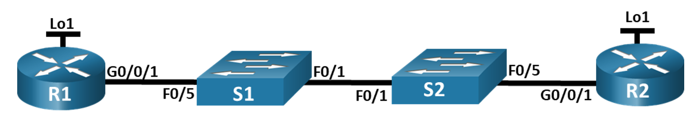
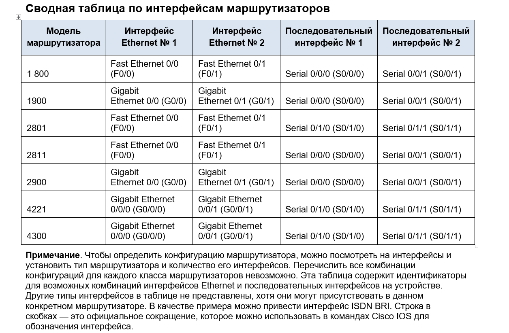
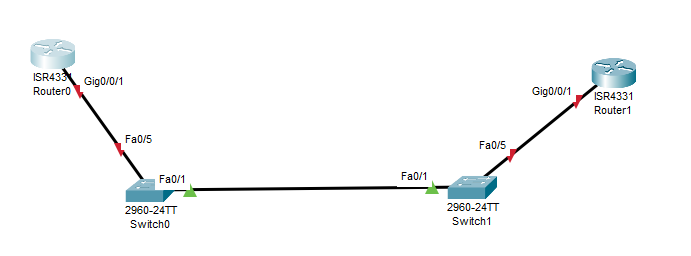

# Лабораторная работа. Настройка протокола OSPFv2 для одной области

## Топология
 


## Таблица адресации


[Перейти к Решению ](#Решение)


## Цели
###  Часть 1. Создание сети и настройка основных параметров устройства
### Часть 2. Настройка и проверка базовой работы протокола  OSPFv2 для одной области
### Часть 3. Оптимизация и проверка конфигурации OSPFv2 для одной области


## Инструкции

###  Часть 1. Создание сети и настройка основных параметров устройства
#### Шаг 1. Создайте сеть согласно топологии.
Подключите устройства, как показано в топологии, и подсоедините необходимые кабели.
#### Шаг 2. Произведите базовую настройку маршрутизаторов.
Откройте окно конфигурации

**a.**	Назначьте маршрутизатору имя устройства.

**b.**	Отключите поиск DNS, чтобы предотвратить попытки маршрутизатора неверно преобразовывать введенные команды таким образом, как будто они являются именами узлов.

**c.**	Назначьте class в качестве зашифрованного пароля привилегированного режима EXEC.

**d.**	Назначьте cisco в качестве пароля консоли и включите вход в систему по паролю.

**e.**	Назначьте cisco в качестве пароля VTY и включите вход в систему по паролю.

**f.**	Зашифруйте открытые пароли.

**g.**	Создайте баннер с предупреждением о запрете несанкционированного доступа к устройству.

**h.**	Сохраните текущую конфигурацию в файл загрузочной конфигурации.

#### Шаг 3. Настройте базовые параметры каждого коммутатора.
**a.**	Назначьте коммутатору имя устройства.

**b.**	Отключите поиск DNS, чтобы предотвратить попытки маршрутизатора неверно преобразовывать введенные команды таким образом, как будто они являются именами узлов.

**c.**	Назначьте class в качестве зашифрованного пароля привилегированного режима EXEC.

**d.**	Назначьте cisco в качестве пароля консоли и включите вход в систему по паролю.
**e.**	Назначьте cisco в качестве пароля VTY и включите вход в систему по паролю.

**f.**	Зашифруйте открытые пароли.

**g.**	Создайте баннер с предупреждением о запрете несанкционированного доступа к устройству.

**h.**	Сохраните текущую конфигурацию в файл загрузочной конфигурации.
Закройте окно настройки.

###  Часть 2. Настройка и проверка базовой работы протокола OSPFv2 для одной области
#### Шаг 1. Настройте адреса интерфейса и базового OSPFv2 на каждом маршрутизаторе.
**a.**	Настройте адреса интерфейсов на каждом маршрутизаторе, как показано в таблице адресации выше.
Откройте окно конфигурации

**b.**	Перейдите в режим конфигурации маршрутизатора OSPF, используя идентификатор процесса 56.

**c.**	Настройте статический идентификатор маршрутизатора для каждого маршрутизатора (1.1.1.1 для R1, 2.2.2.2 для R2).

**d.**	Настройте инструкцию сети для сети между R1 и R2, поместив ее в область 0.

**e.**	Только на R2 добавьте конфигурацию, необходимую для объявления сети Loopback 1 в область OSPF 0.

**f.**	Убедитесь, что OSPFv2 работает между маршрутизаторами. Выполните команду, чтобы убедиться, что R1 и R2 сформировали смежность.

Вопрос:
Какой маршрутизатор является DR? Какой маршрутизатор является BDR? Каковы критерии отбора?

**g.**	На R1 выполните команду `show ip route ospf`, чтобы убедиться, что сеть R2 Loopback1 присутствует в таблице маршрутизации. Обратите внимание, что поведение OSPF по умолчанию заключается в объявлении интерфейса обратной связи в качестве маршрута узла с использованием 32-битной маски.

**h.**	Запустите Ping до  адреса интерфейса R2 Loopback 1 из R1. Выполнение команды `ping` должно быть успешным.
Закройте окно настройки.

###   Часть 3. Оптимизация и проверка конфигурации OSPFv2 для одной области
#### Шаг 1. Реализация различных оптимизаций на каждом маршрутизаторе.
Откройте окно конфигурации
**a.**	На R1 настройте приоритет OSPF интерфейса G0/0/1 на 50, чтобы убедиться, что R1 является назначенным маршрутизатором.

**b.**	Настройте таймеры OSPF на G0/0/1 каждого маршрутизатора для таймера приветствия, составляющего 30 секунд.

**c.**	На R1 настройте статический маршрут по умолчанию, который использует интерфейс Loopback 1 в качестве интерфейса выхода. Затем распространите маршрут по умолчанию в OSPF. Обратите внимание на сообщение консоли после установки маршрута по умолчанию.

**d.**	добавьте конфигурацию, необходимую для OSPF для обработки R2 Loopback 1 как сети точка-точка. Это приводит к тому, что OSPF объявляет Loopback 1 использует маску подсети интерфейса.

**e.**Только на R2 добавьте конфигурацию, необходимую для предотвращения отправки объявлений OSPF в сеть Loopback 1.

**f.**	Измените базовую пропускную способность для маршрутизаторов. После этой настройки перезапустите OSPF с помощью команды `clear ip ospf process` . Обратите внимание на сообщение консоли после установки новой опорной полосы пропускания.

#### Шаг 2. Убедитесь, что оптимизация OSPFv2 реализовалась.
**a.**	Выполните команду `show ip ospf interface g0/0/1` на R1 и убедитесь, что приоритет интерфейса установлен равным 50, а временные интервалы — Hello 30, Dead 120, а тип сети по умолчанию — Broadcast

**b.**	На R1 выполните команду show ip route ospf, чтобы убедиться, что сеть R2 Loopback1 присутствует в таблице маршрутизации. Обратите внимание на разницу в метрике между этим выходным и предыдущим выходным. Также обратите внимание, что маска теперь составляет 24 бита, в отличие от 32 битов, ранее объявленных.

**c.**	Введите команду `show ip route ospf` на маршрутизаторе R2. Единственная информация о маршруте OSPF должна быть распространяемый по умолчанию маршрут R1.

**d.**	Запустите `ping` до адреса интерфейса R1 Loopback 1 из R2. Выполнение команды ping должно быть успешным.

Вопрос:
Почему стоимость OSPF для маршрута по умолчанию отличается от стоимости OSPF в R1 для сети 192.168.1.0/24?

## Сводная таблица по интерфейсам маршрутизаторов


________________________________________________________


# Решение

### Часть 1. Создание сети и настройка основных параметров устройства.

#### Шаг 1. Создайте сеть согласно топологии.

Подключаем устройства, как показано в топологии, и подсоединяем необходимые кабели.

Расположение устройств в топологии немного изменил, для того, чтобы было видно какие порты используются.



#### Шаг 2. Производим базовую настройку маршрутизаторов

Базовая настройка R1
```
Router>
Router>en
Router#conf t
Router(config)#hostname R1
R1(config)#no ip domain-lookup
R1(config)#enable  secret class
R1(config)#line  console 0
R1(config-line)#password cisco
R1(config-line)#login
R1(config-line)#line vty 0 15
R1(config-line)#password cisco
R1(config-line)#login
R1(config-line)#exit 
R1(config)#service password-encryption 
R1(config)#banner motd #DO NOT ENTER#
R1(config)#exit 
R1#
R1#copy running-config startup-config 
Destination filename [startup-config]? startup-config
Building configuration...
[OK]
```

Базовая настройкa R2

```
Router>
Router>en
Router#conf t
Router(config)#hostname R2
R2(config)#no ip domain-lookup 
R2(config)#enable secret class
R2(config)#line console 0
R2(config-line)#password cisco
R2(config-line)#login
R2(config-line)#line vty 0 15
R2(config-line)#password cisco
R2(config-line)#login 
R2(config-line)#exit 
R2(config)#service password-encryption 
R2(config)#banner motd #Do NOT ENTER#
R2(config)#exit 
R2#
R2#copy running-config startup-config 
Destination filename [startup-config]? startup-config
Building configuration...
[OK]
R2#
```

#### Шаг 3. Настраиваем базовые параметры каждого коммутатора.

Настройка S1

```
Switch>
Switch>en
Switch#conf t
Switch(config)#hostname S1
S1(config)#no ip domain-lookup 
S1(config)#enable secret class
S1(config)#line console 0
S1(config-line)#password cisco
S1(config-line)#login
S1(config-line)#lin vty 0 15
S1(config-line)#password cisco
S1(config-line)#login
S1(config-line)#exit 
S1(config)#service password-encryption 
S1(config)#banner  motd #DO NO ENTER#
S1(config)#exit 
S1#
S1#copy  running-config startup-config 
Destination filename [startup-config]? startup-config
Building configuration...
[OK]
S1#
```

Настройка S2

```
Switch>en
Switch#conf t
Switch(config)#hostname S2
S2(config)#no ip domain-lookup 
S2(config)#enable secret class
S2(config)#line console 0
S2(config-line)#password cisco
S2(config-line)#login
S2(config-line)#line vty 0 15
S2(config-line)#password cisco
S2(config-line)#login
S2(config-line)#exit 
S2(config)#service password-encryption 
S2(config)#banner motd #DO NOT ENTER#
S2(config)#exit
S2#
S2#copy running-config startup-config 
Destination filename [startup-config]? startup-config
Building configuration...
[OK]
S2#
```

### Часть 2. Настройка и проверка базовой работы протокола OSPFv2 для одной области.

#### Шаг 1. Настраиваем адреса интерфейса и базового OSPFv2 на каждом маршрутизаторе.

**a.**	Настраиваем адреса интерфейсов на каждом маршрутизаторе из таблицы адресации.

Настройка R1

```
R1>
R1>en
Password: 
R1#
R1#conf t
R1(config)#
R1(config)#interface gigabitEthernet 0/0/1
R1(config-if)#ip address 10.53.0.1 255.255.255.0
R1(config-if)#no shutdown 

R1(config-if)#
%LINK-5-CHANGED: Interface GigabitEthernet0/0/1, changed state to up

%LINEPROTO-5-UPDOWN: Line protocol on Interface GigabitEthernet0/0/1, changed state to up

R1(config-if)#
R1(config-if)#exit 
R1(config)#
R1(config)#interface loopback0

R1(config-if)#
%LINK-5-CHANGED: Interface Loopback0, changed state to up

%LINEPROTO-5-UPDOWN: Line protocol on Interface Loopback0, changed state to up
R1(config-if)#ip address 172.16.1.1 255.255.255.0
R1(config-if)#exit 
R1(config)#exit 
R1#
%SYS-5-CONFIG_I: Configured from console by console

R1#
R1#wr
Building configuration...
[OK]
R1#
```

Настройка R2

```
R2#
R2#conf t
Enter configuration commands, one per line.  End with CNTL/Z.
R2(config)#

R2(config)#interface  gigabitEthernet 0/0/1
R2(config-if)#ip address 10.53.0.2 255.255.255.0
R2(config-if)#no sh

R2(config-if)#
%LINK-5-CHANGED: Interface GigabitEthernet0/0/1, changed state to up

%LINEPROTO-5-UPDOWN: Line protocol on Interface GigabitEthernet0/0/1, changed state to up

R2(config-if)#
R2(config-if)#exit 
R2(config)#interface loopback 0

R2(config-if)#
%LINK-5-CHANGED: Interface Loopback0, changed state to up

%LINEPROTO-5-UPDOWN: Line protocol on Interface Loopback0, changed state to up

R2(config-if)#ip address 192.168.1.1 255.255.255.0
R2(config-if)#no shutdown 
R2(config-if)#exit 
R2(config)#exit 
R2#
%SYS-5-CONFIG_I: Configured from console by console

R2#
R2#write 
Building configuration...
[OK]
R2#
```

Проверим на R1:

```
R1#show ip interface brief 
Interface              IP-Address      OK? Method Status                Protocol 
GigabitEthernet0/0/0   unassigned      YES unset  administratively down down 
GigabitEthernet0/0/1   10.53.0.1       YES manual up                    up 
GigabitEthernet0/0/2   unassigned      YES unset  administratively down down 
Loopback0              172.16.1.1      YES manual up                    up 
Vlan1                  unassigned      YES unset  administratively down down
R1#
```

Проверим на R2:
```
R2#show ip interface brief 
Interface              IP-Address      OK? Method Status                Protocol 
GigabitEthernet0/0/0   unassigned      YES unset  administratively down down 
GigabitEthernet0/0/1   10.53.0.2       YES manual up                    up 
GigabitEthernet0/0/2   unassigned      YES unset  administratively down down 
Loopback0              192.168.1.1     YES manual up                    up 
Vlan1                  unassigned      YES unset  administratively down down
R2#
```


**b.**	Перейдите в режим конфигурации маршрутизатора OSPF, используя идентификатор процесса 56

**c.**	Настраиваем статический идентификатор маршрутизатора для каждого маршрутизатора (1.1.1.1 для R1, 2.2.2.2 для R2)

**d.**	Настраиваем инструкцию сети для сети между R1 и R2, поместив ее в область 0.

Настройка R1

```
R1#
R1#configure  terminal 
R1(config)#router ospf 56
R1(config-router)#router-id 1.1.1.1
R1(config-router)#network 10.53.0.0 0.0.0.255 area 0
R1(config-router)#exit 
R1(config)#exit 
R1#
R1#write 
Building configuration...
[OK]
R1#
```

Настройка R2

```
R2>
R2>en
Password: 
R2#
R2#conf t
R2(config)#router ospf 56
R2(config-router)#router-id 2.2.2.2
R2(config-router)#network 10.53.0.0 0.0.0.255 area 0
R2(config-router)#
00:12:19: %OSPF-5-ADJCHG: Process 56, Nbr 1.1.1.1 on GigabitEthernet0/0/1 from LOADING to FULL, Loading Done
R2(config-router)#
R2(config-router)#exit 
R2(config)#exit 
R2#
%SYS-5-CONFIG_I: Configured from console by console
wr
R2#write 
Building configuration...
[OK]
R2#
```
**e.**	Только на R2 добавляем конфигурацию, необходимую для объявления сети Loopback 0 в область OSPF 0.

```
R2#
R2#conf terminal 
Enter configuration commands, one per line.  End with CNTL/Z.
R2(config)#
R2(config)#router ospf 56
R2(config-router)#router-id 2.2.2.2
R2(config-router)#network 10.53.0.0 0.0.0.255 area 0
R2(config-router)#network 192.168.1.0 0.0.0.255 area 0
R2(config-router)#
R2#
%SYS-5-CONFIG_I: Configured from console by console

R2#conf t
Enter configuration commands, one per line.  End with CNTL/Z.o
R2(config)#interface loopback 0
R2(config-if)#exit 
R2(config)#interface loopback0
R2(config-if)#ip ospf 56 area 0
R2(config-if)#
```


**f.**	Убедитесь, что OSPFv2 работает между маршрутизаторами. Выполните команду, чтобы убедиться, что R1 и R2 сформировали смежность.


R1

```
R1>show ip ospf neighbor 


Neighbor ID     Pri   State           Dead Time   Address         Interface
2.2.2.2           1   FULL/BDR        00:00:34    10.53.0.2       GigabitEthernet0/0/1
R1>
```


Mаршрутизатор R1 является BDR.
Mаршрутизатор R2 является DR

При выборе DR и BDR используется маршрутизатор с наибольшим идентификатором маршрутизатора.

**g.**	На R1 выполняем команду `show ip route ospf`, чтобы убедиться, что сеть R2 Loopback0 присутствует в таблице маршрутизации.

 Обратите внимание, что поведение OSPF по умолчанию заключается в объявлении интерфейса обратной связи в качестве маршрута узла с использованием 32-битной маски.

```

R1>show ip ospf neighbor 

Neighbor ID     Pri   State           Dead Time   Address         Interface
2.2.2.2           1   FULL/BDR        00:00:31    10.53.0.2       GigabitEthernet0/0/1


R1>show ip route ospf 
     192.168.1.0/32 is subnetted, 1 subnets
O       192.168.1.1 [110/2] via 10.53.0.2, 03:08:07, GigabitEthernet0/0/1

R1>
```

**h.**	Выполняем Ping до  адреса интерфейса R2 Loopback 1 из R1. Выполнение команды ping должно быть успешным.
R1>ping 192.168.1.1

Type escape sequence to abort.
Sending 5, 100-byte ICMP Echos to 192.168.1.1, timeout is 2 seconds:
!!!!!
Success rate is 100 percent (5/5), round-trip min/avg/max = 0/0/1 ms

### Часть 3. Оптимизация и проверка конфигурации OSPFv2 для одной области
#### Шаг 1. Реализация различных оптимизаций на каждом маршрутизаторе

**a.**	На R1 настраиваем приоритет OSPF интерфейса G0/0/1 на 50, чтобы убедиться, что R1 является назначенным маршрутизатором.

```
R1#
R1#conf t
R1#conf terminal 
Enter configuration commands, one per line.  End with CNTL/Z.
R1(config)#
R1(config)#interface gigabitEthernet 0/0/1
R1(config-if)#ip os
R1(config-if)#ip ospf pri
R1(config-if)#ip ospf priority 50
R1(config-if)#
```

**b.** Настраиваем таймеры OSPF на G0/0/1 каждого маршрутизатора для таймера приветствия, составляющего 30 секунд.


```
R1(config)#
R1(config)#interface gigabitEthernet 0/0/1
R1(config-if)#ip ospf hell
R1(config-if)#ip ospf hello-interval in
R1(config-if)#ip ospf hello-interval 30
R1(config-if)#
R1(config-if)#
03:40:09: %OSPF-5-ADJCHG: Process 56, Nbr 2.2.2.2 on GigabitEthernet0/0/1 from EXSTART to DOWN, Neighbor Down: Dead timer expired

03:40:09: %OSPF-5-ADJCHG: Process 56, Nbr 2.2.2.2 on GigabitEthernet0/0/1 from EXSTART to DOWN, Neighbor Down: Interface down or detached

03:40:10: %OSPF-5-ADJCHG: Process 56, Nbr 2.2.2.2 on GigabitEthernet0/0/1 from LOADING to FULL, Loading Done

```

```
R1(config)#
R1(config)#
R1(config)#interface gigabitEthernet 0/0/1
R1(config-if)#ip ospf hell
R1(config-if)#ip ospf hello-interval in
R1(config-if)#ip ospf hello-interval 30
R1(config-if)#
R1(config-if)#
03:40:09: %OSPF-5-ADJCHG: Process 56, Nbr 2.2.2.2 on GigabitEthernet0/0/1 from EXSTART to DOWN, Neighbor Down: Dead timer expired

03:40:09: %OSPF-5-ADJCHG: Process 56, Nbr 2.2.2.2 on GigabitEthernet0/0/1 from EXSTART to DOWN, Neighbor Down: Interface down or detached

03:40:10: %OSPF-5-ADJCHG: Process 56, Nbr 2.2.2.2 on GigabitEthernet0/0/1 from LOADING to FULL, Loading Done
```


```
R2(config)#
R2(config)#interface gigabitEthernet 0/0/1
R2(config-if)#ip ospf hello-interval 30
R2(config-if)#
03:40:05: %OSPF-5-ADJCHG: Process 56, Nbr 1.1.1.1 on GigabitEthernet0/0/1 from FULL to DOWN, Neighbor Down: Dead timer expired

03:40:05: %OSPF-5-ADJCHG: Process 56, Nbr 1.1.1.1 on GigabitEthernet0/0/1 from FULL to DOWN, Neighbor Down: Interface down or detached

03:40:10: %OSPF-5-ADJCHG: Process 56, Nbr 1.1.1.1 on GigabitEthernet0/0/1 from LOADING to FULL, Loading Done
```


**c.**	На R1 настраиваем статический маршрут по умолчанию, который использует интерфейс Loopback 0 в качестве интерфейса выхода. Затем распространяем маршрут по умолчанию в OSPF. Обратите внимание на сообщение консоли после установки маршрута по умолчанию.
```
R1(config)#ip route 0.0.0.0 0.0.0.0 loopback0
%Default route without gateway, if not a point-to-point interface, may impact performance
R1(config)#
```

**d.**	добавляем конфигурацию, необходимую для OSPF для обработки R2 Loopback 0 как сети точка-точка. Это приводит к тому, что OSPF объявляет Loopback 0 использует маску подсети интерфейса.


