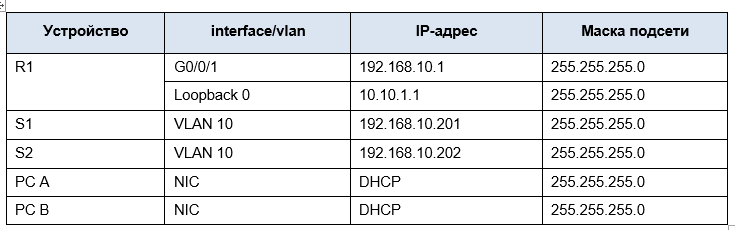
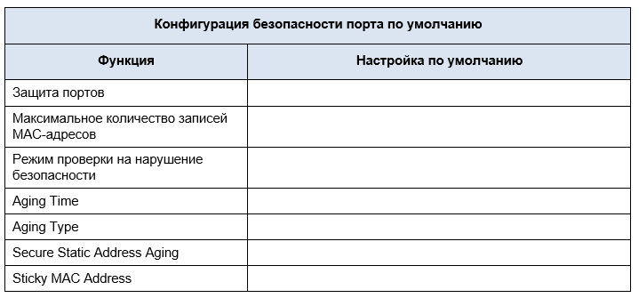
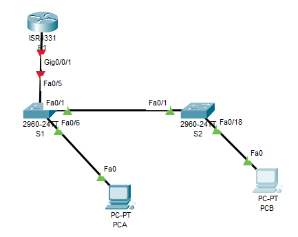
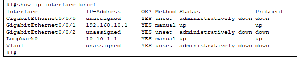
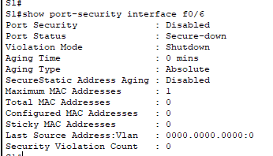
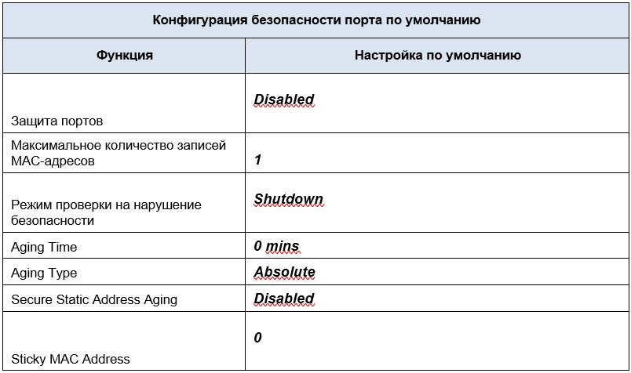

# Лабораторная работа - Конфигурация безопасности коммутатора . 

## Топология
 


## Таблица адресации




[Перейти к Решению ](#Решение)


## Цели
### Часть 1. Настройка основного сетевого устройства
•	Создайте сеть.

•	Настройте маршрутизатор R1.

•	Настройка и проверка основных параметров коммутатора

### Часть 2. Настройка сетей VLAN
•	Сконфигруриуйте VLAN 10.

•	Сконфигруриуйте SVI для VLAN 10.

•	Настройте VLAN 333 с именем Native на S1 и S2.

•	Настройте VLAN 999 с именем ParkingLot на S1 и S2.

### Часть 3. Настройки безопасности коммутатора.
•	Реализация магистральных соединений 802.1Q.

•	Настройка портов доступа

•	Безопасность неиспользуемых портов коммутатора

•	Документирование и реализация функций безопасности 
порта.

•	Реализовать безопасность DHCP snooping .

•	Реализация PortFast и BPDU Guard

•	Проверка сквозной связанности.

## Инструкции
### Часть 1. Настройка основного сетевого устройства


#### Шаг 1. Создайте сеть.
a.	Создайте сеть согласно топологии.

b.	Инициализация устройств

#### Шаг 2. Настройте маршрутизатор R1.
a.	Загрузите следующий конфигурационный скрипт на R1.

Откройте окно конфигурации
```
enable
configure terminal
hostname R1
no ip domain lookup
ip dhcp excluded-address 192.168.10.1 192.168.10.9
ip dhcp excluded-address 192.168.10.201 192.168.10.202
!
ip dhcp pool Students
 network 192.168.10.0 255.255.255.0
 default-router 192.168.10.1
 domain-name CCNA2.Lab-11.6.1
!
interface Loopback0
 ip address 10.10.1.1 255.255.255.0
!
interface GigabitEthernet0/0/1
 description Link to S1
 ip dhcp relay information trusted
 ip address 192.168.10.1 255.255.255.0
 no shutdown
!
line con 0
 logging synchronous
 exec-timeout 0 0
 ```

b.	Проверьте текущую конфигурацию на R1, используя следующую команду: `R1# show ip interface brief`

c.	Убедитесь, что IP-адресация и интерфейсы находятся в состоянии up / up (при необходимости устраните неполадки).

#### Шаг 3. Настройка и проверка основных параметров коммутатора
**a.** Настройте имя хоста для коммутаторов S1 и S2.
Откройте окно конфигурации

**b.** Запретите нежелательный поиск в DNS.

**c.** Настройте описания интерфейса для портов, которые используются в S1 и S2.

**d.** Установите для шлюза по умолчанию для VLAN управления значение 192.168.10.1 на обоих коммутаторах.

### Часть 2. Настройка сетей VLAN на коммутаторах.	

#### Шаг 1. Сконфигруриуйте VLAN 10.
Добавьте VLAN 10 на S1 и S2 и назовите VLAN - Management.

#### Шаг 2. Сконфигруриуйте SVI для VLAN 10.
Настройте IP-адрес в соответствии с таблицей адресации для SVI для VLAN 10 на S1 и S2. Включите интерфейсы SVI и предоставьте описание для интерфейса.
#### Шаг 3. Настройте VLAN 333 с именем Native на S1 и S2.
#### Шаг 4. Настройте VLAN 999 с именем ParkingLot на S1 и S2.

 
### Часть 3. Настройки безопасности коммутатора.	
#### Шаг 1. Релизация магистральных соединений 802.1Q.

**a.**	Настройте все магистральные порты Fa0/1 на обоих коммутаторах для использования VLAN 333 в качестве native VLAN.

**b.**	Убедитесь, что режим транкинга успешно настроен на всех коммутаторах.
`S1# show interface trunk`
```
Port Mode Encapsulation Status Native vlan
Fa0/1 on 802.1q trunking 333

Port Vlans allowed on trunk
Fa0/1 1-4094

Port Vlans allowed and active in management domain
Fa0/1 1,10,333,999

Port Vlans in spanning tree forwarding state and not pruned
Fa0/1 1,10,333,999
```
`S2# show interface trunk`
```
Port Mode Encapsulation Status Native vlan
Fa0/1 on 802.1q trunking 333

Port Vlans allowed on trunk
Fa0/1 1-4094

Port Vlans allowed and active in management domain
Fa0/1 1,10,333,999

Port Vlans in spanning tree forwarding state and not pruned
Fa0/1 1,10,333,999
```
**c.**	Отключить согласование DTP F0/1 на S1 и S2. 

**d.**	Проверьте с помощью команды `show interfaces`
```
S1# show interfaces f0/1 switchport | include Negotiation
Negotiation of Trunking: Off
```

`S1# show interfaces f0/1 switchport | include Negotiation`
```
Negotiation of Trunking: Off
```


#### Шаг 2. Настройка портов доступа
****a.**	На S1 настройте F0/5 и F0/6 в качестве портов доступа и свяжите их с VLAN 10.
**b.**	На S2 настройте порт доступа Fa0/18 и свяжите его с VLAN 10.


#### Шаг 3. Безопасность неиспользуемых портов коммутатора
**a.**	На S1 и S2 переместите неиспользуемые порты из VLAN 1 в VLAN 999 и отключите неиспользуемые порты.

**b.**	Убедитесь, что неиспользуемые порты отключены и связаны с VLAN 999, введя команду  `show`.
```
S1# show interfaces status
Port Name Status Vlan Duplex Speed Type
Fa0/1 Link to S2 connected trunk a-full a-100 10/100BaseTX
Fa0/2 disabled 999 auto auto 10/100BaseTX
Fa0/3 disabled 999 auto auto 10/100BaseTX
Fa0/4 disabled 999 auto auto 10/100BaseTX
Fa0/5 Link to R1 connected 10 a-full a-100 10/100BaseTX
Fa0/6 Link to PC-A connected 10 a-full a-100 10/100BaseTX
Fa0/7 disabled 999 auto auto 10/100BaseTX
Fa0/8 disabled 999 auto auto 10/100BaseTX
Fa0/9 disabled 999 auto auto 10/100BaseTX
Fa0/10 disabled 999 auto auto 10/100BaseTX
<output omitted>
```

```
S2# show interfaces status
Port Name Status Vlan Duplex Speed Type
Fa0/1 Link to S1 connected trunk a-full a-100 10/100BaseTX
Fa0/2 disabled 999 auto auto 10/100BaseTX
Fa0/3 disabled 999 auto auto 10/100BaseTX
<output omitted>
Fa0/14 disabled 999 auto auto 10/100BaseTX
Fa0/15 disabled 999 auto auto 10/100BaseTX
Fa0/16 disabled 999 auto auto 10/100BaseTX
Fa0/17 disabled 999 auto auto 10/100BaseTX
Fa0/18 Link to PC-B connected 10 a-full a-100 10/100BaseTX
Fa0/19 disabled 999 auto auto 10/100BaseTX
Fa0/20 disabled 999 auto auto 10/100BaseTX
Fa0/21 disabled 999 auto auto 10/100BaseTX
Fa0/22 disabled 999 auto auto 10/100BaseTX
Fa0/23 disabled 999 auto auto 10/100BaseTX
Fa0/24 disabled 999 auto auto 10/100BaseTX
Gi0/1 disabled 999 auto auto 10/100/1000BaseTX
Gi0/2 disabled 999 auto auto 10/100/1000BaseTX
```

#### Шаг 4. Документирование и реализация функций безопасности порта.
Интерфейсы F0/6 на S1 и F0/18 на S2 настроены как порты доступа. На этом шаге вы также настроите безопасность портов на этих двух портах доступа.

**a.**	На S1, введите команду show port-security interface f0/6  для отображения настроек по умолчанию безопасности порта для интерфейса F0/6.
 Запишите свои ответы ниже.



Заполнить в файле и кинуть скрин

**b.**	На S1 включите защиту порта на F0 / 6 со следующими настройками:

    o	Максимальное количество записей MAC-адресов: 

    o	Режим безопасности: restrict

    o	Aging time: 60 мин.

    o	Aging type: неактивный

**c.**	Verify port security on S1 F0/6.
```
S1# show port-security interface f0/6
Port Security : Enabled
Port Status : Secure-up
Violation Mode : Restrict
Aging Time : 60 mins
Aging Type : Inactivity
SecureStatic Address Aging : Disabled
Maximum MAC Addresses : 3
Total MAC Addresses : 1
Configured MAC Addresses : 0
Sticky MAC Addresses : 0
Last Source Address:Vlan : 0022.5646.3411:10
Security Violation Count : 0

S1# show port-security address
               Secure Mac Address Table
-----------------------------------------------------------------------------
Vlan Mac Address Type Ports Remaining Age
                                                                   (mins)
---- ----------- ---- ----- -------------
  10 0022.5646.3411 SecureDynamic Fa0/6 60 (I)
-----------------------------------------------------------------------------
Total Addresses in System (excluding one mac per port) : 0
Max Addresses limit in System (excluding one mac per port) : 8192
```

**d.**	Включите безопасность порта для F0 / 18 на S2. Настройте каждый активный порт доступа таким образом, чтобы он автоматически добавлял адреса МАС, изученные на этом порту, в текущую конфигурацию.

**e.**	Настройте следующие параметры безопасности порта на S2 F / 18:
    o	Максимальное количество записей MAC-адресов: 2

    o	Тип безопасности: Protect

    o	Aging time: 60 мин.

**f.**	Проверка функции безопасности портов на S2 F0/18.
```
S2# show port-security interface f0/18
Port Security : Enabled
Port Status : Secure-up
Violation Mode : Protect
Aging Time : 60 mins
Aging Type : Absolute
SecureStatic Address Aging : Disabled
Maximum MAC Addresses : 2
Total MAC Addresses : 1
Configured MAC Addresses : 0
Sticky MAC Addresses : 0
Last Source Address:Vlan : 0022.5646.3413:10
Security Violation Count : 0

S2# show port-security address
               Secure Mac Address Table
-----------------------------------------------------------------------------
Vlan Mac Address Type Ports Remaining Age
                                                                   (mins)
---- ----------- ---- ----- -------------
  10 0022.5646.3413 SecureSticky Fa0/18 -
-----------------------------------------------------------------------------
Total Addresses in System (excluding one mac per port) : 0
Max Addresses limit in System (excluding one mac per port) : 8192
```


#### Шаг 5. Реализовать безопасность DHCP snooping.
**a.**	На S2 включите DHCP snooping и настройте DHCP snooping во VLAN 10.

**b.**	Настройте магистральные порты на S2 как доверенные порты.

**c.**	Ограничьте ненадежный порт Fa0/18 на S2 пятью DHCP-пакетами в секунду.

**d.**	Проверка DHCP Snooping на S2.
```
S2# show ip dhcp snooping
Switch DHCP snooping is enabled
DHCP snooping is configured on following VLANs:
10
DHCP snooping is operational on following VLANs:
10
DHCP snooping is configured on the following L3 Interfaces:
Insertion of option 82 is enabled
   circuit-id default format: vlan-mod-port
   remote-id: 0cd9.96d2.3f80 (MAC)
Option 82 on untrusted port is not allowed
Verification of hwaddr field is enabled
Verification of giaddr field is enabled
DHCP snooping trust/rate is configured on the following Interfaces:

Interface Trusted Allow option Rate limit (pps)
----------------------- ------- ------------ ----------------
FastEthernet0/1 yes yes unlimited
  Custom circuit-ids:
FastEthernet0/18 no no 5
  Custom circuit-ids:
```  
**e.**	В командной строке на PC-B освободите, а затем обновите IP-адрес.

C:\Users\Student> ipconfig /release

C:\Users\Student> ipconfig /renew

**f.**	Проверьте привязку отслеживания DHCP с помощью команды show ip dhcp snooping binding.
```
S2# show ip dhcp snooping binding 
MacIp адресAddress Lease(sec) Type VLAN Interface
------------------ --------------- ---------- ------------- ---- --------------------
00:50:56:90:D0:8E 192.168.10.11 86213 dhcp-snooping 10 FastEthernet0/18
Total number of bindings: 1
```

#### Шаг 6. Реализация PortFast и BPDU Guard
**a.**	Настройте PortFast на всех портах доступа, которые используются на обоих коммутаторах.

**b.**	Включите защиту BPDU на портах доступа VLAN 10 S1 и S2, подключенных к PC-A и PC-B.

**c.**	Убедитесь, что защита BPDU и PortFast включены на соответствующих портах.
```
S1# show spanning-tree interface f0/6 detail
 Port 8 (FastEthernet0/6) of VLAN0010 is designated forwarding
   Port path cost 19, Port priority 128, Port Identifier 128.6.
   <output omitted for brevity>
   Number of transitions to forwarding state: 1
   The port is in the portfast mode
   Link type is point-to-point by default
   Bpdu guard is enabled
   BPDU: sent 128, received 0
```   

#### Шаг 7. Проверьте наличие сквозного подключения.
Проверьте PING свзяь между всеми устройствами в таблице IP-адресации. В случае сбоя проверки связи может потребоваться отключить брандмауэр на хостах.

Закройте окно настройки.

Вопросы для повторения:

**1.**	С точки зрения безопасности порта на S2, почему нет значения таймера для оставшегося возраста в минутах, когда было сконфигурировано динамическое обучение - sticky?

**2.**	Что касается безопасности порта на S2, если вы загружаете скрипт текущей конфигурации на S2, почему порту 18 на PC-B никогда не получит IP-адрес через DHCP?

**3.**	Что касается безопасности порта, в чем разница между типом абсолютного устаревания и типом устаревание по неактивности?


# РЕШЕНИЕ

## Цели
### Часть 1. Настройка основного сетевого устройства
#### Шаг 1. Создаем сеть
Создаем сеть согласно топологии

Инициализируем устройства

#### Шаг 2. Настраиваем маршрутизатор R1
Загружаем следующий конфигурационный скрипт на R1
```
enable
configure terminal
hostname R1
no ip domain lookup
ip dhcp excluded-address 192.168.10.1 192.168.10.9
ip dhcp excluded-address 192.168.10.201 192.168.10.202
!
ip dhcp pool Students
 network 192.168.10.0 255.255.255.0
 default-router 192.168.10.1
 domain-name CCNA2.Lab-11.6.1
!
interface Loopback0
 ip address 10.10.1.1 255.255.255.0
!
interface GigabitEthernet0/0/1
 description Link to S1
 ip dhcp relay information trusted
 ip address 192.168.10.1 255.255.255.0
 no shutdown
!
line con 0
 logging synchronous
 exec-timeout 0 0
 ```

 Команда ``` ip dhcp relay information trusted```  не выполнилась.


Убеждаемся, что IP-адресация и интерфейсы находятся в состоянии up / up (при необходимости устраняем неполадки.

 Проверяем текущую конфигурацию на R1, используя следующую команду:
```R1# show ip interface brief```

Скрин:



Интерфейсы созданы и в статусе UP.

#### Шаг 3. Настройка и проверка основных параметров коммутатора
Настраиваем имя хоста для коммутаторов S1 и S2

Открываем окно конфигурации

Запрещаем нежелательный поиск в DNS

Настраиваем описания интерфейса для портов, которые используются в S1 и S2

Устанавливаем для шлюза по умолчанию для VLAN управления значение 192.168.10.1 на обоих коммутаторах


Настройка на S1:
```
S1>
S1>en
S1>enable 
S1#configure terminal 
Enter configuration commands, one per line.  End with CNTL/Z.
S1(config)#hostname S1
S1(config)#no ip domain-lookup
S1(config)#interface fastEthernet 0/1
S1(config-if)#description Link to S2
S1(config-if)#exit 
S1(config)#interface fastEthernet 0/5
S1(config-if)#description Link to R1
S1(config-if)#exit 
S1(config)#interface fastEthernet 0/6
S1(config-if)#description Link to PCA
S1(config-if)#exit 
S1(config)#ip default-gateway 192.168.10.1
S1(config)#
```

Настройка на S2:

```
S2>
S2>enable 
S2#conf terminal 
Enter configuration commands, one per line.  End with CNTL/Z.
S2(config)#hostname S2
S2(config)#no ip domain-lookup
S2(config)#interface fastEthernet 0/1
S2(config-if)#description Link to S1
S2(config-if)#exit
S2(config)#interface fastEthernet 0/18
S2(config-if)#description Link to PCB
S2(config-if)#exit 
S2(config)#ip default-gateway 192.168.10.1
S2(config)#exit 
S2#
```

### Часть 2. Настройка сетей VLAN на коммутаторах.
#### Шаг 1. Сконфигруриуйте VLAN 10.
Добавьте VLAN 10 на S1 и S2 и назовите VLAN - Management.

Настройка на S1
```
S1>

S1>en
S1#conf t
Enter configuration commands, one per line.  End with CNTL/Z.
S1(config)#vlan 10
S1(config-vlan)#name Management
S1(config-vlan)#exit 
```

Настройка на S2

```
S2>en
S2#conf t
Enter configuration commands, one per line.  End with CNTL/Z.
S2(config)#vlan 10
S2(config-vlan)#name Management
S2(config-vlan)#exit 
S2(config)#
```


#### Шаг 2. Сконфигруриуйте SVI для VLAN 10.
Настройте IP-адрес в соответствии с таблицей адресации для SVI для VLAN 10 на S1 и S2. Включите интерфейсы SVI и предоставьте описание для интерфейса.

Настройка на S1
```
S1#
S1#configure terminal 
Enter configuration commands, one per line.  End with CNTL/Z.
S1(config)#interface vlan 10
S1(config-if)#
%LINK-5-CHANGED: Interface Vlan10, changed state to up
ip add
S1(config-if)#ip address 192.168.10.201 255.255.255.0
S1(config-if)#description Management SVI
S1(config-if)#no shutdown 
S1(config-if)#
```

Настройка на S2

```
S2#
S2#conf t
Enter configuration commands, one per line.  End with CNTL/Z.
S2(config)#interface vlan 10
S2(config-if)#
%LINK-5-CHANGED: Interface Vlan10, changed state to up
S2(config-if)#ip address 192.168.10.202 255.255.255.0
S2(config-if)#description Management SVI
S2(config-if)#no shutdown 
S2(config-if)#exit 
S2(config)#
```

#### Шаг 3. Настройте VLAN 333 с именем Native на S1 и S2.

```
S1(config)#
S1(config)#vlan 333
S1(config-vlan)#name Native
S1(config-vlan)#exit 
```

```
S2(config)#
S2(config)#vlan 333
S2(config-vlan)#name Native
S2(config-vlan)#
```

#### Шаг 4. Настройте VLAN 999 с именем ParkingLot на S1 и S2.

```
S1(config)#
S1(config)#vlan 999
S1(config-vlan)#name ParkingLot
S1(config-vlan)#
```

```
S2(config)#vlan 999
S2(config-vlan)#name ParkingLot
S2(config-vlan)#
```
### Часть 3. Настройки безопасности коммутатора
#### Шаг 1. Релизация магистральных соединений 802.1Q
Настрраиваем все магистральные порты Fa0/1 на обоих коммутаторах для использования VLAN 333 в качестве native VLAN

Убеждаемся, что режим транкинга успешно настроен на всех коммутаторах

```
S1#
S1#configure terminal 
Enter configuration commands, one per line.  End with CNTL/Z.
S1(config)#interface FastEthernet 0/1
S1(config-if)#switchport trunk native vlan 333
S1(config-if)#exit 
S1(config)#exit 
S1#
%SYS-5-CONFIG_I: Configured from console by console

```
Проверяем настроку:
```
S1#show interfaces trunk 
Port        Mode         Encapsulation  Status        Native vlan
Fa0/1       on           802.1q         trunking      333

Port        Vlans allowed on trunk
Fa0/1       333

Port        Vlans allowed and active in management domain
Fa0/1       333

Port        Vlans in spanning tree forwarding state and not pruned
Fa0/1       333

S1#
```


```
S2(config)#
S2(config)#interface fastEthernet 0/1
S2(config-if)#switchport trunk native vlan 333
S2(config-if)#%SPANTREE-2-RECV_PVID_ERR: Received BPDU with inconsistent peer vlan id 1 on FastEthernet0/1 VLAN333.

%SPANTREE-2-BLOCK_PVID_LOCAL: Blocking FastEthernet0/1 on VLAN0333. Inconsistent local vlan.

S2(config-if)#exit 
S2(config)#exit 
S2#
%SYS-5-CONFIG_I: Configured from console by console
```
Проверяем настроку:
```
S2#show interfaces trunk 
Port        Mode         Encapsulation  Status        Native vlan
Fa0/1       on           802.1q         trunking      333

Port        Vlans allowed on trunk
Fa0/1       333

Port        Vlans allowed and active in management domain
Fa0/1       333

Port        Vlans in spanning tree forwarding state and not pruned
Fa0/1       333

S2#
```

Отключаем согласование DTP F0/1 на S1 и S2

```
S1>
S1>enable 
S1#conf t
Enter configuration commands, one per line.  End with CNTL/Z.
S1(config)#interface fastEthernet 0/1
S1(config-if)#switchport nonegotiate 
S1(config-if)#
```

```
S2>
S2>en
S2#conf t
Enter configuration commands, one per line.  End with CNTL/Z.
S2(config)#int f0/1
S2(config-if)#sw none
S2(config-if)#exit 
S2(config)#
```

Проверяем с помощью команды show interfaces с доп атрибутами для удобного вывода:

```
S1#
S1#show interfaces  fastEthernet 0/1 switchport | include Nego
Negotiation of Trunking: Off
S1#
```

```
S2#show interfaces  fastEthernet 0/1 switchport | include Nego
Negotiation of Trunking: Off
S2#
```

#### Шаг 2: Настройка портов доступа
На S1 настрраиваем F0/5 и F0/6 в качестве портов доступа и связываем их с VLAN 10

На S1 выполним настройку интерфейсов F0/5 и F0/6 в качестве портов доступа и привяжем их к VLAN 10

```
S1(config)#interface range fastEthernet 0/5-6
S1(config-if-range)#switchport access vlan 10
S1(config-if-range)#exit 
S1(config)#
```


На S2 настраиваем порт доступа Fa0/18 и связываем его с VLAN 10

```
S2#
S2#conf t
Enter configuration commands, one per line.  End with CNTL/Z.
S2(config)#interface fastEthernet 0/18
S2(config-if)#switchport mode access 
S2(config-if)#switchport access vlan 10
S2(config-if)#
```

#### Шаг 3: Безопасность неиспользуемых портов коммутатора
На S1 и S2 перемещаем неиспользуемые порты из VLAN 1 в VLAN 999 и отключаем неиспользуемые порты

```
S1>
S1>en
S1#conf t
Enter configuration commands, one per line.  End with CNTL/Z.
S1(config)#int range f0/2-4 , f0/7-24 ,g0/1-2
S1(config-if-range)#switchport access vlan 999
S1(config-if-range)#sh
S1(config-if-range)#shutdown 
S1(config-if-range)#
```

Проверяем, что неиспользуемые порты отключены и связаны с VLAN 999, используякоманду `show interfaces status`

```
S1#show interfaces status 
Port      Name               Status       Vlan       Duplex  Speed Type
Fa0/1     Link to S2         connected    trunk      auto    auto  10/100BaseTX
Fa0/2                        disabled 999        auto    auto  10/100BaseTX
Fa0/3                        disabled 999        auto    auto  10/100BaseTX
Fa0/4                        disabled 999        auto    auto  10/100BaseTX
Fa0/5     Link to R1         connected    10         auto    auto  10/100BaseTX
Fa0/6     Link to PCA        connected    10         auto    auto  10/100BaseTX
Fa0/7                        disabled 999        auto    auto  10/100BaseTX
Fa0/8                        disabled 999        auto    auto  10/100BaseTX
Fa0/9                        disabled 999        auto    auto  10/100BaseTX
Fa0/10                       disabled 999        auto    auto  10/100BaseTX
Fa0/11                       disabled 999        auto    auto  10/100BaseTX
Fa0/12                       disabled 999        auto    auto  10/100BaseTX
Fa0/13                       disabled 999        auto    auto  10/100BaseTX
Fa0/14                       disabled 999        auto    auto  10/100BaseTX
Fa0/15                       disabled 999        auto    auto  10/100BaseTX
Fa0/16                       disabled 999        auto    auto  10/100BaseTX
Fa0/17                       disabled 999        auto    auto  10/100BaseTX
Fa0/18                       disabled 999        auto    auto  10/100BaseTX
Fa0/19                       disabled 999        auto    auto  10/100BaseTX
Fa0/20                       disabled 999        auto    auto  10/100BaseTX
Fa0/21                       disabled 999        auto    auto  10/100BaseTX
Fa0/22                       disabled 999        auto    auto  10/100BaseTX
Fa0/23                       disabled 999        auto    auto  10/100BaseTX
Fa0/24                       disabled 999        auto    auto  10/100BaseTX
Gig0/1                       disabled 999        auto    auto  10/100BaseTX
Gig0/2                       disabled 999        auto    auto  10/100BaseTX

S1#
```
Второй вариант глянуть командой `show ip  interface brief`
```
S1#show ip  interface brief 
Interface              IP-Address      OK? Method Status                Protocol 
FastEthernet0/1        unassigned      YES manual up                    up 
FastEthernet0/2        unassigned      YES manual administratively down down 
FastEthernet0/3        unassigned      YES manual administratively down down 
FastEthernet0/4        unassigned      YES manual administratively down down 
FastEthernet0/5        unassigned      YES manual up                    up 
FastEthernet0/6        unassigned      YES manual up                    up 
FastEthernet0/7        unassigned      YES manual administratively down down 
FastEthernet0/8        unassigned      YES manual administratively down down 
FastEthernet0/9        unassigned      YES manual administratively down down 
FastEthernet0/10       unassigned      YES manual administratively down down 
FastEthernet0/11       unassigned      YES manual administratively down down 
FastEthernet0/12       unassigned      YES manual administratively down down 
FastEthernet0/13       unassigned      YES manual administratively down down 
FastEthernet0/14       unassigned      YES manual administratively down down 
FastEthernet0/15       unassigned      YES manual administratively down down 
FastEthernet0/16       unassigned      YES manual administratively down down 
FastEthernet0/17       unassigned      YES manual administratively down down 
FastEthernet0/18       unassigned      YES manual administratively down down 
FastEthernet0/19       unassigned      YES manual administratively down down 
FastEthernet0/20       unassigned      YES manual administratively down down 
FastEthernet0/21       unassigned      YES manual administratively down down 
FastEthernet0/22       unassigned      YES manual administratively down down 
FastEthernet0/23       unassigned      YES manual administratively down down 
FastEthernet0/24       unassigned      YES manual administratively down down 
GigabitEthernet0/1     unassigned      YES manual administratively down down 
GigabitEthernet0/2     unassigned      YES manual administratively down down 
Vlan1                  unassigned      YES manual administratively down down 
Vlan10                 192.168.10.201  YES manual up                    up
```

Аналогично действуем с S2

```
S2>
S2>en
S2#conf t
Enter configuration commands, one per line.  End with CNTL/Z.
S2(config)#
S2(config)#int range f0/2-17 , f0/19-24 , g0/1-2
S2(config-if-range)#switchport mode access 
S2(config-if-range)#switchport access vlan 999
S2(config-if-range)#shutdown 
S2(config-if-range)#exit 
S2(config)#exit 
S2#
```
Проверяем:
```
S2#show ip interface brief 
Interface              IP-Address      OK? Method Status                Protocol 
FastEthernet0/1        unassigned      YES manual up                    up 
FastEthernet0/2        unassigned      YES manual administratively down down 
FastEthernet0/3        unassigned      YES manual administratively down down 
FastEthernet0/4        unassigned      YES manual administratively down down 
FastEthernet0/5        unassigned      YES manual administratively down down 
FastEthernet0/6        unassigned      YES manual administratively down down 
FastEthernet0/7        unassigned      YES manual administratively down down 
FastEthernet0/8        unassigned      YES manual administratively down down 
FastEthernet0/9        unassigned      YES manual administratively down down 
FastEthernet0/10       unassigned      YES manual administratively down down 
FastEthernet0/11       unassigned      YES manual administratively down down 
FastEthernet0/12       unassigned      YES manual administratively down down 
FastEthernet0/13       unassigned      YES manual administratively down down 
FastEthernet0/14       unassigned      YES manual administratively down down 
FastEthernet0/15       unassigned      YES manual administratively down down 
FastEthernet0/16       unassigned      YES manual administratively down down 
FastEthernet0/17       unassigned      YES manual administratively down down 
FastEthernet0/18       unassigned      YES manual up                    up 
FastEthernet0/19       unassigned      YES manual administratively down down 
FastEthernet0/20       unassigned      YES manual administratively down down 
FastEthernet0/21       unassigned      YES manual administratively down down 
FastEthernet0/22       unassigned      YES manual administratively down down 
FastEthernet0/23       unassigned      YES manual administratively down down 
FastEthernet0/24       unassigned      YES manual administratively down down 
GigabitEthernet0/1     unassigned      YES manual administratively down down 
GigabitEthernet0/2     unassigned      YES manual administratively down down 
Vlan1                  unassigned      YES manual administratively down down 
Vlan10                 192.168.10.202  YES manual up                    up
S2#
```

#### Шаг 4. Документирование и реализация функций безопасности порта
На S1, вводим команду `show port-security interface f0/6` для отображения настроек по умолчанию безопасности порта для интерфейса F0/6.

 Записываем свои ответы ниже

Скрин из CLI:



**Ответы:**



На S1 включаем защиту порта на F0/6 со следующими настройками:

- Максимальное количество записей MAC-адресов: 3

- Режим безопасности: restrict
- Aging time: 60 мин.=

- Aging type: неактивный

```
S1(config)#
S1(config)#interface fastEthernet 0/6
S1(config-if)#switchport port-security  maximum 3
S1(config-if)#switchport port-security  violation restrict 
S1(config-if)#switchport port-security  aging time 60
S1(config-if)#switchport port-security  aging type inactivity
                                               ^
% Invalid input detected at '^' marker.
```
Командa `switchport port-security  aging type inactivity` не отработывает.

Проверяем настройки безопасность порта на S1 F0 /6

```
S1#show port-security i
S1#show port-security interface f
S1#show port-security interface fastEthernet 0/6
Port Security              : Enabled
Port Status                : Secure-up
Violation Mode             : Restrict
Aging Time                 : 60 mins
Aging Type                 : Absolute
SecureStatic Address Aging : Disabled
Maximum MAC Addresses      : 3
Total MAC Addresses        : 0
Configured MAC Addresses   : 0
Sticky MAC Addresses       : 0
Last Source Address:Vlan   : 0000.0000.0000:0
Security Violation Count   : 0
```

*Aging Type : Absolute*  - Значение осталось без изменения, на режим **inactivity** не изменился.

Включаем безопасность порта для F0 / 18 на S2. Настраиваем каждый активный порт доступа таким образом, чтобы он автоматически добавлял адреса МАС, изученные на этом порту, в текущую конфигурацию

```
S2>
S2>en
S2#conf t
Enter configuration commands, one per line.  End with CNTL/Z.
S2(config)#interface fastEthernet 0/18
S2(config-if)#switchport port-security mac-address sticky 
S2(config-if)#
```

**e.** Настроимм следующие параметры безопасности порта  F/18 на S2:

- Максимальное количество записей MAC-адресов: 2

- Тип безопасности: Protect

- Aging time: 60 мин

```
S2(config)#interface fastEthernet 0/18
S2(config-if)#switchport port-security aging time 60
S2(config-if)#switchport port-security maximum 2
S2(config-if)#switchport port-security violation protect 
S2(config-if)#
```

