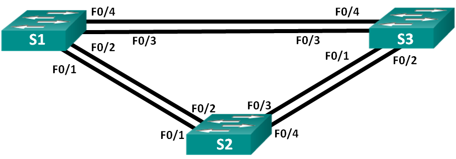
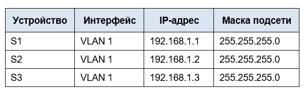
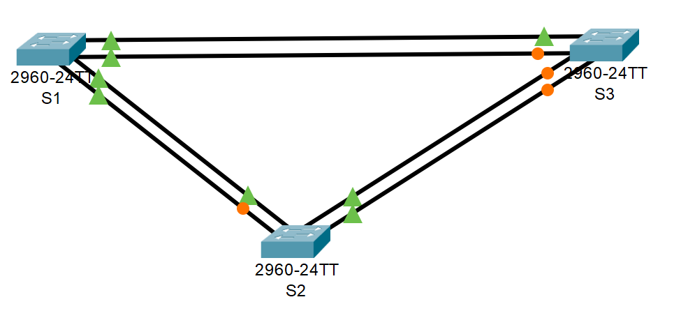
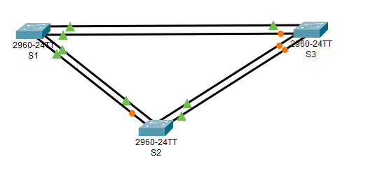

# Лабораторная работа. Развертывание коммутируемой сети с резервными каналами

## Топология
 
 

## Таблица адресации




[Перейти к Решению ](#Решение)


## Цели
### Часть 1. Создание сети и настройка основных параметров устройства
### Часть 2. Выбор корневого моста
### Часть 3. Наблюдение за процессом выбора протоколом STP порта, исходя из стоимости портов
### Часть 4. Наблюдение за процессом выбора протоколом STP порта, исходя из приоритета портов

## Инструкции
### Часть 1:	Создание сети и настройка основных параметров устройства
В части 1 вам предстоит настроить топологию сети и основные параметры маршрутизаторов.

#### Шаг 1:	Создайте сеть согласно топологии.
Подключите устройства, как показано в топологии, и подсоедините необходимые кабели.

#### Шаг 2:	Выполните инициализацию и перезагрузку коммутаторов.

#### Шаг 3:	Настройте базовые параметры каждого коммутатора.

**a.**	Отключите поиск DNS.

**b.**	Присвойте имена устройствам в соответствии с топологией.

**c.**	Назначьте class в качестве зашифрованного пароля доступа к привилегированному режиму.

**d.**	Назначьте cisco в качестве паролей консоли и VTY и активируйте вход для консоли и VTY каналов.

**e.**	Настройте logging synchronous для консольного канала.

**f.**	Настройте баннерное сообщение дня (MOTD) для предупреждения пользователей о запрете несанкционированного доступа.

**g.**	Задайте IP-адрес, указанный в таблице адресации для VLAN 1 на всех коммутаторах.

**h.**	Скопируйте текущую конфигурацию в файл загрузочной конфигурации.

#### Шаг 4:	Проверьте связь.
Проверьте способность компьютеров обмениваться эхо-запросами.

Успешно ли выполняется эхо-запрос от коммутатора S1 на коммутатор S2?
______________
Успешно ли выполняется эхо-запрос от коммутатора S1 на коммутатор S3?	
______________
Успешно ли выполняется эхо-запрос от коммутатора S2 на коммутатор S3?
______________

Выполняйте отладку до тех пор, пока ответы на все вопросы не будут положительными.

### Часть 2:	Определение корневого моста
Для каждого экземпляра протокола spanning-tree (коммутируемая сеть LAN или широковещательный домен) существует коммутатор, выделенный в качестве корневого моста. Корневой мост служит точкой привязки для всех расчётов протокола spanning-tree, позволяя определить избыточные пути, которые следует заблокировать.
Процесс выбора определяет, какой из коммутаторов станет корневым мостом. Коммутатор с наименьшим значением идентификатора моста (BID) становится корневым мостом. Идентификатор BID состоит из значения приоритета моста, расширенного идентификатора системы и MAC-адреса коммутатора. Значение приоритета может находиться в диапазоне от 0 до 65535 с шагом 4096. По умолчанию используется значение 32768.
#### Шаг 1:	Отключите все порты на коммутаторах.

#### Шаг 2:	Настройте подключенные порты в качестве транковых.

#### Шаг 3:	Включите порты F0/2 и F0/4 на всех коммутаторах.

#### Шаг 4:	Отобразите данные протокола spanning-tree.
Введите команду `show spanning-tree` на всех трех коммутаторах. Приоритет идентификатора моста рассчитывается путем сложения значений приоритета и расширенного идентификатора системы. Расширенным идентификатором системы всегда является номер сети VLAN. 
В примере ниже все три коммутатора имеют равные значения приоритета идентификатора моста (32769 = 32768 + 1, где приоритет по умолчанию = 32768, номер сети VLAN = 1); следовательно, коммутатор с самым низким значением MAC-адреса становится корневым мостом.

### Часть 3:	Наблюдение за процессом выбора протоколом STP порта, исходя из стоимости портов
Алгоритм протокола spanning-tree (STA) использует корневой мост как точку привязки, после чего определяет, какие порты будут заблокированы, исходя из стоимости пути. Порт с более низкой стоимостью пути является предпочтительным. Если стоимости портов равны, процесс сравнивает BID. Если BID равны, для определения корневого моста используются приоритеты портов. Наиболее низкие значения являются предпочтительными. В части 3 вам предстоит изменить стоимость порта, чтобы определить, какой порт будет заблокирован протоколом spanning-tree.

#### Шаг 1:	Определите коммутатор с заблокированным портом.
При текущей конфигурации только один коммутатор может содержать заблокированный протоколом STP порт. Выполните команду `show spanning-tree` на обоих коммутаторах некорневого моста. В примере ниже протокол spanning-tree блокирует порт F0/2 на коммутаторе с самым высоким идентификатором BID (S3).

```
S2#show spanning-tree 
VLAN0001
  Spanning tree enabled protocol ieee
  Root ID    Priority    32769
             Address     000D.BDDA.BBA4
             Cost        19
             Port        2(FastEthernet0/2)
             Hello Time  2 sec  Max Age 20 sec  Forward Delay 15 sec

  Bridge ID  Priority    32769  (priority 32768 sys-id-ext 1)
             Address     0060.5C45.3EBE
             Hello Time  2 sec  Max Age 20 sec  Forward Delay 15 sec
             Aging Time  20

Interface        Role Sts Cost      Prio.Nbr Type
---------------- ---- --- --------- -------- --------------------------------
Fa0/4            Desg FWD 19        128.4    P2p
Fa0/2            Root FWD 19        128.2    P2p

```

```
S3#show spanning-tree 
VLAN0001
  Spanning tree enabled protocol ieee
  Root ID    Priority    32769
             Address     000D.BDDA.BBA4
             Cost        19
             Port        4(FastEthernet0/4)
             Hello Time  2 sec  Max Age 20 sec  Forward Delay 15 sec

  Bridge ID  Priority    32769  (priority 32768 sys-id-ext 1)
             Address     00D0.D3E0.DC4B
             Hello Time  2 sec  Max Age 20 sec  Forward Delay 15 sec
             Aging Time  20

Interface        Role Sts Cost      Prio.Nbr Type
---------------- ---- --- --------- -------- --------------------------------
Fa0/4            Root FWD 19        128.4    P2p
Fa0/2            Altn BLK 19        128.2    P2p
```

Примечание. В конкретной топологии корневой мост может отличаться от выбора порта.

#### Шаг 2:	Измените стоимость порта.
Помимо заблокированного порта, единственным активным портом на этом коммутаторе является порт, выделенный в качестве порта корневого моста. Уменьшите стоимость этого порта корневого моста до 18, выполнив команду `spanning-tree vlan 1 cost 18` режима конфигурации интерфейса.

```
S3(config)# interface f0/4
S3(config-if)# spanning-tree vlan 1 cost 18
```

#### Шаг 3:	Просмотрите изменения протокола spanning-tree.
Повторно выполните команду `show spanning-tree` на обоих коммутаторах некорневого моста. Обратите внимание, что ранее заблокированный порт (S3 – F0/2) теперь является назначенным портом, и протокол spanning-tree теперь блокирует порт на другом коммутаторе некорневого моста (S2 – F0/4).

```
S2#show  spanning-tree 
VLAN0001
  Spanning tree enabled protocol ieee
  Root ID    Priority    32769
             Address     000D.BDDA.BBA4
             Cost        19
             Port        2(FastEthernet0/2)
             Hello Time  2 sec  Max Age 20 sec  Forward Delay 15 sec

  Bridge ID  Priority    32769  (priority 32768 sys-id-ext 1)
             Address     0060.5C45.3EBE
             Hello Time  2 sec  Max Age 20 sec  Forward Delay 15 sec
             Aging Time  20

Interface        Role Sts Cost      Prio.Nbr Type
---------------- ---- --- --------- -------- --------------------------------
Fa0/4            Altn BLK 19        128.4    P2p
Fa0/2            Root FWD 19        128.2    P2p
```

```
S3#show spanning-tree 
VLAN0001
  Spanning tree enabled protocol ieee
  Root ID    Priority    32769
             Address     000D.BDDA.BBA4
             Cost        18
             Port        4(FastEthernet0/4)
             Hello Time  2 sec  Max Age 20 sec  Forward Delay 15 sec

  Bridge ID  Priority    32769  (priority 32768 sys-id-ext 1)
             Address     00D0.D3E0.DC4B
             Hello Time  2 sec  Max Age 20 sec  Forward Delay 15 sec
             Aging Time  20

Interface        Role Sts Cost      Prio.Nbr Type
---------------- ---- --- --------- -------- --------------------------------
Fa0/2            Desg FWD 19        128.2    P2p
Fa0/4            Root FWD 18        128.4    P2p
```

Почему протокол spanning-tree заменяет ранее заблокированный порт на назначенный порт и блокирует порт, который был назначенным портом на другом коммутаторе?
Т.к стоимость корневого моста изменилась на 18, соотетсвенно стоимость прохода линка изменилась, из это следует, что маршрут был изменён и порт блокируется теперь на другом коммутаторе
_____________________________

#### Шаг 4:	Удалите изменения стоимости порта.
**a.**	Выполните команду `no spanning-tree vlan 1 cost 18` режима конфигурации интерфейса, чтобы удалить запись стоимости, созданную ранее.

```
S3(config)# interface f0/2
S3(config-if)# no spanning-tree vlan 1 cost 18
```

**b.**	Повторно выполните команду `show spanning-tree`, чтобы подтвердить, что протокол STP сбросил порт на коммутаторе некорневого моста, вернув исходные настройки порта. Протоколу STP требуется примерно 30 секунд, чтобы завершить процесс перевода порта.

Проверяем:

```

```

### Часть 4:	Наблюдение за процессом выбора протоколом STP порта, исходя из приоритета портов
Если стоимости портов равны, процесс сравнивает BID. Если BID равны, для определения корневого моста используются приоритеты портов. Значение приоритета по умолчанию — 128. STP объединяет приоритет порта с номером порта, чтобы разорвать связи. Наиболее низкие значения являются предпочтительными. В части 4 вам предстоит активировать избыточные пути до каждого из коммутаторов, чтобы просмотреть, каким образом протокол STP выбирает порт с учетом приоритета портов.

**a.**	Включите порты F0/1 и F0/3 на всех коммутаторах.

**b.**	Подождите 30 секунд, чтобы протокол STP завершил процесс перевода порта, после чего выполните команду `show spanning-tree` на коммутаторах некорневого моста. Обратите внимание, что порт корневого моста переместился на порт с меньшим номером, связанный с коммутатором корневого моста, и заблокировал предыдущий порт корневого моста.

```
S1# show spanning-tree

VLAN0001
  Spanning tree enabled protocol ieee
  Root ID    Priority    32769
             Address     0cd9.96d2.4000
             Cost        19
             Port        1 (FastEthernet0/1)
             Hello Time   2 sec  Max Age 20 sec  Forward Delay 15 sec

  Bridge ID  Priority    32769  (priority 32768 sys-id-ext 1)
             Address     0cd9.96e8.8a00
             Hello Time   2 sec  Max Age 20 sec  Forward Delay 15 sec
             Aging Time  15  sec

Interface           Role Sts Cost      Prio.Nbr Type
------------------- ---- --- --------- -------- --------------------------------
Fa0/1               Root FWD 19        128.1    P2p 
Fa0/2               Altn BLK 19        128.2    P2p 
Fa0/3               Altn BLK 19        128.3    P2p 
Fa0/4               Altn BLK 19        128.4    P2p
```

```
S3# show spanning-tree

VLAN0001
  Spanning tree enabled protocol ieee
  Root ID    Priority    32769
             Address     0cd9.96d2.4000
             Cost        19
             Port        1 (FastEthernet0/1)
             Hello Time   2 sec  Max Age 20 sec  Forward Delay 15 sec

  Bridge ID  Priority    32769  (priority 32768 sys-id-ext 1)
             Address     0cd9.96e8.7400
             Hello Time   2 sec  Max Age 20 sec  Forward Delay 15 sec
             Aging Time  15  sec

Interface           Role Sts Cost      Prio.Nbr Type
------------------- ---- --- --------- -------- --------------------------------
Fa0/1               Root FWD 19        128.1    P2p 
Fa0/2               Altn BLK 19        128.2    P2p 
Fa0/3               Desg FWD 19        128.3    P2p 
Fa0/4               Desg FWD 19        128.4    P2p
```

Какой порт выбран протоколом STP в качестве порта корневого моста на каждом коммутаторе некорневого моста?
_________________________________

Почему протокол STP выбрал эти порты в качестве портов корневого моста на этих коммутаторах?
_______________________________________________________________________________________
_______________________________________________________________________________________

	Вопросы для повторения
**1.**	Какое значение протокол STP использует первым после выбора корневого моста, чтобы определить выбор порта?
_______________________________________________________________________________________

**2.**	Если первое значение на двух портах одинаково, какое следующее значение будет использовать протокол STP при выборе порта?
_______________________________________________________________________________________

**3.**	Если оба значения на двух портах равны, каким будет следующее значение, которое использует протокол STP при выборе порта?
_______________________________________________________________________________________


# РЕШЕНИЕ

## Цели
### Часть 1. Создание сети и настройка основных параметров устройства
### Часть 2. Выбор корневого моста
### Часть 3. Наблюдение за процессом выбора протоколом STP порта, исходя из стоимости портов
### Часть 4. Наблюдение за процессом выбора протоколом STP порта, исходя из приоритета портов

## Инструкции
### Часть 1:	Создание сети и настройка основных параметров устройства
В части 1 вам предстоит настроить топологию сети и основные параметры маршрутизаторов.

*!!!Все действия выполняются на одном устройстве, остальные необходимо настроить по аналогии.*

#### Шаг 1:	Создайте сеть согласно топологии.
Подключите устройства, как показано в топологии, и подсоедините необходимые кабели.



#### Шаг 2:	Выполните инициализацию и перезагрузку коммутаторов.

#### Шаг 3:	Настройте базовые параметры каждого коммутатора.

**a.**	Отключите поиск DNS.

`S1(config)#no ip domain-lookup`

**b.**	Присвойте имена устройствам в соответствии с топологией.

`S1(config)#hostname S1`

**c.**	Назначьте class в качестве зашифрованного пароля доступа к привилегированному режиму.

S1(config)#enable secret class

**d.**	Назначьте cisco в качестве паролей консоли и VTY и активируйте вход для консоли и VTY каналов.

```
S1(config)#line console 0
S1(config-line)#password cisco
S1(config-line)#login
S1(config-line)#end
S1#
%SYS-5-CONFIG_I: Configured from console by console
```

Дополнительно Ограничим доступ к vtu линиям с 0 по 5.

```
S1(config)#line vty  0 5
S1(config-line)#password cisco
S1(config-line)#login
S1(config-line)#end
S1#
%SYS-5-CONFIG_I: Configured from console by console

S1#
```

**e.**	Настройте logging synchronous для консольного канала.

```
S1(config)#
S1(config)#line console 0
S1(config-line)#logging synchronous 
S1(config-line)#
```

**f.**	Настройте баннерное сообщение дня (MOTD) для предупреждения пользователей о запрете несанкционированного доступа.

```
S1(config)#banner 
S1(config)#banner motd #
Enter TEXT message.  End with the character '#'.
Unauthorized access is strictly prohibited.#

S1(config)#
```

**g.**	Задайте IP-адрес, указанный в таблице адресации для VLAN 1 на всех коммутаторах.

```
S1(config)#interface vlan 1
S1(config-if)#ip address 192.168.1.1 255.255.255.0
S1(config-if)#no shutdown 
S1(config-if)#exit
S1(config)#exit
S1#
%SYS-5-CONFIG_I: Configured from console by console
```

**h.**	Скопируйте текущую конфигурацию в файл загрузочной конфигурации.

*Примечание: Команда* `write`  *является устаревшей, и работает не на всех моделях Cicso.
Рекомендуется использовать* `copy running-config`

```
S1#write 
Building configuration...
[OK]
S1#
```

Продожаем аналогичную настройку на устройствах S2 и S3.


#### Шаг 4:	Проверьте связь.
Проверьте способность компьютеров обмениваться эхо-запросами.

Успешно ли выполняется эхо-запрос от коммутатора S1 на коммутатор S2?

```
S1#ping 192.168.1.2

Type escape sequence to abort.
Sending 5, 100-byte ICMP Echos to 192.168.1.2, timeout is 2 seconds:
!!!!!
Success rate is 100 percent (5/5), round-trip min/avg/max = 0/1/6 ms

S1#
```
*Ответ: Успешно.*
______________
Успешно ли выполняется эхо-запрос от коммутатора S1 на коммутатор S3?	

```
S1#ping 192.168.1.3

Type escape sequence to abort.
Sending 5, 100-byte ICMP Echos to 192.168.1.3, timeout is 2 seconds:
!!!!!
Success rate is 100 percent (5/5), round-trip min/avg/max = 0/0/0 ms

S1#
```
*Ответ: Успешно.*
______________
Успешно ли выполняется эхо-запрос от коммутатора S2 на коммутатор S3?

```
S2#ping 192.168.1.3

Type escape sequence to abort.
Sending 5, 100-byte ICMP Echos to 192.168.1.3, timeout is 2 seconds:
!!!!!
Success rate is 100 percent (5/5), round-trip min/avg/max = 0/0/0 ms

S2#
```
*Ответ: Успешно.*
______________

Выполняйте отладку до тех пор, пока ответы на все вопросы не будут положительными.

### Часть 2:	Определение корневого моста
Для каждого экземпляра протокола spanning-tree (коммутируемая сеть LAN или широковещательный домен) существует коммутатор, выделенный в качестве корневого моста. Корневой мост служит точкой привязки для всех расчётов протокола spanning-tree, позволяя определить избыточные пути, которые следует заблокировать.
Процесс выбора определяет, какой из коммутаторов станет корневым мостом. Коммутатор с наименьшим значением идентификатора моста (BID) становится корневым мостом. Идентификатор BID состоит из значения приоритета моста, расширенного идентификатора системы и MAC-адреса коммутатора. Значение приоритета может находиться в диапазоне от 0 до 65535 с шагом 4096. По умолчанию используется значение 32768.
#### Шаг 1:	Отключите все порты на коммутаторах.
Входим в CLI коммутатора S1, заходим на интерфейс с помощью команды `range` массово отключаем все fastEthernet порты командой `shutdown`.

```
S1#configure terminal 
S1(config-if)#interface range fastEthernet 0/1-24
S1(config-if-range)#shutdown 
```

Проверяем предыдущее действие на S1

Выполним команду: `show ip interface brief`

```
S1#show ip interface brief 
Interface              IP-Address      OK? Method Status                Protocol 
FastEthernet0/1        unassigned      YES manual administratively down down 
FastEthernet0/2        unassigned      YES manual administratively down down 
FastEthernet0/3        unassigned      YES manual administratively down down 
FastEthernet0/4        unassigned      YES manual administratively down down 
FastEthernet0/5        unassigned      YES manual administratively down down 
FastEthernet0/6        unassigned      YES manual administratively down down 
FastEthernet0/7        unassigned      YES manual administratively down down 
FastEthernet0/8        unassigned      YES manual administratively down down 
FastEthernet0/9        unassigned      YES manual administratively down down 
FastEthernet0/10       unassigned      YES manual administratively down down 
FastEthernet0/11       unassigned      YES manual administratively down down 
FastEthernet0/12       unassigned      YES manual administratively down down 
FastEthernet0/13       unassigned      YES manual administratively down down 
FastEthernet0/14       unassigned      YES manual administratively down down 
FastEthernet0/15       unassigned      YES manual administratively down down 
FastEthernet0/16       unassigned      YES manual administratively down down 
FastEthernet0/17       unassigned      YES manual administratively down down 
FastEthernet0/18       unassigned      YES manual administratively down down 
FastEthernet0/19       unassigned      YES manual administratively down down 
FastEthernet0/20       unassigned      YES manual administratively down down 
FastEthernet0/21       unassigned      YES manual administratively down down 
FastEthernet0/22       unassigned      YES manual administratively down down 
FastEthernet0/23       unassigned      YES manual administratively down down 
FastEthernet0/24       unassigned      YES manual administratively down down 
GigabitEthernet0/1     unassigned      YES manual down                  down 
GigabitEthernet0/2     unassigned      YES manual down                  down 
Vlan1                  192.168.1.1     YES manual up                    down
```

Убеждаемся, что все fastEthernet порты переведены в режим down, гигабитные порты видим, что также выключены.

Аналогичные действия выполняем на S2 и S3.
#### Шаг 2:	Настройте подключенные порты в качестве транковых.
Первым делом необходимо отключить автосогласование через протокол DTP switchport nonegotiate для повышения ИБ.
Отключаем на всех коммутаторах выполнив команду на всех trunk магистральных портах `switchport nonegotiate` 

Выполним настройку на одном коммутаторе например на S2
```
S2(config)#interface fastEthernet 0/1
S2(config-if)#switchport nonegotiate 
```

Настроим fastEthernet 0/1
```
S2(config)#interface fastEthernet 0/1
S2(config-if)#switchport mode trunk
S2(config-if)#switchport trunk allowed vlan 1

```

Настроим fastEthernet 0/2
```
S2(config)#interface fastEthernet 0/2
S2(config-if)#switchport mode trunk 
S2(config-if)#switchport trunk allowed vlan 1
```
Настроим по аналогии fastEthernet 0/3
Настроим по аналогии fastEthernet 0/4


Далее выполним аналогичную настройку trunk портов на S1 с портами f0/1 и f0/2, f0/3, f0/4.

Далее выполним аналогичную настройку trunk портов  на S3 с портами f0/1 и f0/2, f0/3, f0/4.


#### Шаг 3:	Включите порты F0/2 и F0/4 на всех коммутаторах.

```
S2(config)#interface fastEthernet 0/2
S2(config)#no shutdown
```
По аналогии также включаем остальное.

#### Шаг 4:	Отобразите данные протокола spanning-tree.
Введите команду `show spanning-tree` на всех трех коммутаторах. Приоритет идентификатора моста рассчитывается путем сложения значений приоритета и расширенного идентификатора системы. Расширенным идентификатором системы всегда является номер сети VLAN. 
В примере ниже все три коммутатора имеют равные значения приоритета идентификатора моста (32769 = 32768 + 1, где приоритет по умолчанию = 32768, номер сети VLAN = 1); следовательно, коммутатор с самым низким значением MAC-адреса становится корневым мостом (в примере — S2).

```
S1# show spanning-tree

VLAN0001
  Spanning tree enabled protocol ieee
  Root ID    Priority    32769
             Address     0cd9.96d2.4000
             Cost        19
             Port        2 (FastEthernet0/2)
             Hello Time   2 sec  Max Age 20 sec  Forward Delay 15 sec

  Bridge ID  Priority    32769  (priority 32768 sys-id-ext 1)
             Address     0cd9.96e8.8a00
             Hello Time   2 sec  Max Age 20 sec  Forward Delay 15 sec
             Aging Time  300 sec

Interface           Role Sts Cost      Prio.Nbr Type
------------------- ---- --- --------- -------- --------------------------------
Fa0/2               Root FWD 19        128.2    P2p 
Fa0/4               Altn BLK 19        128.4    P2p
```

```
S2# show spanning-tree

VLAN0001
  Spanning tree enabled protocol ieee
  Root ID    Priority    32769
             Address     0cd9.96d2.4000
             This bridge is the root
             Hello Time   2 sec  Max Age 20 sec  Forward Delay 15 sec

  Bridge ID  Priority    32769  (priority 32768 sys-id-ext 1)
             Address     0cd9.96d2.4000
             Hello Time   2 sec  Max Age 20 sec  Forward Delay 15 sec
             Aging Time  300 sec

Interface           Role Sts Cost      Prio.Nbr Type
------------------- ---- --- --------- -------- --------------------------------
Fa0/2               Desg FWD 19        128.2    P2p 
Fa0/4               Desg FWD 19        128.4    P2p
```

```
S3# show spanning-tree

VLAN0001
  Spanning tree enabled protocol ieee
  Root ID    Priority    32769
             Address     0cd9.96d2.4000
             Cost        19
             Port        2 (FastEthernet0/2)
             Hello Time   2 sec  Max Age 20 sec  Forward Delay 15 sec

  Bridge ID  Priority    32769  (priority 32768 sys-id-ext 1)
             Address     0cd9.96e8.7400
             Hello Time   2 sec  Max Age 20 sec  Forward Delay 15 sec
             Aging Time  300 sec

Interface           Role Sts Cost      Prio.Nbr Type
------------------- ---- --- --------- -------- --------------------------------
Fa0/2               Root FWD 19        128.2    P2p 
Fa0/4               Desg FWD 19        128.4    P2p
```

Примечание. Режим STP по умолчанию на коммутаторе 2960 — протокол STP для каждой сети VLAN (PVST).
В схему ниже запишите роль и состояние (Sts) активных портов на каждом коммутаторе в топологии.
 
С учетом выходных данных, поступающих с коммутаторов, ответьте на следующие вопросы.

Какой коммутатор является корневым мостом?

**Ответ:**

*S1*
_____________


Почему этот коммутатор был выбран протоколом spanning-tree в качестве корневого моста?

**Ответ:**

*Т.к S1 является с самым низким значением MAC-адреса, поэтому он становится корневым мостом.*
_______________________________________________________________________________________

Какие порты на коммутаторе являются корневыми портами?

**Ответ:**

fastEthernet 0/1
___________________________________

Какие порты на коммутаторе являются назначенными портами?

**Ответ:**

fastEthernet 0/2
fastEthernet 0/4
___________________________________

Какой порт отображается в качестве альтернативного и в настоящее время заблокирован? 

**Ответ:**

Fa0/2            Altn BLK 19 на коммутаторе S3
______________________________

Почему протокол spanning-tree выбрал этот порт в качестве невыделенного (заблокированного) порта?

**Ответ:**

Порт fastEthernet 0/4 на S2 не может быть заблокирован, т.к другого линка нет, соответсвенно блокируется порт соседа т.е Fa0/2 на коммутаторе S3 и данный порт является назначенным.
_________________________________________________________

### Часть 3:	Наблюдение за процессом выбора протоколом STP порта, исходя из стоимости портов
Алгоритм протокола spanning-tree (STA) использует корневой мост как точку привязки, после чего определяет, какие порты будут заблокированы, исходя из стоимости пути. Порт с более низкой стоимостью пути является предпочтительным. Если стоимости портов равны, процесс сравнивает BID. Если BID равны, для определения корневого моста используются приоритеты портов. Наиболее низкие значения являются предпочтительными. В части 3 вам предстоит изменить стоимость порта, чтобы определить, какой порт будет заблокирован протоколом spanning-tree.

#### Шаг 1:	Определите коммутатор с заблокированным портом.
При текущей конфигурации только один коммутатор может содержать заблокированный протоколом STP порт. Выполните команду `show spanning-tree` на обоих коммутаторах некорневого моста. В примере ниже протокол spanning-tree блокирует порт F0/2 на коммутаторе с самым высоким идентификатором BID (S3).

```
S2#show spanning-tree 
VLAN0001
  Spanning tree enabled protocol ieee
  Root ID    Priority    32769
             Address     000D.BDDA.BBA4
             Cost        19
             Port        2(FastEthernet0/2)
             Hello Time  2 sec  Max Age 20 sec  Forward Delay 15 sec

  Bridge ID  Priority    32769  (priority 32768 sys-id-ext 1)
             Address     0060.5C45.3EBE
             Hello Time  2 sec  Max Age 20 sec  Forward Delay 15 sec
             Aging Time  20

Interface        Role Sts Cost      Prio.Nbr Type
---------------- ---- --- --------- -------- --------------------------------
Fa0/2            Root FWD 19        128.2    P2p
Fa0/4            Desg FWD 19        128.4    P2p
```


```
S3#sh spanning-tree 
VLAN0001
  Spanning tree enabled protocol ieee
  Root ID    Priority    32769
             Address     000D.BDDA.BBA4
             Cost        19
             Port        4(FastEthernet0/4)
             Hello Time  2 sec  Max Age 20 sec  Forward Delay 15 sec

  Bridge ID  Priority    32769  (priority 32768 sys-id-ext 1)
             Address     00D0.D3E0.DC4B
             Hello Time  2 sec  Max Age 20 sec  Forward Delay 15 sec
             Aging Time  20

Interface        Role Sts Cost      Prio.Nbr Type
---------------- ---- --- --------- -------- --------------------------------
Fa0/2            Altn BLK 19        128.2    P2p
Fa0/4            Root FWD 19        128.4    P2p

```


Примечание. В конкретной топологии корневой мост может отличаться от выбора порта.

#### Шаг 2:	Измените стоимость порта.
Помимо заблокированного порта, единственным активным портом на этом коммутаторе является порт, выделенный в качестве порта корневого моста. Уменьшите стоимость этого порта корневого моста до 18, выполнив команду `spanning-tree vlan 1 cost 18` режима конфигурации интерфейса.

```
S3(config)# interface f0/2
S3(config-if)# spanning-tree vlan 1 cost 18
```

#### Шаг 3:	Просмотрите изменения протокола spanning-tree.
Повторно выполните команду `show spanning-tree` на обоих коммутаторах некорневого моста. Обратите внимание, что ранее заблокированный порт (S3 – F0/2) теперь является назначенным портом, и протокол spanning-tree теперь блокирует порт на другом коммутаторе некорневого моста (S2 – F0/4).

```
S3#show spanning-tree 
VLAN0001
  Spanning tree enabled protocol ieee
  Root ID    Priority    32769
             Address     000D.BDDA.BBA4
             Cost        18
             Port        4(FastEthernet0/4)
             Hello Time  2 sec  Max Age 20 sec  Forward Delay 15 sec

  Bridge ID  Priority    32769  (priority 32768 sys-id-ext 1)
             Address     00D0.D3E0.DC4B
             Hello Time  2 sec  Max Age 20 sec  Forward Delay 15 sec
             Aging Time  20

Interface        Role Sts Cost      Prio.Nbr Type
---------------- ---- --- --------- -------- --------------------------------
Fa0/2            Desg FWD 19        128.2    P2p
Fa0/4            Root FWD 18        128.4    P2p
```

```
S2#show spanning-tree 
VLAN0001
  Spanning tree enabled protocol ieee
  Root ID    Priority    32769
             Address     000D.BDDA.BBA4
             Cost        19
             Port        2(FastEthernet0/2)
             Hello Time  2 sec  Max Age 20 sec  Forward Delay 15 sec

  Bridge ID  Priority    32769  (priority 32768 sys-id-ext 1)
             Address     0060.5C45.3EBE
             Hello Time  2 sec  Max Age 20 sec  Forward Delay 15 sec
             Aging Time  20

Interface        Role Sts Cost      Prio.Nbr Type
---------------- ---- --- --------- -------- --------------------------------
Fa0/2            Root FWD 19        128.2    P2p
Fa0/4            Altn BLK 19        128.4    P2p
```

Почему протокол spanning-tree заменяет ранее заблокированный порт на назначенный порт и блокирует порт, который был назначенным портом на другом коммутаторе?
Т.к мы в ручную поставили стоимость порта = 18, соответственно топология перестроилась, и теперь блокируется порт на соседнем коммутаторе.( S2- Fa0/4)
_________________________________________

#### Шаг 4:	Удалите изменения стоимости порта.
**a.**	Выполните команду `no spanning-tree vlan 1 cost 18` режима конфигурации интерфейса, чтобы удалить запись стоимости, созданную ранее.

```
S3(config)# interface f0/4
S3(config-if)# no spanning-tree vlan 1 cost 18
```

**b.**	Повторно выполните команду `show spanning-tree`, чтобы подтвердить, что протокол STP сбросил порт на коммутаторе некорневого моста, вернув исходные настройки порта. Протоколу STP требуется примерно 30 секунд, чтобы завершить процесс перевода порта.

После отмены изменений, стоимость порта стала дефолтной и равна 19.
```
S3#show spanning-tree 
VLAN0001
  Spanning tree enabled protocol ieee
  Root ID    Priority    32769
             Address     000D.BDDA.BBA4
             Cost        19
             Port        4(FastEthernet0/4)
             Hello Time  2 sec  Max Age 20 sec  Forward Delay 15 sec

  Bridge ID  Priority    32769  (priority 32768 sys-id-ext 1)
             Address     00D0.D3E0.DC4B
             Hello Time  2 sec  Max Age 20 sec  Forward Delay 15 sec
             Aging Time  20

Interface        Role Sts Cost      Prio.Nbr Type
---------------- ---- --- --------- -------- --------------------------------
Fa0/2            Desg FWD 19        128.2    P2p
Fa0/4            Root FWD 19        128.4    P2p
```

Спустя 30 секунд, проверим состояние портов:
```
S3#show spanning-tree 
VLAN0001
  Spanning tree enabled protocol ieee
  Root ID    Priority    32769
             Address     000D.BDDA.BBA4
             Cost        19
             Port        4(FastEthernet0/4)
             Hello Time  2 sec  Max Age 20 sec  Forward Delay 15 sec

  Bridge ID  Priority    32769  (priority 32768 sys-id-ext 1)
             Address     00D0.D3E0.DC4B
             Hello Time  2 sec  Max Age 20 sec  Forward Delay 15 sec
             Aging Time  20

Interface        Role Sts Cost      Prio.Nbr Type
---------------- ---- --- --------- -------- --------------------------------
Fa0/2            Altn BLK 19        128.2    P2p
Fa0/4            Root FWD 19        128.4    P2p
```
Как видим изменения вступили в силу и порт 0/2 является Альтернативным и находится в состоянии BLK (заблокирован).

### Часть 4:	Наблюдение за процессом выбора протоколом STP порта, исходя из приоритета портов
Если стоимости портов равны, процесс сравнивает BID. Если BID равны, для определения корневого моста используются приоритеты портов. Значение приоритета по умолчанию — 128. STP объединяет приоритет порта с номером порта, чтобы разорвать связи. Наиболее низкие значения являются предпочтительными. В части 4 вам предстоит активировать избыточные пути до каждого из коммутаторов, чтобы просмотреть, каким образом протокол STP выбирает порт с учетом приоритета портов.

**a.**	Включите порты F0/1 и F0/3 на всех коммутаторах.

Включаем на S1, действуем по аналогии с S2 и S3
```
S1(config)#interface fastEthernet 0/1
S1(config-if)#no shutdown 
```
```
S1(config-if)#interface fastEthernet 0/3
S1(config-if)#no shutdown 
```


**b.**	Подождите 30 секунд, чтобы протокол STP завершил процесс перевода порта, после чего выполните команду `show spanning-tree` на коммутаторах некорневого моста. Обратите внимание, что порт корневого моста переместился на порт с меньшим номером, связанный с коммутатором корневого моста, и заблокировал предыдущий порт корневого моста.

```
S1#show spanning-tree 
VLAN0001
  Spanning tree enabled protocol ieee
  Root ID    Priority    32769
             Address     000D.BDDA.BBA4
             This bridge is the root
             Hello Time  2 sec  Max Age 20 sec  Forward Delay 15 sec

  Bridge ID  Priority    32769  (priority 32768 sys-id-ext 1)
             Address     000D.BDDA.BBA4
             Hello Time  2 sec  Max Age 20 sec  Forward Delay 15 sec
             Aging Time  20

Interface        Role Sts Cost      Prio.Nbr Type
---------------- ---- --- --------- -------- --------------------------------
Fa0/1            Desg FWD 19        128.1    P2p
Fa0/2            Desg FWD 19        128.2    P2p
Fa0/4            Desg FWD 19        128.4    P2p
Fa0/3            Desg FWD 19        128.3    P2p
```

```
S2#show spanning-tree 
VLAN0001
  Spanning tree enabled protocol ieee
  Root ID    Priority    32769
             Address     000D.BDDA.BBA4
             Cost        19
             Port        1(FastEthernet0/1)
             Hello Time  2 sec  Max Age 20 sec  Forward Delay 15 sec

  Bridge ID  Priority    32769  (priority 32768 sys-id-ext 1)
             Address     0060.5C45.3EBE
             Hello Time  2 sec  Max Age 20 sec  Forward Delay 15 sec
             Aging Time  20

Interface        Role Sts Cost      Prio.Nbr Type
---------------- ---- --- --------- -------- --------------------------------
Fa0/3            Desg FWD 19        128.3    P2p
Fa0/1            Root FWD 19        128.1    P2p
Fa0/2            Altn BLK 19        128.2    P2p
Fa0/4            Desg FWD 19        128.4    P2p
```

```
S3#show spanning-tree 
VLAN0001
  Spanning tree enabled protocol ieee
  Root ID    Priority    32769
             Address     000D.BDDA.BBA4
             Cost        19
             Port        3(FastEthernet0/3)
             Hello Time  2 sec  Max Age 20 sec  Forward Delay 15 sec

  Bridge ID  Priority    32769  (priority 32768 sys-id-ext 1)
             Address     00D0.D3E0.DC4B
             Hello Time  2 sec  Max Age 20 sec  Forward Delay 15 sec
             Aging Time  20

Interface        Role Sts Cost      Prio.Nbr Type
---------------- ---- --- --------- -------- --------------------------------
Fa0/2            Altn BLK 19        128.2    P2p
Fa0/1            Altn BLK 19        128.1    P2p
Fa0/3            Root FWD 19        128.3    P2p
Fa0/4            Altn BLK 19        128.4    P2p
```

Общая топология выглядит так:


Какой порт выбран протоколом STP в качестве порта корневого моста на каждом коммутаторе некорневого моста?
_________________________________

Почему протокол STP выбрал эти порты в качестве портов корневого моста на этих коммутаторах?
_______________________________________________________________________________________
_______________________________________________________________________________________

	Вопросы для повторения
**1.**	Какое значение протокол STP использует первым после выбора корневого моста, чтобы определить выбор порта?
_______________________________________________________________________________________

**2.**	Если первое значение на двух портах одинаково, какое следующее значение будет использовать протокол STP при выборе порта?
_______________________________________________________________________________________

**3.**	Если оба значения на двух портах равны, каким будет следующее значение, которое использует протокол STP при выборе порта?
_______________


