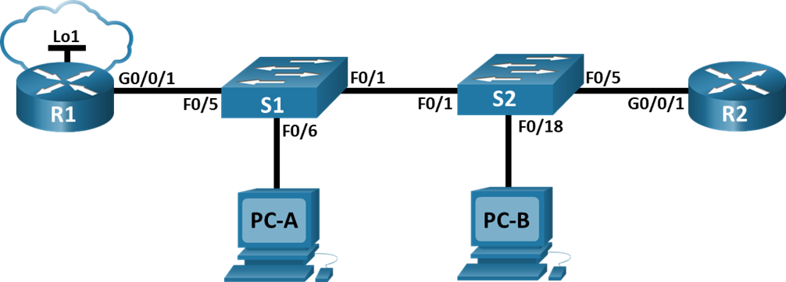
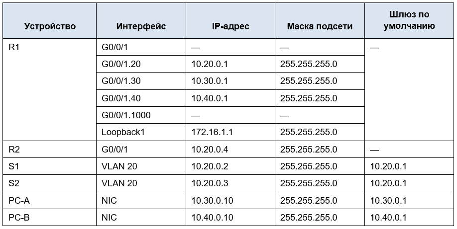
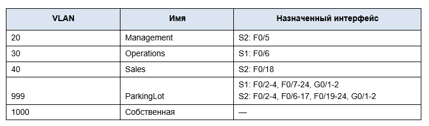
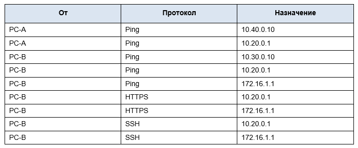
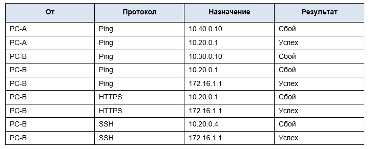
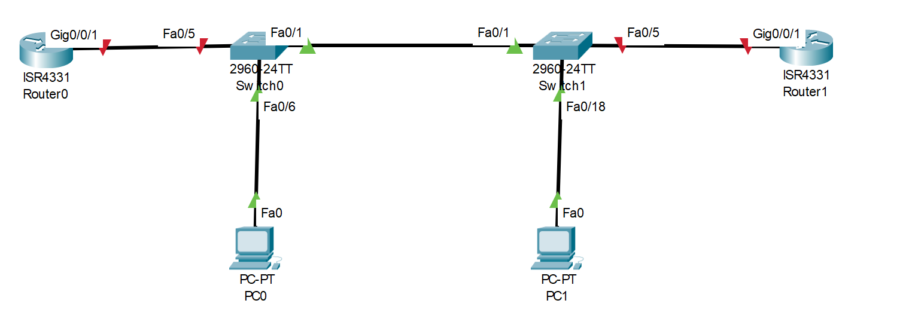
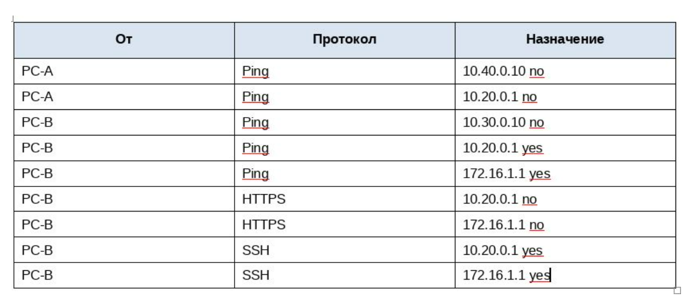

# Лабораторная работа. Настройка и проверка расширенных списков контроля доступа.

## Топология



## Таблица адресации



## Таблица VLAN




## Задачи

### Часть 1. Создание сети и настройка основных параметров устройства

### Часть 2. Настройка и проверка списков расширенного контроля доступа


[Перейти к Решению ](#Решение)


Инструкции

### Часть 1. Создание сети и настройка основных параметров устройства

#### Шаг 1. Создайте сеть согласно топологии.
Подключите устройства, как показано в топологии, и подсоедините необходимые кабели.

#### Шаг 2. Произведите базовую настройку маршрутизаторов.
Откройте окно конфигурации

**a.**	Назначьте маршрутизатору имя устройства.

**b.**	Отключите поиск DNS, чтобы предотвратить попытки маршрутизатора неверно преобразовывать введенные команды таким образом, как будто они являются именами узлов.

**c.**	Назначьте class в качестве зашифрованного пароля привилегированного режима EXEC.

**d.**	Назначьте cisco в качестве пароля консоли и включите вход в систему по паролю.

**e.**	Назначьте cisco в качестве пароля VTY и включите вход в систему по паролю.

**f.**	Зашифруйте открытые пароли.

**g.**	Создайте баннер с предупреждением о запрете несанкционированного доступа к устройству.

**h.**	Сохраните текущую конфигурацию в файл загрузочной конфигурации.

#### Шаг 3. Настройте базовые параметры каждого коммутатора.

Откройте окно конфигурации

**a.**	Присвойте коммутатору имя устройства.

**b.**	Отключите поиск DNS, чтобы предотвратить попытки маршрутизатора неверно преобразовывать введенные команды таким образом, как будто они являются именами узлов.

**c.**	Назначьте class в качестве зашифрованного пароля привилегированного режима EXEC.

**d.**	Назначьте cisco в качестве пароля консоли и включите вход в систему по паролю.

**e.**	Назначьте cisco в качестве пароля VTY и включите вход в систему по паролю.

**f.**	Зашифруйте открытые пароли.

**g.**	Создайте баннер с предупреждением о запрете несанкционированного доступа к устройству.

**h.**	Сохраните текущую конфигурацию в файл загрузочной конфигурации.


### Часть 2. Настройка сетей VLAN на коммутаторах.

#### Шаг 1. Создайте сети VLAN на коммутаторах.

Откройте окно конфигурации

**a.**	Создайте необходимые VLAN и назовите их на каждом коммутаторе из приведенной выше таблицы.

**b.**	Настройте интерфейс управления и шлюз по умолчанию на каждом коммутаторе, используя информацию об IP-адресе в таблице адресации. 

**c.**	Назначьте все неиспользуемые порты коммутатора VLAN Parking Lot, настройте их для статического режима доступа и административно деактивируйте их.

Примечание. Команда `interface range` полезна для выполнения этой задачи с помощью необходимого количества команд. 

#### Шаг 2. Назначьте сети VLAN соответствующим интерфейсам коммутатора.

**a.**	Назначьте используемые порты соответствующей VLAN (указанной в таблице VLAN выше) и настройте их для режима статического доступа.

**b.**	Выполните команду show vlan brief, чтобы убедиться, что сети VLAN назначены правильным интерфейсам.
Закройте окно настройки.

### Часть 3. ·Настройте транки (магистральные каналы).

#### Шаг 1. Вручную настройте магистральный интерфейс F0/1.

Откройте окно конфигурации

**a.**	Измените режим порта коммутатора на интерфейсе F0/1, чтобы принудительно создать магистральную связь. Не забудьте сделать это на обоих коммутаторах.

**b.**	В рамках конфигурации транка установите для native vlan значение 1000 на обоих коммутаторах. При настройке двух интерфейсов для разных собственных VLAN сообщения об ошибках могут отображаться временно.

**c.**	В качестве другой части конфигурации транка укажите, что VLAN 10, 20, 30 и 1000 разрешены в транке.

**d.**	Выполните команду show interfaces trunk для проверки портов магистрали, собственной VLAN и разрешенных VLAN через магистраль.


#### Шаг 2. Вручную настройте магистральный интерфейс F0/5 на коммутаторе S1.

**a.**	Настройте интерфейс S1 F0/5 с теми же параметрами транка, что и F0/1. Это транк до маршрутизатора.

**b.**	Сохраните текущую конфигурацию в файл загрузочной конфигурации.

**c.**	Используйте команду show interfaces trunk для проверки настроек транка.

### Часть 4. Настройте маршрутизацию.
#### Шаг 1. Настройка маршрутизации между сетями VLAN на R1.

Откройте окно конфигурации

**a.**	Активируйте интерфейс G0/0/1 на маршрутизаторе.

**b.**	Настройте подинтерфейсы для каждой VLAN, как указано в таблице IP-адресации. Все подинтерфейсы используют инкапсуляцию 802.1Q. Убедитесь, что подинтерфейс для собственной VLAN не имеет назначенного IP-адреса. Включите описание для каждого подинтерфейса.

**c.**	Настройте интерфейс Loopback 1 на R1 с адресацией из приведенной выше таблицы.

**d.**	С помощью команды show ip interface brief проверьте конфигурацию подынтерфейса.

#### Шаг 2. Настройка интерфейса R2 g0/0/1 с использованием адреса из таблицы и маршрута по умолчанию с адресом следующего перехода 10.20.0.1


###  Часть 5. Настройте удаленный доступ

#### Шаг 1. Настройте все сетевые устройства для базовой поддержки SSH.

Откройте окно конфигурации

**a.**	Создайте локального пользователя с именем пользователя SSHadmin и зашифрованным паролем $cisco123!

**b.**	Используйте ccna-lab.com в качестве доменного имени.

**c.**	Генерируйте криптоключи с помощью 1024 битного модуля.

**d.**	Настройте первые пять линий VTY на каждом устройстве, чтобы поддерживать только SSH-соединения и с локальной аутентификацией.

#### Шаг 2. Включите защищенные веб-службы с проверкой подлинности на R1.

**a.**	Включите сервер HTTPS на R1.
R1(config)# ip http secure-server 

**b.**	Настройте R1 для проверки подлинности пользователей, пытающихся подключиться к веб-серверу.
R1(config)# ip http authentication local

### Часть 6. Проверка подключения

#### Шаг 1. Настройте узлы ПК.
Адреса ПК можно посмотреть в таблице адресации.

#### Шаг 2. Выполните следующие тесты. Эхозапрос должен пройти успешно.
Примечание. Возможно, вам придется отключить брандмауэр ПК для работы ping




### Часть 7. Настройка и проверка списков контроля доступа (ACL)

При проверке базового подключения компания требует реализации следующих политик безопасности:

**Политика1.** Сеть Sales не может использовать SSH в сети Management (но в  другие сети SSH разрешен). 

**Политика 2.** Сеть Sales не имеет доступа к IP-адресам в сети Management с помощью любого веб-протокола (HTTP/HTTPS). Сеть Sales также не имеет доступа к интерфейсам R1 с помощью любого веб-протокола. Разрешён весь другой веб-трафик (обратите внимание — Сеть Sales  может получить доступ к интерфейсу Loopback 1 на R1).

**Политика3.** Сеть Sales не может отправлять эхо-запросы ICMP в сети Operations или Management. Разрешены эхо-запросы ICMP к другим адресатам. 

**Политика 4**: Cеть Operations  не может отправлять ICMP эхозапросы в сеть Sales. Разрешены эхо-запросы ICMP к другим адресатам. 

#### Шаг 1. Проанализируйте требования к сети и политике безопасности для планирования реализации ACL.
 
#### Шаг 2. Разработка и применение расширенных списков доступа, которые будут соответствовать требованиям политики безопасности.
Откройте окно конфигурации
Закройте окно настройки.

#### Шаг 3. Убедитесь, что политики безопасности применяются развернутыми списками доступа.

Выполните следующие тесты. Ожидаемые результаты показаны в таблице:



# РЕШЕНИЕ

### Часть 1. Создание сети и настройка основных параметров устройства
#### Шаг 1. Создаем сеть согласно топологии



#### Шаг 2. Производим базовую настройку маршрутизаторов

Настройка R1

```
Router>
Router>en
Router#conf t
Router(config)#hostname R1
R1(config)#no ip domain lookup
R1(config)#enable secret class
R1(config)#line console 0
R1(config-line)#password cisco
R1(config-line)#login
R1(config-line)#line vty 0 4
R1(config-line)#password cisco
R1(config-line)#login 
R1(config-line)#exit 
R1(config)#service password-encryption 
R1(config)#banner  motd #DO NOT ENTER#
R1(config)#exit 
R1#
R1#copy running-config startup-config 
Destination filename [startup-config]? startup-config
Building configuration...
[OK]
R1#
```

Настройка R2

```
Router>
Router>en
Router#conf t
Router(config)#hostname R2
R2(config)#no ip domain lookup
R2(config)#enable secret class
R2(config)#line console 0
R2(config-line)#password  cisco
R2(config-line)#login
R2(config-line)#line vty 0 4
R2(config-line)#password cisco
R2(config-line)#login
R2(config-line)#exit 
R2(config)#service  password-encryption 
R2(config)#banner motd # DO NOT ENTER #
R2(config)#exit 
R2#
R2#copy  running-config startup-config 
Destination filename [startup-config]? startup-config
Building configuration...
[OK]
R2#
```

#### Шаг 3. Настраиваем базовые параметры каждого коммутатора.

Настройка S1


```
Switch>
Switch>en
Switch#conf t
Switch(config)#hostname S1
S1(config)#no ip domain lookup
S1(config)#enable secret class
S1(config)#line console 0
S1(config-line)#password cisco
S1(config-line)#login
S1(config-line)#line vty 0 15
S1(config-line)#password cisco
S1(config-line)#login
S1(config-line)#exit 
S1(config)#service password-encryption 
S1(config)#banner motd #DO NO ENTER#
S1(config)#exit 
S1#copy running-config startup-config 
Destination filename [startup-config]? startup-config
Building configuration...
[OK]
S1#
```

Настройка S2

```
Switch>
Switch>en
Switch#conf t
Switch(config)#hostname S2
S2(config)#no ip domain lookup
S2(config)#enable secret class
S2(config)#line console 0
S2(config-line)#password cisco
S2(config-line)#login
S2(config-line)# line vty 0 15
S2(config-line)#password cisco
S2(config-line)#login
S2(config-line)#service password-encryption
S2(config)#banner motd  # DO NOT ENTER#
S2(config)#exit 
S2#
S2#copy running-config startup-config 
Destination filename [startup-config]? startup-config
Building configuration...
[OK]
S2#

```
### Часть 2. Настройка сетей VLAN на коммутаторах.

**a.** Создаем необходимые VLAN и называем их на каждом коммутаторе из приведенной выше таблицы

Настройка S1

```
S1#
S1#conf t
S1(config)#
S1(config)#vlan 20
S1(config-vlan)#name Management
S1(config-vlan)#vlan 30
S1(config-vlan)#name Operations
S1(config-vlan)#vlan 40
S1(config-vlan)#name Sales
S1(config-vlan)#vlan 999
S1(config-vlan)#name ParkingLot
S1(config-vlan)#vlan 1000
S1(config-vlan)#name Native
S1(config-vlan)#exit
S1(config)#
```

Настройка S2

```
S2>
S2>en
Password: 
S2#conf t
S2(config)#
S2(config)#vlan 20
S2(config-vlan)#name Management
S2(config-vlan)#vlan 30
S2(config-vlan)#name Operations
S2(config-vlan)#vlan 40
S2(config-vlan)#name Sales
S2(config-vlan)#vlan 999
S2(config-vlan)#name ParkingLot
S2(config-vlan)#vlan 1000
S2(config-vlan)#name Native
S2(config-vlan)#ex
S2(config-vlan)#exit 
S2(config)#

```

**b.** Настраиваем интерфейс управления и шлюз по умолчанию на каждом коммутаторе, используя информацию об IP-адресе в таблице адресации

Настройка S1

```
S1#conf t 
Enter configuration commands, one per line.  End with CNTL/Z.
S1(config)#
S1(config)#interface vlan 20
S1(config-if)#
%LINK-5-CHANGED: Interface Vlan20, changed state to up
S1(config-if)#ip address 10.20.0.2 255.255.255.0
S1(config-if)#no shutdown 
S1(config-if)#exit 
S1(config)#ip default-gateway 10.20.0.1
S1(config)#
```


Настройка S2

```
S2>
S2>en
Password: 
S2#conf t
Enter configuration commands, one per line.  End with CNTL/Z.
S2(config)#
S2(config)#interface vlan 20
S2(config-if)#
%LINK-5-CHANGED: Interface Vlan20, changed state to up
ip add
S2(config-if)#ip address 10.20.0.3 255.255.255.0
S2(config-if)#no shutdown 
S2(config-if)#exit 
S2(config)#ip default-gateway 10.20.0.1
S2(config)#
```

**c.** Назначаем все неиспользуемые порты коммутатора VLAN Parking Lot, настраиваем их для статического режима доступа и административно деактивируем их

на S1

```
S1>
S1>en
Password: 
S1#
S1#conf t
Enter configuration commands, one per line.  End with CNTL/Z.
S1(config)#
S1(config)#interface range f0/2 - 4, f0/7 - 24, g0/1 - 2
S1(config-if-range)#switchport mode access 
S1(config-if-range)#switchport access vlan 999
S1(config-if-range)#shutdown 

%LINK-5-CHANGED: Interface FastEthernet0/2, changed state to administratively down

%LINK-5-CHANGED: Interface FastEthernet0/3, changed state to administratively down

%LINK-5-CHANGED: Interface FastEthernet0/4, changed state to administratively down

%LINK-5-CHANGED: Interface FastEthernet0/7, changed state to administratively down

%LINK-5-CHANGED: Interface FastEthernet0/8, changed state to administratively down

%LINK-5-CHANGED: Interface FastEthernet0/9, changed state to administratively down

%LINK-5-CHANGED: Interface FastEthernet0/10, changed state to administratively down

%LINK-5-CHANGED: Interface FastEthernet0/11, changed state to administratively down

%LINK-5-CHANGED: Interface FastEthernet0/12, changed state to administratively down

%LINK-5-CHANGED: Interface FastEthernet0/13, changed state to administratively down

%LINK-5-CHANGED: Interface FastEthernet0/14, changed state to administratively down

%LINK-5-CHANGED: Interface FastEthernet0/15, changed state to administratively down

%LINK-5-CHANGED: Interface FastEthernet0/16, changed state to administratively down

%LINK-5-CHANGED: Interface FastEthernet0/17, changed state to administratively down

%LINK-5-CHANGED: Interface FastEthernet0/18, changed state to administratively down

%LINK-5-CHANGED: Interface FastEthernet0/19, changed state to administratively down

%LINK-5-CHANGED: Interface FastEthernet0/20, changed state to administratively down

%LINK-5-CHANGED: Interface FastEthernet0/21, changed state to administratively down

%LINK-5-CHANGED: Interface FastEthernet0/22, changed state to administratively down

%LINK-5-CHANGED: Interface FastEthernet0/23, changed state to administratively down

%LINK-5-CHANGED: Interface FastEthernet0/24, changed state to administratively down

%LINK-5-CHANGED: Interface GigabitEthernet0/1, changed state to administratively down

%LINK-5-CHANGED: Interface GigabitEthernet0/2, changed state to administratively down
S1(config-if-range)#
```

на S2
```
S2(config)#
S2(config)#interface range f0/2 - 17, f0/19 - 24, g0/1 - 2
S2(config-if-range)#switchport mode access
S2(config-if-range)#switchport access vlan 999
S2(config-if-range)#shutdown 

%LINK-5-CHANGED: Interface FastEthernet0/2, changed state to administratively down

%LINK-5-CHANGED: Interface FastEthernet0/3, changed state to administratively down

%LINK-5-CHANGED: Interface FastEthernet0/4, changed state to administratively down

%LINK-5-CHANGED: Interface FastEthernet0/5, changed state to administratively down

%LINK-5-CHANGED: Interface FastEthernet0/6, changed state to administratively down

%LINK-5-CHANGED: Interface FastEthernet0/7, changed state to administratively down

%LINK-5-CHANGED: Interface FastEthernet0/8, changed state to administratively down

%LINK-5-CHANGED: Interface FastEthernet0/9, changed state to administratively down

%LINK-5-CHANGED: Interface FastEthernet0/10, changed state to administratively down

%LINK-5-CHANGED: Interface FastEthernet0/11, changed state to administratively down

%LINK-5-CHANGED: Interface FastEthernet0/12, changed state to administratively down

%LINK-5-CHANGED: Interface FastEthernet0/13, changed state to administratively down

%LINK-5-CHANGED: Interface FastEthernet0/14, changed state to administratively down

%LINK-5-CHANGED: Interface FastEthernet0/15, changed state to administratively down

%LINK-5-CHANGED: Interface FastEthernet0/16, changed state to administratively down

%LINK-5-CHANGED: Interface FastEthernet0/17, changed state to administratively down


%LINK-5-CHANGED: Interface FastEthernet0/19, changed state to administratively down

%LINK-5-CHANGED: Interface FastEthernet0/20, changed state to administratively down

%LINK-5-CHANGED: Interface FastEthernet0/21, changed state to administratively down

%LINK-5-CHANGED: Interface FastEthernet0/22, changed state to administratively down

%LINK-5-CHANGED: Interface FastEthernet0/23, changed state to administratively down

%LINK-5-CHANGED: Interface FastEthernet0/24, changed state to administratively down

%LINK-5-CHANGED: Interface GigabitEthernet0/1, changed state to administratively down

%LINK-5-CHANGED: Interface GigabitEthernet0/2, changed state to administratively down
S2(config-if-range)#
%LINK-5-CHANGED: Interface FastEthernet0/18, changed state to administratively down

%LINEPROTO-5-UPDOWN: Line protocol on Interface FastEthernet0/18, changed state to down
S2(config-if-range)#

```

#### Шаг 2. Назначаем сети VLAN соответствующим интерфейсам коммутатора

a. Назначаем используемые порты соответствующей VLAN (указанной в таблице VLAN выше) и настраиваем их для режима статического доступ

```
S1(config)#
S1(config)#interface f0/6
S1(config-if)#switchport mode access 
S1(config-if)#switchport access vlan 30
S1(config-if)#
```

```
S2(config)#
S2(config)#interface f0/18
S2(config-if)#switchport mode access 
S2(config-if)#switchport access vlan 40
S2(config-if)#
```

**b.** Выполняем команду `show vlan brief`, чтобы убедиться, что сети VLAN назначены правильным интерфейсам.

Настройка S1

```
S1#
S1#show vlan brief 

VLAN Name                             Status    Ports
---- -------------------------------- --------- -------------------------------
1    default                          active    Fa0/1, Fa0/5
20   Management                       active    
30   Operations                       active    Fa0/6
40   Sales                            active    
999  ParkingLot                       active    Fa0/2, Fa0/3, Fa0/4, Fa0/7
                                                Fa0/8, Fa0/9, Fa0/10, Fa0/11
                                                Fa0/12, Fa0/13, Fa0/14, Fa0/15
                                                Fa0/16, Fa0/17, Fa0/18, Fa0/19
                                                Fa0/20, Fa0/21, Fa0/22, Fa0/23
                                                Fa0/24, Gig0/1, Gig0/2
1000 Native                           active    
1002 fddi-default                     active    
1003 token-ring-default               active    
1004 fddinet-default                  active    
1005 trnet-default                    active    
S1#
```


Настройка S2

```
S2#
S2#show vlan brief 

VLAN Name                             Status    Ports
---- -------------------------------- --------- -------------------------------
1    default                          active    Fa0/1
20   Management                       active    
30   Operations                       active    
40   Sales                            active    Fa0/18
999  ParkingLot                       active    Fa0/2, Fa0/3, Fa0/4, Fa0/5
                                                Fa0/6, Fa0/7, Fa0/8, Fa0/9
                                                Fa0/10, Fa0/11, Fa0/12, Fa0/13
                                                Fa0/14, Fa0/15, Fa0/16, Fa0/17
                                                Fa0/19, Fa0/20, Fa0/21, Fa0/22
                                                Fa0/23, Fa0/24, Gig0/1, Gig0/2
1000 Native                           active    
1002 fddi-default                     active    
1003 token-ring-default               active    
1004 fddinet-default                  active    
1005 trnet-default                    active    
S2#
```

### Часть 3. Настраиваем транки (магистральные каналы).

#### Шаг 1. Вручную настраиваем магистральный интерфейс F0/1

**a.** Изменяем режим порта коммутатора на интерфейсе F0/1, чтобы принудительно создать магистральную связь. Не забудьте сделать это на обоих коммутаторах.

Делаем на S1

```
S1(config)#
S1(config)#interface f0/1
S1(config-if)#switchport mode trunk 

S1(config-if)#
%LINEPROTO-5-UPDOWN: Line protocol on Interface FastEthernet0/1, changed state to down

%LINEPROTO-5-UPDOWN: Line protocol on Interface FastEthernet0/1, changed state to up

%LINEPROTO-5-UPDOWN: Line protocol on Interface Vlan20, changed state to up

```

Делаем на S2

```
S2#
S2#%SPANTREE-2-RECV_PVID_ERR: Received 802.1Q BPDU on non trunk FastEthernet0/1 VLAN1.

%SPANTREE-2-BLOCK_PVID_LOCAL: Blocking FastEthernet0/1 on VLAN0001. Inconsistent port type.

%LINEPROTO-5-UPDOWN: Line protocol on Interface FastEthernet0/1, changed state to down

%LINEPROTO-5-UPDOWN: Line protocol on Interface FastEthernet0/1, changed state to up

%LINEPROTO-5-UPDOWN: Line protocol on Interface Vlan20, changed state to up

S2#
S2#conf t
Enter configuration commands, one per line.  End with CNTL/Z.
S2(config)#
S2(config)#interface fastEthernet 0/1
S2(config-if)#switchport mode trunk 
S2(config-if)#
```

**b.** В рамках конфигурации транка устанавливаем для native vlan значение 1000 на обоих коммутаторах. При настройке двух интерфейсов для разных собственных VLAN сообщения об ошибках могут отображаться временно.

Настройка на S1

```
S1(config)#
S1(config)#interface fastEthernet 0/1
S1(config-if)#switchport mode trunk 
S1(config-if)#switchport trunk native vlan 1000
S1(config-if)#
```

Настройка на S2

```
S2(config-if)#switchport trunk native vlan 1000
```

**c.** В качестве другой части конфигурации транка указываем, что VLAN 10, 20, 30 и 1000 разрешены в транке.

```
S1(config-if)#switchport trunk allowed vlan 20,30,40,1000
```

```
S2(config-if)#switchport trunk allowed vlan 20,30,40,1000
```


**d.** Выполняем команду show interfaces trunk для проверки портов магистрали, собственной VLAN и разрешенных VLAN через магистраль

```
S1#
S1#show interfaces trunk 
Port        Mode         Encapsulation  Status        Native vlan
Fa0/1       on           802.1q         trunking      1000

Port        Vlans allowed on trunk
Fa0/1       20,30,40,1000

Port        Vlans allowed and active in management domain
Fa0/1       20,30,40,1000

Port        Vlans in spanning tree forwarding state and not pruned
Fa0/1       20,30,40,1000

S1#
```

```
S2#
S2#show interfaces trunk 
Port        Mode         Encapsulation  Status        Native vlan
Fa0/1       on           802.1q         trunking      1000

Port        Vlans allowed on trunk
Fa0/1       20,30,40,1000

Port        Vlans allowed and active in management domain
Fa0/1       20,30,40,1000

Port        Vlans in spanning tree forwarding state and not pruned
Fa0/1       20,30,40,1000

S2#
```

#### Шаг 2. Вручную настраиваем магистральный интерфейс F0/5 на коммутаторе S1

**a.** Настраиваем интерфейс S1 F0/5 с теми же параметрами транка, что и F0/1. Это транк до маршрутизатора.

```
S1#
S1#conf t
S1(config)#
S1(config)#interface fastEthernet 0/5
S1(config-if)#switchport mode trunk 
S1(config-if)#switchport trunk native vlan 1000
S1(config-if)#switchport trunk allowed vlan 20,30,40,1000
S1(config-if)#exit 
S1(config)#
```

**b.** Сохраняем текущую конфигурацию в файл загрузочной конфигурации.

```
S1#
S1#copy  running-config startup-config 
Destination filename [startup-config]? startup-config
Building configuration...
[OK]
S1#
```

**c.** Используем команду `show interfaces trunk` для проверки настроек транка.

```
S1#
S1#show interfaces trunk
Port        Mode         Encapsulation  Status        Native vlan
Fa0/1       on           802.1q         trunking      1000

Port        Vlans allowed on trunk
Fa0/1       20,30,40,1000

Port        Vlans allowed and active in management domain
Fa0/1       20,30,40,1000

Port        Vlans in spanning tree forwarding state and not pruned
Fa0/1       20,30,40,1000

S1#
```

### Часть 4. Настраиваем маршрутизацию.

#### Шаг 1. Настраиваем маршрутизацию между сетями VLAN на R1.

**a.** Активируем интерфейс G0/0/1 на маршрутизаторе.

```
R1>
R1>en
Password: 
R1#conf t
Enter configuration commands, one per line.  End with CNTL/Z.
R1(config)#
R1(config)#interface gigabitEthernet 0/0/1
R1(config-if)#no shutdown 

R1(config-if)#
%LINK-5-CHANGED: Interface GigabitEthernet0/0/1, changed state to up

%LINEPROTO-5-UPDOWN: Line protocol on Interface GigabitEthernet0/0/1, changed state to up
```

**b.** Настраиваем подинтерфейсы для каждой VLAN, как указано в таблице IP-адресации. Все подинтерфейсы используют инкапсуляцию 802.1Q. Убеждаемся, что подинтерфейс для собственной VLAN не имеет назначенного IP-адреса. Включаем описание для каждого подинтерфейса.

```
R1>en
R1#conf t
Enter configuration commands, one per line.  End with CNTL/Z.
R1(config)#
R1(config)#interface gigabitEthernet 0/0/1
R1(config-if)#no shutdown 

R1(config-if)#
%LINK-5-CHANGED: Interface GigabitEthernet0/0/1, changed state to up

%LINEPROTO-5-UPDOWN: Line protocol on Interface GigabitEthernet0/0/1, changed state to up

R1(config-if)#exit 
R1(config)#
R1(config)#interface gigabitEthernet 0/0/1.20
R1(config-subif)#
%LINK-5-CHANGED: Interface GigabitEthernet0/0/1.20, changed state to up

%LINEPROTO-5-UPDOWN: Line protocol on Interface GigabitEthernet0/0/1.20, changed state to up

R1(config-subif)#
R1(config-subif)#description Management Network
R1(config-subif)#encapsulation dot1Q 20
R1(config-subif)#ip address 10.20.0.1 255.255.255.0
R1(config-subif)#interface g0/0/1.30
R1(config-subif)#
%LINK-5-CHANGED: Interface GigabitEthernet0/0/1.30, changed state to up

%LINEPROTO-5-UPDOWN: Line protocol on Interface GigabitEthernet0/0/1.30, changed state to up
desc
R1(config-subif)#encapsulation dot1Q 30
R1(config-subif)#description Operations Network
R1(config-subif)#ip address 10.30.0.1 255.255.255.0
R1(config-subif)#interface g0/0/1.40
R1(config-subif)#
%LINK-5-CHANGED: Interface GigabitEthernet0/0/1.40, changed state to up

%LINEPROTO-5-UPDOWN: Line protocol on Interface GigabitEthernet0/0/1.40, changed state to up
enc
R1(config-subif)#encapsulation dot1Q 40
R1(config-subif)#description Sales Network
R1(config-subif)#ip address 10.40.0.1 255.255.255.0
R1(config-subif)#interface g0/0/1.1000
R1(config-subif)#
%LINK-5-CHANGED: Interface GigabitEthernet0/0/1.1000, changed state to up

%LINEPROTO-5-UPDOWN: Line protocol on Interface GigabitEthernet0/0/1.1000, changed state to up

R1(config-subif)#
R1(config-subif)#encapsulation dot1Q 1000 Native
R1(config-subif)#description Native VLAN
R1(config-subif)#
```

**c.** Настраиваем интерфейс Loopback 1 на R1 с адресацией из приведенной выше таблицы.

```
R1(config)#
R1(config)#interface Loopback 1

R1(config-if)#
%LINK-5-CHANGED: Interface Loopback1, changed state to up

%LINEPROTO-5-UPDOWN: Line protocol on Interface Loopback1, changed state to up
ip add
R1(config-if)#ip address 172.16.1.1 255.255.255.0
R1(config-if)#
```

**d.** С помощью команды `show ip interface brief` проверяем конфигурацию подинтерфейса

```
R1#
R1#show ip interface brief 
Interface              IP-Address      OK? Method Status                Protocol 
GigabitEthernet0/0/0   unassigned      YES unset  administratively down down 
GigabitEthernet0/0/1   unassigned      YES unset  up                    up 
GigabitEthernet0/0/1.2010.20.0.1       YES manual up                    up 
GigabitEthernet0/0/1.3010.30.0.1       YES manual up                    up 
GigabitEthernet0/0/1.4010.40.0.1       YES manual up                    up 
GigabitEthernet0/0/1.1000unassigned      YES unset  up                    up 
GigabitEthernet0/0/2   unassigned      YES unset  administratively down down 
Loopback1              172.16.1.1      YES manual up                    up 
Vlan1                  unassigned      YES unset  administratively down down
R1#
```

#### Шаг 2. Настройка интерфейса R2 g0/0/1 с использованием адреса из таблицы и маршрута по умолчанию с адресом следующего перехода 10.20.0.1

```
R2#
R2#conf t
Enter configuration commands, one per line.  End with CNTL/Z.
R2(config)#interface g0/0/1
R2(config-if)#ip address 10.20.0.4 255.255.255.0
R2(config-if)#no shutdown 

R2(config-if)#
%LINK-5-CHANGED: Interface GigabitEthernet0/0/1, changed state to up

R2(config-if)#
R2(config-if)#exit 
R2(config)#ip route 0.0.0.0 0.0.0.0 10.20.0.1
R2(config)#
```

### Часть 5. Настройте удаленный доступ.

#### Шаг 1. Настраиваем все сетевые устройства для базовой поддержки SSH.

**a.** Создаем локального пользователя с именем пользователя SSHadmin и зашифрованным паролем $cisco123!


```
R2(config)#
R2(config)#username  SSHadmin secret $cisco123!
R2(config)#
```

**b.** Используем ccna-lab.com в качестве доменного имени.

```
R2(config)#
R2(config)#ip domain name ccna-lab.com
R2(config)#
```

**c.** Генерируем криптоключи с помощью 1024 битного модуля.

```
R2(config)#
R2(config)#crypto  key generate rsa general-keys modulus 1024
The name for the keys will be: R2.ccna-lab.com

% The key modulus size is 1024 bits
% Generating 1024 bit RSA keys, keys will be non-exportable...[OK]
*Mar 1 16:1:18.967: %SSH-5-ENABLED: SSH 1.99 has been enabled
R2(config)#
```


**d.** Настраиваем первые пять линий VTY на каждом устройстве, чтобы поддерживать только SSH-соединения и с локальной аутентификацией.

```
R1>en
Password: 
R1#conf t
Enter configuration commands, one per line.  End with CNTL/Z.
R1(config)#
R1(config)#line vty 0 4 
R1(config-line)#transport input ssh 
R1(config-line)#login local 
R1(config-line)#exit
R1(config)#
```

```
R2>en
Password: 
R2#conf t
Enter configuration commands, one per line.  End with CNTL/Z.
R2(config)#line vty 0 4
R2(config-line)#transport input ssh 
R2(config-line)#login local 
R2(config-line)#exit 
R2(config)#
```
Сменим версию SSH на 2-ю. 

```
R1(config)#ip ssh version 2
Please create RSA keys (of at least 768 bits size) to enable SSH v2.
R1(config)#
```


```
R2(config)#
R2(config)#ip ssh version 2
R2(config)#
```

#### Шаг 2. Включаем защищенные веб-службы с проверкой подлинности на R1.

**a.** Включаем сервер HTTPS на R1.

```

R1#
R1#ip http authentication local
      ^
% Invalid input detected at '^' marker.
	
R1# 
```

Нет вывода команды , в трейсере не поддерживается. 

#### Часть 6. Проверка подключения.

#### Шаг 1. Настраиваем узлы ПК.

Адреса ПК можно посмотреть в таблице адресации.

#### Шаг 2. Выполняем следующие тесты. Эхозапрос должен пройти успешно.



### Часть 7. Настройка и проверка списков контроля доступа (ACL)

При проверке базового подключения компания требует реализации следующих политик безопасности:

**Политика1.** Сеть Sales не может использовать SSH в сети Management (но в другие сети SSH разрешен).

**Политика 2.** Сеть Sales не имеет доступа к IP-адресам в сети Management с помощью любого веб-протокола (HTTP/HTTPS). Сеть Sales также не имеет доступа к интерфейсам R1 с помощью любого веб-протокола. Разрешён весь другой веб-трафик (обратите внимание — Сеть Sales может получить доступ к интерфейсу Loopback 1 на R1).

**Политика3.** Сеть Sales не может отправлять эхо-запросы ICMP в сети Operations или Management. Разрешены эхо-запросы ICMP к другим адресатам.

**Политика 4:** Cеть Operations не может отправлять ICMP эхозапросы в сеть Sales. Разрешены эхо-запросы ICMP к другим адресатам.

Разработка и применение расширенных списков доступа, которые будут соответствовать требованиям политики безопасности.


```

R1>en
Password: 
R1#conf t
Enter configuration commands, one per line.  End with CNTL/Z.
R1(config)#
R1(config)#access-list 101 deny tcp 10.40.0.0 0.0.0.255 10.20.0.0 0.0.0.255 eq 22
R1(config)#access-list 101 deny tcp 10.40.0.0 0.0.0.255 10.20.0.0 0.0.0.255 eq 22
R1(config)#access-list 101 deny tcp 10.40.0.0 0.0.0.255 10.30.0.1 0.0.0.0 eq 80
R1(config)#access-list 101 deny tcp 10.40.0.0 0.0.0.255 10.40.0.1 0.0.0.0 eq 80
R1(config)#access-list 101 deny tcp 10.40.0.0 0.0.0.255 10.20.0.0 0.0.0.255 eq 443
R1(config)#access-list 101 deny tcp 10.40.0.0 0.0.0.255 10.30.0.1 0.0.0.0 eq 443
R1(config)#access-list 101 deny tcp 10.40.0.0 0.0.0.255 10.40.0.1 0.0.0.0 eq 443
R1(config)#access-list 101 deny icmp 10.40.0.0 0.0.0.255 10.20.0.0 0.0.0.255 echo
R1(config)#access-list 101 deny icmp 10.40.0.0 0.0.0.255 10.30.0.0 0.0.0.255 echo
R1(config)#access-list 101 permit ip any any
R1(config)#interface g0/0/1.40
R1(config-subif)#ip access-group 101 in
R1(config-subif)#exit 
R1(config)#access-list 101 remark ACL 101 fulfills policies 1, 2,
R1(config)#access-list 101 remark ACL 102 fulfills policies 4
R1(config)#access-list 102 deny icmp 10.30.0.0 0.0.0.255 10.40.0.0 0.0.0.255 echo
R1(config)#access-list 102 permit ip any any 
R1(config)#interface gigabitEthernet 0/0/1.30
R1(config-subif)#ip access-group 102 in
R1(config-subif)#
```
